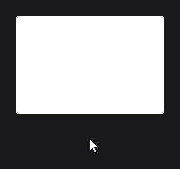
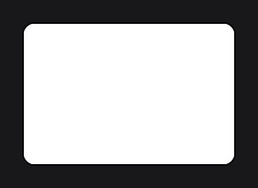

# RoundedNodeEffect

`RoundedNodeEffect` (`dev.joid.lib.ui.node.effect.impl`) rounds the corners of a node with a shader. It works on anything the node draws: a colored rectangle, an image, a gradient, or a whole card with its content.

```java
@Override
public void init() {
    RectNode.create(100, 100, 300, 200).color(Color.WHITE).effect(RoundedNodeEffect.create(16F)).attach(this);
    ResourceNode.create(450, 100, 200, 200).resource(Resource.of("https://placehold.co/400x400.png")).effect(RoundedNodeEffect.create(10F)).attach(this);
}
```


## Creating with create

| Factory | Description |
| --- | --- |
| `create(float radius)` | Rounds the four corners. |
| `create(Supplier<Float> radius)` | Same, with a radius read every frame. |
| `create(float radius, boolean left, boolean top, boolean right, boolean bottom)` | Rounds the corners of the enabled sides. The sides come in the order of `DrawShape.drawRoundedRect`. |
| `create(Supplier<Float> radius, Supplier<Boolean> left, Supplier<Boolean> top, Supplier<Boolean> right, Supplier<Boolean> bottom)` | Same, every value read every frame. |

The radius is in UI units. A corner is rounded only when both of its sides are enabled:

| Corners | Call |
| --- | --- |
| All four | `create(16F)` |
| Top-left and top-right | `create(16F, true, true, true, false)` |
| Bottom-left and bottom-right | `create(16F, true, false, true, true)` |
| Top-left and bottom-left | `create(16F, true, true, false, true)` |
| Top-right and bottom-right | `create(16F, false, true, true, true)` |
| Top-left only | `create(16F, true, true, false, false)` |


A radius of half the node's smaller side gives a pill (`create(60F)` on a 200 × 120 node). The radius is not clamped: keep it at most half of the smaller side. A radius of `0F` draws square corners.

## Changing the radius and the sides

| Method | Description |
| --- | --- |
| `radius(float radius)`, `radius(Supplier<Float> radius)` | Replaces the radius. |
| `left(boolean left)`, `left(Supplier<Boolean> left)` | Enables the left corners. |
| `right(boolean right)`, `right(Supplier<Boolean> right)` | Enables the right corners. |
| `top(boolean top)`, `top(Supplier<Boolean> top)` | Enables the top corners. |
| `bottom(boolean bottom)`, `bottom(Supplier<Boolean> bottom)` | Enables the bottom corners. |

The setters return the effect, so you can configure it inline (see [Effects](effects.md#applying-effects-with-effect)):

```java
RectNode
.create(100, 100, 300, 200)
.color(Color.WHITE)
.effect(RoundedNodeEffect.create(16F).bottom(false))
.attach(this);
```

A supplier animates the corners, here with the hover progress:

```java
RectNode
.create(100, 100, 300, 200)
.color(Color.WHITE)
.effect(node -> RoundedNodeEffect.create(() -> 8F + node.hoverValue(24F)))
.attach(this);
```



## Rounding the children with CHILDREN

By default the effect has the `SELF` scope: it rounds what the node draws itself, and its children are drawn on top without rounding. To round a card together with its content (an image filling the card, a header bar), use the `CHILDREN` scope:

```java
RectNode
.create(100, 100, 300, 200)
.color(Color.WHITE)
.effect(RoundedNodeEffect.create(16F).scope(NodeEffectScope.CHILDREN))
.body(card -> {
    ResourceNode.create(0, 0, card.getWidth(), 120).resource(Resource.of("https://placehold.co/300x120.png")).attach(card);
})
.attach(this);
```


`NodeEffectScope` is the nested enum `NodeEffect.NodeEffectScope`. See [Scope](effects.md#scope-with-nodeeffectscope).

## Combining with a border

A [BorderNodeEffect](border.md) follows the rounded corners, because the rounding pass runs before the border pass. `RectNode.border(...)` uses a `BorderNodeEffect` too:

```java
RectNode
.create(100, 100, 300, 200)
.color(Color.WHITE)
.border(Color.BLACK, 2D)
.effect(RoundedNodeEffect.create(16F))
.attach(this);
```



## Rendering details

- The edges are anti-aliased over about one unit.
- The node's rectangle is aligned to the pixel grid before the corners are computed, so straight edges stay sharp.
- The effect goes through the [shader pipeline](../shaders/pipeline.md): the node is drawn into a framebuffer, then cut.
- The hover and click area stays the full rectangle.

To draw a rounded rectangle without a node, use `DrawUtils.SHAPE.drawRoundedRect(...)` (see [Shapes](../drawing/shapes.md)).

## Reference

| Method | Description |
| --- | --- |
| `create(...)` | Factories, see above. |
| `radius(...)`, `left(...)`, `right(...)`, `top(...)`, `bottom(...)` | Setters, value or `Supplier`. |
| `getRadius()` | Current radius (the supplier is read). |
| `isLeft()`, `isRight()`, `isTop()`, `isBottom()` | Current side flags (the suppliers are read). |
| `getRadiusSupplier()`, `getLeftSupplier()`, `getRightSupplier()`, `getTopSupplier()`, `getBottomSupplier()` | The suppliers. |
| `priority(int)`, `scope(NodeEffectScope)` | Inherited, see [Effects](effects.md). |

Shader pass priority: 100 (before blur and border).

## See also

- [Effects](effects.md)
- [CircleNodeEffect](circle.md)
- [BorderNodeEffect](border.md)
- [RectNode](../nodes/visual/rect.md)
- [Shapes](../drawing/shapes.md)