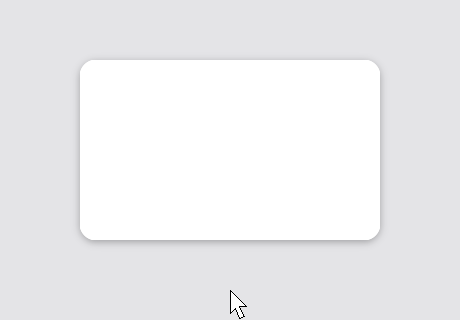

# ShadowNodeEffect

`ShadowNodeEffect` (`dev.joid.lib.ui.node.effect.impl`) draws a soft shadow under a node: a drop shadow when it is offset, a glow when it is not. Use it to lift cards, menus and buttons, or to make a badge shine. Unlike the shape effects of the previous pages, it is a render-state effect (see [Effects](effects.md#effect-order-and-priority)): it draws around the node, without framebuffer.

```java
@Override
public void init() {
	RectNode.create(100, 100, 300, 180).color(Color.WHITE).effect(RoundedNodeEffect.create(16F)).effect(ShadowNodeEffect.create(Color.BLACK.copyAlpha(0.3F), 24F, 0D, 10D)).attach(this);
	RectNode.create(500, 130, 120, 120).color(Color.CYAN).effect(CircleNodeEffect.create()).effect(ShadowNodeEffect.create(Color.CYAN, 24F)).attach(this);
}
```

, then a glow without offset.")

## Creating with create

| Factory | Description |
| --- | --- |
| `create(Color color, float blur)` | A glow: the shadow sits right under the node. |
| `create(Color color, float blur, double offsetX, double offsetY)` | A drop shadow, moved by the offset. |

- `color` is the color of the shadow at its darkest; its alpha sets the strength. A gradient color uses its first color.
- `blur` is the softness in UI units, like the `blur` of a CSS `box-shadow`: the shadow fades out over about `blur` units on each side of the edge. A blur of `0F` gives a sharp shadow.
- `offsetX` and `offsetY` move the shadow in UI units; positive values go right and down.

## Changing the values

| Method | Description |
| --- | --- |
| `color(Color color)`, `color(Supplier<Color> color)` | Replaces the color. |
| `blur(float blur)`, `blur(Supplier<Float> blur)` | Replaces the blur. |
| `offsetX(double offsetX)`, `offsetX(Supplier<Double> offsetX)`, `offsetY(...)` | Replaces one offset. |

The setters return the effect, and suppliers are read every frame. A shadow that grows with the hover progress:

```java
RectNode
.create(100, 100, 300, 180)
.color(Color.WHITE)
.effect(RoundedNodeEffect.create(16F))
.self(node -> node.effect(ShadowNodeEffect.create(Color.BLACK.copyAlpha(0.3F), 8F).blur(() -> 8F + node.hoverValue(16F)).offsetY(() -> 2D + node.hoverValue(8F))))
.attach(this);
```



## Shape of the shadow

The shadow follows the shape of the node:

| Node | Shadow |
| --- | --- |
| With a [RoundedNodeEffect](rounded.md) | The node's rectangle with the radius of the effect, on the four corners. |
| With a [CircleNodeEffect](circle.md), or a `CircleNode` | The largest circle centered in the node. |
| Any other node | The node's rectangle. |

The shadow is computed from this shape, not from the drawn pixels: a text or an image with transparent areas casts the shadow of its rectangle.

## Rendering details

- The shadow is a render-state effect: `pre(...)` draws it before the node, its children and its shader effects, so everything the node draws covers it. It is not clipped by the node's own overflow, only by the masks of its parents.
- It is drawn with `DrawShape.drawShadow(...)` (see [Shapes](../drawing/shapes.md#shadows-and-glows-with-drawshadow)), in one pass, without framebuffer.
- Like the other render-state effects, it runs in the priority order: give it a higher priority than a [TransformNodeEffect](transform.md), or add it after, so it moves with the node.
- The hover and click area stays the node's rectangle.

## Reference

| Method | Description |
| --- | --- |
| `create(...)` | Factories, see above. |
| `color(...)`, `blur(...)`, `offsetX(...)`, `offsetY(...)` | Setters, value or `Supplier`. |
| `getColor()`, `getBlur()`, `getOffsetX()`, `getOffsetY()` | Current values (the suppliers are read). |
| `getColorSupplier()`, `getBlurSupplier()`, `getOffsetXSupplier()`, `getOffsetYSupplier()` | The suppliers. |
| `priority(int)`, `scope(NodeEffectScope)` | Inherited, see [Effects](effects.md). The scope has no effect on a render-state effect. |

## Pitfalls

- The shadow follows the node's shape effects, not its drawn pixels: a `CircleNode` or a `CircleNodeEffect` casts a round shadow, a `RoundedNodeEffect` a rounded one, anything else a rectangle.
- A shadow extends outside the node: a parent with `HIDDEN` overflow clips it.

## See also

- Next: [MaskNodeEffect](mask.md)
- [Effects](effects.md)
- [RoundedNodeEffect](rounded.md)
- [BlurNodeEffect](blur.md)
- [Shapes](../drawing/shapes.md)