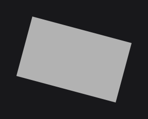
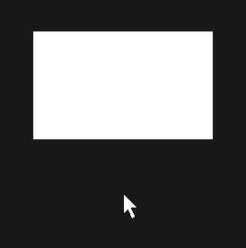
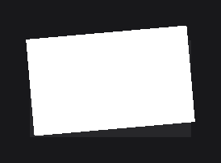

# TransformNodeEffect

`TransformNodeEffect` (`dev.joid.lib.ui.node.effect.impl`) translates, scales or rotates the rendering of a node and its children. Use it for visual motion (a card that lifts on hover, a spinning icon, a flip) that must not change the layout.

```java
@Override
public void init() {
	RectNode
	.create(100, 100, 200, 120)
	.color(Color.LIGHTGRAY)
	.self(node -> node.effect(TransformNodeEffect.create(new RotateTransformOperation(15D, Rotation.ROLL, Vector.create(() -> node.ax(node.dw(2D)), () -> node.ay(node.dh(2D)))))))
	.attach(this);
}
```



The node is drawn turned by 15 degrees around its center.

## Creating with create

| Factory | Description |
| --- | --- |
| `create(TranslateTransformOperation translate)` | A single translation. |
| `create(ScaleTransformOperation scale)` | A single scaling. |
| `create(RotateTransformOperation rotation)` | A single rotation. |
| `create(Transformation transformation)` | Any sequence of operations. |

| Method | Description |
| --- | --- |
| `transformation(Transformation transformation)` | Replaces the transformation. |
| `transformation(Supplier<Transformation> transformation)` | Reads the transformation every frame. |
| `getTransformationSupplier()` | The transformation supplier. |

The renderer keeps a current matrix, the transformation applied to everything drawn, on a stack. Before the node renders, the effect pushes a copy of the matrix (saves it) and applies the operations of the transformation in order; after the node and its children have rendered, it pops the matrix (restores the saved one), so nothing drawn afterwards is affected.

## Coordinates and pivots

Operations work in the coordinate space of the node's position: the same space as `getX()`/`getY()`, which is relative to the parent. A pivot at `(getX(), getY())` is the node's top-left corner.

To pivot on the node's center and keep following it when it moves or resizes, build the pivot from suppliers in `self(...)`, which hands you the node, as in the first example: `Vector.create(() -> node.ax(node.dw(2D)), () -> node.ay(node.dh(2D)))`. `ax(value)` is `x + value` and `dw(value)` is `width / value` (see [Node Fundamentals](../nodes/node-fundamentals.md)).

## Operations

The operations are in `dev.joid.lib.render.transform.operation`, the value types in `dev.joid.lib.render.transform`.

### TranslateTransformOperation

`new TranslateTransformOperation(Vector vector)` moves the rendering by `vector`. The offset is snapped to the pixel grid, so the node stays sharp while it moves.

```java
RectNode
.create(100, 100, 200, 120)
.color(Color.WHITE)
.self(node -> node.effect(TransformNodeEffect.create(new TranslateTransformOperation(Vector.Y(() -> (double) -node.hoverValue(6F))))))
.attach(this);
```


The node lifts by 6 units while hovered.

### ScaleTransformOperation

`new ScaleTransformOperation(Scale scale, Vector pivot)` scales the rendering around `pivot`. `Scale.create(x, y, z)` takes factors (`1D` keeps the size; pass `1D` for `z`).

```java
RectNode
.create(100, 100, 200, 120)
.color(Color.WHITE)
.self(node -> {
	final Vector center = Vector.create(() -> node.ax(node.dw(2D)), () -> node.ay(node.dh(2D)));
	final Scale scale = Scale.create(() -> 1D + node.hoverValue(0.05F), () -> 1D + node.hoverValue(0.05F), () -> 1D);
	node.effect(TransformNodeEffect.create(new ScaleTransformOperation(scale, center)));
})
.attach(this);
```



The node grows by 5 % around its center while hovered.

### RotateTransformOperation

`new RotateTransformOperation(double angle, Rotation axis, Vector pivot)` or `new RotateTransformOperation(Supplier<Double> angle, Rotation axis, Vector pivot)` rotates the rendering by `angle` degrees around `axis`, through `pivot`.

| Axis | Rotation |
| --- | --- |
| `Rotation.ROLL` | Around the axis that points out of the screen: the usual 2D rotation. Positive angles turn clockwise on screen. |
| `Rotation.YAW` | Around the vertical axis, out of the screen plane. 180 degrees mirrors the node horizontally. |
| `Rotation.PITCH` | Around the horizontal axis, out of the screen plane. 180 degrees mirrors the node vertically. |

`Rotation.create(yaw, pitch, roll)` builds another axis from the three components (`Rotation.create(0, 0, 1)` gives the same axis as `ROLL`).

An angle supplier makes a continuous rotation, here one turn per second driven by the JOID clock (`BridgeHandler`, in `dev.joid.lib.bridge`):

```java
RectNode
.create(100, 100, 64, 64)
.color(Color.WHITE)
.self(node -> node.effect(TransformNodeEffect.create(new RotateTransformOperation(() -> BridgeHandler.CLOCK.get().currentTimeMillis() % 1000L * 0.36D, Rotation.ROLL, Vector.create(() -> node.ax(node.dw(2D)), () -> node.ay(node.dh(2D)))))))
.attach(this);
```

.")

### Several operations with Transformation

`Transformation` (`dev.joid.lib.render.transform`) is an ordered list of operations:

```java
final Transformation transformation = Transformation
.create()
.translate(Vector.create(0D, -10D))
.rotate(-5D, Rotation.ROLL, Vector.create(200D, 160D));

RectNode.create(100, 100, 200, 120).color(Color.WHITE).effect(TransformNodeEffect.create(transformation)).attach(this);
```



| Method | Description |
| --- | --- |
| `Transformation.create()` | Empty transformation. |
| `Transformation.create(ITransformOperation operation)` | Transformation with one operation. |
| `add(ITransformOperation operation)` | Appends an operation. |
| `translate(Vector vector)` | Appends a `TranslateTransformOperation`. |
| `rotate(double angle, Rotation rotation, Vector pivot)` | Appends a `RotateTransformOperation`. |
| `scale(Scale scale, Vector pivot)` | Appends a `ScaleTransformOperation`. |
| `clear()` | Removes every operation. |
| `getOperations()` | The operations, in order. |

Each operation applies to the coordinate system left by the previous one, like successive matrix multiplications. The transformation is read each frame: operations added later take effect on the next frame. `apply()`, `apply(Drawing)` and `reset()` apply a transformation in your own drawing code (see [Transformations and Framebuffers](../drawing/transformations.md)).

### Value types

| Type | Factories | Setters |
| --- | --- | --- |
| `Vector` | `create()`, `create(x, y)`, `create(x, y, z)`, `create(Supplier<Double> x, Supplier<Double> y)`, `create(Supplier<Double> x, Supplier<Double> y, Supplier<Double> z)`, `X(...)`, `Y(...)`, `Z(...)` (one axis, value or supplier) | `x(...)`, `y(...)`, `z(...)`, `add(x, y, z)`, `add(Supplier ×3)` |
| `Scale` | `create()` (all `1`), `create(x, y, z)`, `create(Supplier ×3)`, `WIDTH(...)`, `HEIGHT(...)`, `DEPTH(...)` (one axis, the others `1`) | `width(...)`, `height(...)`, `depth(...)` |
| `Rotation` | `ROLL`, `YAW`, `PITCH`, `create()`, `create(yaw, pitch, roll)`, `create(Supplier ×3)` | none |

Suppliers in these types are read each time the operation is applied, every frame. `Vector.add(x, y, z)` with values reads the current values once and stores fixed results: the vector stops following its suppliers. `add` with suppliers keeps it dynamic.

### Writing an operation

`ITransformOperation` is an interface with a single method, `transform()`, called while the node's matrix is pushed. An implementation (a lambda works) modifies the current matrix through `BridgeHandler.RENDER.get()`: `translate(x, y, z)`, `scale(x, y, z)`, `rotate(angle, x, y, z)`. The built-in operations translate to their pivot, apply their change, then translate back. Add your operation to a `Transformation` with `add(...)`.

## What the transform affects

- Rendering only: layout, `getX()`/`getWidth()`, hovering and clicks use the untransformed rectangle. A scaled node does not push its siblings, and a translated node is still clicked at its original place.
- The whole render of the node: its own drawing, its children, its layers and its shader effects (which are computed in the transformed space). The scope setting has no influence on it.
- Nodes drawn after it are not affected: the matrix is restored after the node.

## Reference

| Method | Description |
| --- | --- |
| `create(TranslateTransformOperation)`, `create(ScaleTransformOperation)`, `create(RotateTransformOperation)`, `create(Transformation)` | Factories. |
| `transformation(Transformation)`, `transformation(Supplier<Transformation>)` | Replaces the transformation. |
| `getTransformationSupplier()` | The transformation supplier. |
| `priority(int)` | Inherited, see [Effects](effects.md). |

## Pitfalls

- Hit testing and layout ignore the transform: a translated node is clicked at its original place.
- Rotated edges are smoothed, polygons and images included; a concave polygon drawn with `drawPolygon` keeps hard edges.
- `Vector.add(...)` with values freezes the vector: pass suppliers to keep it following.

## See also

- Next: [Custom Effects](custom-effects.md)
- [Effects](effects.md)
- [Transformations and Framebuffers](../drawing/transformations.md)
- [MaskNodeEffect](mask.md)
- [Hover and Tooltips](../interactions/hover.md)
- [Node Fundamentals](../nodes/node-fundamentals.md)