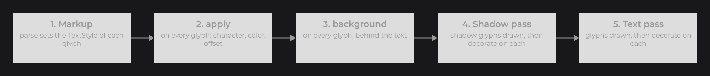
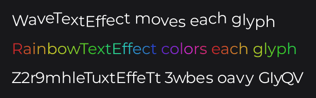

# Markup and Text Effects

Markup and effects style a string from the inside. An `ITextMarkup` turns inline codes such as `<b>` into style changes; an `ITextEffect` transforms and decorates each glyph (an underline, a highlight, a wave). JOID has no markup syntax of its own: you write or pick the markup of your project, and it works with every [glyph font](../fonts/how-fonts-work.md#glyph-fonts-with-glyphfont), when text is drawn and when it is measured.

```java
TextMarkup.register(TagTextMarkup.inst());
final TextInfo info = TextInfo.create(font, 28F, Color.WHITE);
TextNode.create(100, 100).text(Text.create("<b>Bold</b>, <i>italic</i>, <c=ff5555>red</c> and <u>underlined</u>", info)).attach(this);
```


`TagTextMarkup` and its `UnderlineTextEffect` are the two classes below. `ITextMarkup` and `TextMarkup` are in `dev.joid.lib.font.dto.markup`, `ITextEffect` and `ITextGlyph` in `dev.joid.lib.font.dto.effect`, `TextStyle` in `dev.joid.lib.font.dto`; `font` is a loaded font family (see [Adding Your Own Fonts](../fonts/adding-fonts.md)).

## Writing markup with ITextMarkup

Before each character of a run, JOID asks the markups whether a code starts there. A markup returns `0` when nothing starts at `index`; otherwise it changes `style` and returns the number of characters the code takes:

```java
@NoArgsConstructor(access = AccessLevel.PRIVATE)
public final class TagTextMarkup implements ITextMarkup {

	private static final TagTextMarkup INSTANCE = new TagTextMarkup();

	private static final Pattern TAG = Pattern.compile("<(?:([biu])|c=([0-9a-fA-F]{6})|/([biuc]))>");

	public static @NonNull TagTextMarkup inst() {
		return TagTextMarkup.INSTANCE;
	}

	@Override
	public int parse(final @NonNull String text, final int index, final @NonNull TextStyle style) {
		if (text.charAt(index) != '<') {
			return 0;
		}

		final Matcher matcher = TagTextMarkup.TAG.matcher(text).region(index, text.length());
		if (!matcher.lookingAt()) {
			return 0;
		}

		final TextStyle base = style.getBase();
		if (matcher.group(2) != null) {
			style.color(Color.decode("#" + matcher.group(2)));
		} else if ("b".equals(matcher.group(1))) {
			style.weight(FontWeight.BOLD);
		} else if ("i".equals(matcher.group(1))) {
			style.italic(true);
		} else if ("u".equals(matcher.group(1))) {
			style.effect(UnderlineTextEffect.inst());
		} else if ("b".equals(matcher.group(3))) {
			style.weight(base.getWeight());
		} else if ("i".equals(matcher.group(3))) {
			style.italic(base.isItalic());
		} else if ("u".equals(matcher.group(3))) {
			style.removeEffect(UnderlineTextEffect.inst());
		} else {
			style.color(base.getColor());
		}
		return matcher.end() - index;
	}

}
```

- The characters of a code are neither drawn nor measured; the next character is read after them.
- `style` is a working copy that starts from the style of the `TextInfo` at each run and keeps its changes until the end of the run. `style.getBase()` is the style of the `TextInfo`, to close a tag back to it.
- `parse` runs for every character of every run, at every measure and draw: return `0` at once when the character cannot start a code.

| Change | Call |
|---|---|
| Weight | `style.weight(FontWeight.BOLD)`: the face switches and kerning restarts. |
| Italic | `style.italic(true)` |
| Color | `style.color(color)`; ignored when the `TextInfo` is not `colored`. |
| Effect | `style.effect(effect)`, `style.removeEffect(effect)`; a style holds each effect once. |
| Back to the `TextInfo` style | `style.reset()` |

## Registering markup with TextMarkup

`TextMarkup.register(markup)` adds a markup for every `TextInfo` that follows the registry; the latest registration is tried first, and the first markup that consumes characters at an index wins. `TextMarkup.unregister(markup)` removes it.

## Choosing the markups of a TextInfo with markups

A `TextInfo` follows the registry until you call `markups(...)` on it. Give it a markup to use only that one, or no argument to draw the raw string:

```java
final TextInfo tagged = TextInfo.create(font, 20F, Color.WHITE).markups(TagTextMarkup.inst());
final TextInfo raw = TextInfo.create(font, 20F, Color.WHITE).markups();
```

Turn markup off for text typed by users, so it shows exactly as entered; the text fields do it unless you call `markup(true)` (see [TextFieldNode](../nodes/input/text-field.md)).

## Markup in wrapped and cut text

In `TextMode.SPLIT` and `BOX`, the style opened by a tag continues on the next lines of the same run, and lines never break inside a tag:

```java
final TextInfo info = TextInfo.create(font, 26F, Color.WHITE).markups(TagTextMarkup.inst());
TextNode.create(100, 100, 360, 0).text(Text.create("<b>a long bold sentence that wraps</b> and the rest", info)).mode(TextMode.SPLIT).attach(this);
```


- Each wrapped line starts with every tag read before the break, replayed in order, so it is measured and drawn in its style. `DrawUtils.TEXT.getLines(...)` returns these lines with their replayed tags (they take no room).
- A space inside a tag (`<c red>`) is never a break, and a word too long for the line is cut before or after a tag, never inside it.
- `TextMode.OVERFLOW` cuts at the last position outside a tag that fits, then adds the mark.
- The style restarts at each `TextElement`: a tag opened in one run does not continue in the next one.

## The demo markup

The demo UIs use `DemoTextMarkup` (`dev.joid.demo.ui.font.markup`, `dev` jars only, `DemoTextMarkup.inst()`). Its syntax is a reference for your own:

| Tag | Effect | Closing tag |
|---|---|---|
| `<b>` | Bold | `</b>`: base weight |
| `<w=NNN>` | Weight of three digits, through `FontWeight.of` | `</w>`: base weight |
| `<i>` | Italic | `</i>` |
| `<c=RRGGBB>` | Color | `</c>`: base color |
| `<u>` | Underline effect | `</u>` |
| `<h>` | Highlight effect | `</h>` |

; right, the same strings with markups(DemoTextMarkup.inst()).")

Closing tags go back to the `TextInfo` style; they do not restore an outer tag of the same kind.

## Text effects with ITextEffect

An `ITextEffect` takes part in drawing each glyph it is attached to. Its three hooks are `default` no-ops: override the ones you need. Attach an effect to a whole run with `TextInfo.effects(...)`, or to part of a string from markup with `style.effect(...)`:

```java
@NoArgsConstructor(access = AccessLevel.PRIVATE)
public final class HighlightTextEffect implements ITextEffect {

	private static final Color               COLOR    = new Color(255, 214, 0, 110);
	private static final HighlightTextEffect INSTANCE = new HighlightTextEffect();

	public static @NonNull HighlightTextEffect inst() {
		return HighlightTextEffect.INSTANCE;
	}

	@Override
	public void background(final @NonNull ITextGlyph glyph) {
		final double top = glyph.getBaseline() - glyph.getAscender();
		DrawUtils.SHAPE.drawRect(glyph.getX(), top, glyph.getAdvance(), glyph.getBaseline() - glyph.getDescender() - top, HighlightTextEffect.COLOR);
	}

}
```

```java
final TextInfo info = TextInfo.create(font, 32F, Color.WHITE).effects(HighlightTextEffect.inst());
TextNode.create(100, 100).text(Text.create("Highlighted text", info)).attach(this);
```

 behind each glyph of the run.")

| Hook | When | Use |
|---|---|---|
| `apply(ITextGlyph glyph)` | Before anything is drawn. | Change the character, the color or the offset of the glyph. |
| `background(ITextGlyph glyph)` | After every `apply`, before the shadow and the text. | Draw behind the text. |
| `decorate(ITextGlyph glyph)` | After the glyphs of a pass are drawn, once for the shadow and once for the text. | Draw over the glyphs. |

For one line, JOID runs the passes in this order:



The shadow glyphs are copies of the glyphs after `apply`, shifted by the shadow offset and drawn with the shadow color: an animated or random character looks the same on the text and on its shadow. Effects only run when text is drawn: they never change the measured width or the layout.

```java
final TextInfo info = TextInfo.create(font, 32F, Color.WHITE).effects(WaveTextEffect.inst()).shadow(Color.BLACK);
TextNode.create(100, 100).text(Text.create("the shadow waves with the text", info)).attach(this);
```


### Effect examples

Each effect is a stateless singleton, like the highlight above; only its hook changes. An underline, drawn over the glyphs in the color of each pass:

```java
@Override
public void decorate(final @NonNull ITextGlyph glyph) {
	DrawUtils.SHAPE.drawRect(glyph.getX(), glyph.getUnderlineY(), glyph.getAdvance(), glyph.getUnderlineThickness(), glyph.getColor());
}
```

A wave that moves each glyph without touching the layout:

```java
@Override
public void apply(final @NonNull ITextGlyph glyph) {
	glyph.offset(0D, Math.sin(BridgeHandler.CLOCK.get().currentTimeMillis() / 150D + glyph.getIndex() * 0.6D) * glyph.getSize() / 8D);
}
```

A rainbow, glyph by glyph, keeping the alpha of the text:

```java
@Override
public void apply(final @NonNull ITextGlyph glyph) {
	glyph.color(Color.RAINBOW(BridgeHandler.CLOCK.get().currentTimeMillis() + glyph.getIndex() * 120L).copyAlpha(glyph.getColor().a));
}
```

Scrambled characters of about the same width, changing every 80 ms and centered on the original:

```java
private static final String POOL = "abcdefghijklmnopqrstuvwxyzABCDEFGHIJKLMNOPQRSTUVWXYZ0123456789";

@Override
public void apply(final @NonNull ITextGlyph glyph) {
	if (Character.isWhitespace(glyph.getCodepoint())) {
		return;
	}

	final double advance = glyph.getAdvance(glyph.getCodepoint());
	final long seed = (BridgeHandler.CLOCK.get().currentTimeMillis() / 80L * 31L + glyph.getIndex()) * 0x9E3779B97F4A7C15L;
	final char candidate = ScrambleTextEffect.POOL.charAt((int) ((seed >>> 33) % ScrambleTextEffect.POOL.length()));
	if (glyph.hasGlyph(candidate) && Math.abs(glyph.getAdvance(candidate) - advance) <= advance * 0.25D) {
		glyph.codepoint(candidate).offset(glyph.getOffsetX() + (advance - glyph.getAdvance(candidate)) / 2D, glyph.getOffsetY());
	}
}
```

```java
final TextInfo info = TextInfo.create(font, 32F, Color.WHITE);
TextNode.create(100, 100).text(Text.create("WaveTextEffect moves each glyph", info.copy().effects(WaveTextEffect.inst()))).attach(this);
TextNode.create(100, 160).text(Text.create("RainbowTextEffect colors each glyph", info.copy().effects(RainbowTextEffect.inst()))).attach(this);
TextNode.create(100, 220).text(Text.create("ScrambleTextEffect swaps each glyph", info.copy().effects(ScrambleTextEffect.inst()))).attach(this);
```



`BridgeHandler` is in `dev.joid.lib.bridge`. The demo UIs `UIDemoText` and `UIDemoMarkup` show every case of this page.

## Reference

### ITextMarkup and TextMarkup

| Method | Description |
|---|---|
| `int parse(String text, int index, TextStyle style)` | `ITextMarkup`: `0` when no code starts at `index`; otherwise changes `style` and returns the length of the code. |
| `TextMarkup.register(ITextMarkup markup)` | Adds a markup for every `TextInfo` that follows the registry, tried first. |
| `TextMarkup.unregister(ITextMarkup markup)` | Removes it; an unknown markup is ignored. |
| `TextMarkup.getRegistered()` | Registered markups, latest first, read-only. |
| `TextMarkup.parse(List<ITextMarkup> markups, String text, int index, TextStyle style)` | Asks each markup in order and returns the first count above 0, or `0`. |

### TextStyle

`TextStyle` is the style of one glyph: weight, italic flag, color and effects. Drawing starts from `TextInfo.getStyle()`, and markup edits a working copy as it reads the string.

| Method | Description |
|---|---|
| `TextStyle.create(FontWeight weight, boolean italic, Color color, ITextEffect... effects)` | Root style, its own base. |
| `weight(FontWeight)`, `italic(boolean)`, `color(Color)` | Change the style. |
| `effect(ITextEffect effect)`, `removeEffect(ITextEffect effect)` | Add an effect (once) or remove it. |
| `reset()` | Restores the weight, italic flag, color and effects of the base. |
| `derive()` | New style whose base is this one. |
| `copy()` | Snapshot with the same base. |
| `getBase()` | The base style, this style at the root; while a run is laid out, the style of its `TextInfo`. |
| `getWeight()`, `isItalic()`, `getColor()`, `getEffects()` | Current values; the effect list is read-only. |

### ITextGlyph

Positions and sizes are in UI units.

| Method | Description |
|---|---|
| `getIndex()` | Index of the character in the string of the run, markup included. |
| `getCodepoint()` | Character drawn. |
| `getX()`, `getBaseline()` | Pen position of the glyph and Y of the baseline. |
| `getSize()` | Font size. |
| `getAdvance()` | Distance to the next glyph, kerning and letter spacing included: consecutive glyphs touch. |
| `getAdvance(int codepoint)`, `hasGlyph(int codepoint)` | Advance of another character of the face at this size, and whether the face holds it. |
| `getAscender()`, `getDescender()` | Height above the baseline (positive) and depth below it (negative). |
| `getUnderlineY()`, `getUnderlineThickness()` | Y of the underline and its thickness, from the font. |
| `getOffsetX()`, `getOffsetY()` | Offset applied when the glyph is drawn. |
| `getColor()` | Color of the glyph (the shadow color in the shadow pass). |
| `getStyle()` | `TextStyle` of the glyph. |
| `isShadow()` | `true` in the shadow pass. |
| `codepoint(int codepoint)` | Draws another character in the same place; the layout does not change. |
| `color(Color color)` | Draws the glyph with another color. |
| `offset(double x, double y)` | Sets the offset of the glyph. |

## Pitfalls

- The style restarts at each `TextElement`; a tag never carries over to the next run.
- With `colored(false)`, markup colors are ignored. Markup colors take the alpha of the `TextInfo` color.
- `Text.getText()` and `TextElement.getText()` return the string with its codes; only measuring and drawing read them.
- A style holds each effect once: share one instance per effect (a singleton), never `new` in `parse`.
- Effects never change the layout: an effect that draws a wider glyph overlaps its neighbors.

## See also

- [Text and TextInfo](text-and-textinfo.md)
- [Styling Text](styling-text.md)
- [TextFieldNode](../nodes/input/text-field.md)
- [Custom Font Implementations](../fonts/custom-fonts.md)
- [Drawing Text](../drawing/text.md)