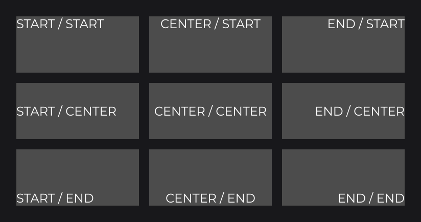
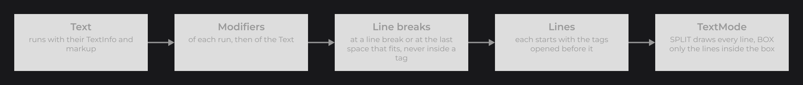
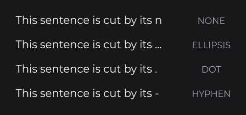
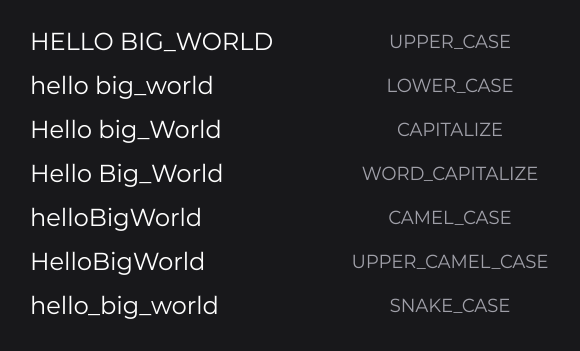

# Styling Text

Once a [`TextInfo`](text-and-textinfo.md) gives a run its font, size and color, you shape the text with a weight (`FontWeight`), italic, an alignment, a layout mode for boxes (`TextMode`), an overflow mark (`TextOverflow`) and modifiers that rewrite the string (`TextModifier`). Use this page to lay a text out in its node.

```java
final TextInfo title = TextInfo.create(font, FontWeight.SEMI_BOLD, 32F, Color.WHITE).italic(true);
RectNode
.create(100, 100, 500, 80)
.color(Color.DARKGRAY)
.body(rect -> {
	TextNode.create(0, 0, 500, 80).text(Text.create("player settings", title, Align.CENTER, Align.CENTER).modifier(TextModifier.WORD_CAPITALIZE)).attach(rect);
})
.attach(this);
```


`font` is the family loaded with `MsdfFontLoader` in [Text](../essentials/text.md#loading-a-font-with-msdffontloader); the Fonts section ([Adding Your Own Fonts](../fonts/adding-fonts.md)) covers loading in detail. `FontWeight` is in `dev.joid.lib.font`, `TextModifier` and `ITextModifier` in `dev.joid.lib.draw.text.builder.modifier`, `TextOverflow` in `dev.joid.lib.draw.text.builder.utils`, `TextMode` in `dev.joid.lib.draw.text.utils`, `Align` in `dev.joid.lib.utils.align`.

## Weight with FontWeight

`FontWeight` names the nine CSS weights. Set it with `TextInfo.create(font, weight, size)` or `TextInfo.weight(...)`:

```java
FlexNode
.vertical(100, 100, 360)
.margin(6D)
.body(flex -> {
	for (final FontWeight weight : FontWeight.values()) {
		TextNode.create(0, 0).text(Text.create(weight.name() + " " + weight.getValue(), TextInfo.create(font, weight, 26F, Color.WHITE))).attach(flex);
	}
})
.attach(this);
```

 and with italic(true).")

| Constant | Value | Constant | Value |
|---|---|---|---|
| `THIN` | 100 | `SEMI_BOLD` | 600 |
| `EXTRA_LIGHT` | 200 | `BOLD` | 700 |
| `LIGHT` | 300 | `EXTRA_BOLD` | 800 |
| `REGULAR` | 400 | `BLACK` | 900 |
| `MEDIUM` | 500 | | |

- `getValue()` returns the numeric weight.
- `FontWeight.of(int value)` returns the nearest named weight, a half step rounding up, clamped to 100–900: `of(600)` is `SEMI_BOLD`, `of(650)` is `BOLD`, `of(1000)` is `BLACK`.
- A weight draws the face of that weight when the family has it, its closest face otherwise (see [Choosing a face](../fonts/how-fonts-work.md#choosing-a-face-with-fontfamily-resolve)); dev mode then prints a [missing weight warning](../fonts/adding-fonts.md#missing-weight-warnings). Load every weight you use.

## Italic

`TextInfo.italic(true)` draws the italic face of the family. When the family has no italic face, the upright glyphs are sheared by 0.2 (about 11°), so italic always shows; load the italic file of the font for the real italic shapes.

## Alignment with horizontalAlign and verticalAlign

The alignment belongs to the `Text`: pass it to `Text.create(...)` or set it with `horizontalAlign(Align)` and `verticalAlign(Align)` (`START`, `CENTER` or `END`):

```java
final TextInfo info = TextInfo.create(font, 24F, Color.WHITE);
final Align[] aligns = {Align.START, Align.CENTER, Align.END};
for (int row = 0; row < 3; row++) {
	for (int column = 0; column < 3; column++) {
		final Text text = Text.create(aligns[column] + " / " + aligns[row], info, aligns[column], aligns[row]);
		RectNode
		.create(100 + column * 260, 100 + row * 130, 240, 110)
		.color(Color.DARKGRAY)
		.body(rect -> {
			TextNode.create(0, 0, 240, 110).text(text).attach(rect);
		})
		.attach(this);
	}
}
```



- In a node or a box, the text is aligned inside the box.
- Drawn at a point (`DrawUtils.TEXT.drawText(x, y, text)`), the alignment says which part of the text sits on the point: with `CENTER` / `CENTER` the point is the center of the text, with `END` its right or bottom edge (see [Drawing Text](../drawing/text.md)).
- Runs of different heights are aligned vertically inside the height of the tallest one.

## Layout in a box with TextMode

`TextMode` chooses how a text is laid out in its box. Set it with `TextNode.mode(...)`, or pass it to the box overloads of `DrawUtils.TEXT.drawText`:

```java
final TextInfo info = TextInfo.create(font, 22F, Color.WHITE);
for (final TextMode mode : TextMode.values()) {
	RectNode
	.create(100 + mode.ordinal() % 2 * 760, 100 + mode.ordinal() / 2 * 200, 260, 60)
	.color(Color.DARKGRAY)
	.body(rect -> {
		TextNode.create(0, 0, 260, 60).text(Text.create("A long sentence wraps on the width of its box, line after line", info, TextOverflow.ELLIPSIS)).mode(mode).attach(rect);
	})
	.attach(this);
}
```


| Mode | Behavior | Size of a `TextNode` |
|---|---|---|
| `NORMAL` (default) | One line, aligned in the box, never cut. | A width or height of 0 takes the size of the text. |
| `OVERFLOW` | One line; a text wider than the box is cut and ends with the overflow mark. | A height of 0 takes the line height. |
| `SPLIT` | Wraps into lines that fit the width; every line is drawn. | The height becomes the height of the lines. |
| `BOX` | Wraps like `SPLIT` and draws only the lines that fit entirely inside the box. | Unchanged. |

How `SPLIT` and `BOX` break a text into lines:



- A line breaks at `\n`, `\r`, `\r\n` and `<br>`, then at the last space that fits. A word wider than the box is cut where it overflows.
- A space inside a markup tag is never a break, and a cut never falls inside a tag. A style opened by markup continues on the next lines of the same run (see [Markup and Text Effects](markup-and-effects.md#markup-in-wrapped-and-cut-text)).
- `NORMAL` and `OVERFLOW` ignore line breaks: the text stays on one line.

## Overflow marks with TextOverflow

`TextOverflow` is the mark that ends a text cut by `TextMode.OVERFLOW`. Pass it to `Text.create(..., TextOverflow)` or set it with `Text.overflow(...)`:

```java
final TextInfo info = TextInfo.create(font, 22F, Color.WHITE);
for (final TextOverflow overflow : TextOverflow.values()) {
	TextNode.create(100, 100 + overflow.ordinal() * 50, 300, 0).text(Text.create("This sentence is cut by its node", info, overflow)).mode(TextMode.OVERFLOW).attach(this);
}
```



| Constant | Mark |
|---|---|
| `NONE` (default) | Nothing: the text is cut without mark. |
| `ELLIPSIS` | `...` |
| `DOT` | `.` |
| `HYPHEN` | `-` |

The text is cut at the last position that leaves room for the mark, never inside a markup tag. `getOverflow()` on a constant returns its mark.

## Text modifiers with TextModifier

An `ITextModifier` rewrites the string right before it is measured and drawn. Set it with `Text.modifier(...)` or `TextElement.modifier(...)`; `null` removes it. `TextModifier` holds the built-in ones:

```java
final TextInfo info = TextInfo.create(font, 24F, Color.WHITE);
final ITextModifier[] modifiers = {TextModifier.UPPER_CASE, TextModifier.LOWER_CASE, TextModifier.CAPITALIZE, TextModifier.WORD_CAPITALIZE, TextModifier.CAMEL_CASE, TextModifier.UPPER_CAMEL_CASE, TextModifier.SNAKE_CASE};
for (int i = 0; i < modifiers.length; i++) {
	TextNode.create(100, 100 + i * 44).text(Text.create("hello big_World", info).modifier(modifiers[i])).attach(this);
}
```



| Constant | Rule | `"hello big_World"` becomes |
|---|---|---|
| `UPPER_CASE` | Upper case. | `HELLO BIG_WORLD` |
| `LOWER_CASE` | Lower case. | `hello big_world` |
| `CAPITALIZE` | First character in upper case, the rest unchanged. | `Hello big_World` |
| `WORD_CAPITALIZE` | First character of every whitespace-separated word in upper case. | `Hello Big_World` |
| `CAMEL_CASE` | Splits on every character that is not a letter or a digit; first word in lower case, the next ones capitalized. | `helloBigWorld` |
| `UPPER_CAMEL_CASE` | Same split, every word capitalized. | `HelloBigWorld` |
| `SNAKE_CASE` | Lower case, spaces replaced by `_`. | `hello_big_world` |

- The case changes ignore the default locale of the JVM (`Locale.ROOT`): `"title"` gives `"TITLE"` on every system.
- A run modifier applies first, then the modifier of the `Text`, on the joined text of every run: a rule that depends on the previous characters stays right across runs.
- A custom modifier is a lambda: `Text.create(this.password.get(), info).modifier(text -> text.replaceAll(".", "*"))`.

## Reference

| `Text` method | Description |
|---|---|
| `horizontalAlign(Align align)`, `verticalAlign(Align align)` | Alignment, `START` by default. |
| `overflow(TextOverflow overflow)` | Mark of a text cut by `TextMode.OVERFLOW`, `NONE` by default. |
| `modifier(ITextModifier modifier)` | Modifier of the joined text; `null` removes it. |
| `getHorizontalAlignment()`, `getVerticalAlignment()`, `getOverflow()`, `getModifier()` | Current settings. |

| `TextNode` method | Description |
|---|---|
| `mode(TextMode mode)`, `mode(Supplier<TextMode> mode)` | Layout in the node, `NORMAL` by default (see [TextNode](../nodes/visual/text.md)). |

| Type | Members |
|---|---|
| `FontWeight` | The nine constants, `getValue()`, `FontWeight.of(int value)`. |
| `TextMode` | `NORMAL`, `OVERFLOW`, `SPLIT`, `BOX`. |
| `TextOverflow` | `NONE`, `ELLIPSIS`, `DOT`, `HYPHEN`, `getOverflow()`. |
| `TextModifier` | `UPPER_CASE`, `LOWER_CASE`, `CAPITALIZE`, `WORD_CAPITALIZE`, `CAMEL_CASE`, `UPPER_CAMEL_CASE`, `SNAKE_CASE`. |
| `ITextModifier` | `String modify(String text)`. |

## Pitfalls

- A weight the family does not hold draws its closest face: load every weight you use, and watch the dev warnings.
- Line breaks (`\n`, `<br>`) only break in `SPLIT` and `BOX`.
- In `NORMAL` mode, a `TextNode` created with a width or height of 0 takes the size of its text; give it a size to align the text in a box.
- `BOX` keeps the size of the node: size it for the lines you want to show.

## See also

- Next: [Markup and Text Effects](markup-and-effects.md)
- [Text and TextInfo](text-and-textinfo.md)
- [TextNode](../nodes/visual/text.md)
- [Drawing Text](../drawing/text.md)
- [How Fonts Work](../fonts/how-fonts-work.md)