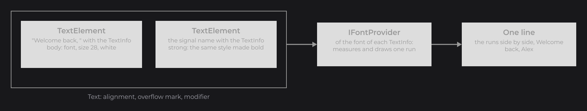

# Text and TextInfo

A `Text` is a line of text made of one or more runs (`TextElement`), and each run carries its style in a `TextInfo`: font, size, weight, color, spacing, shadow, markup and effects. The same objects feed `TextNode`, `DrawUtils.TEXT` and every measure, so you build a style once and reuse it everywhere. This page opens the Text section and goes deeper into the model that [Text](../essentials/text.md) introduced.

```java
final TextInfo info = TextInfo.create(font, 32F, Color.WHITE);
TextNode.create(100, 100).text(Text.create("Hello JOID", info)).attach(this);
```


`font` is the family loaded with `MsdfFontLoader` in [Text](../essentials/text.md#loading-a-font-with-msdffontloader); the Fonts section ([Adding Your Own Fonts](../fonts/adding-fonts.md)) covers loading in detail. The examples of this page use that `font`. `TextInfo` and `FontBounds` are in `dev.joid.lib.font.dto`, `Text` and `TextElement` in `dev.joid.lib.draw.text.builder`, `FontWeight` in `dev.joid.lib.font`.

## Runs with TextElement

A `Text` holds its runs in order and draws them side by side on one line. Give each run its own `TextInfo` to mix styles, fonts or colors in one line:

```java
private final Signal<String> name = Signal.of("Alex");

@Override
public void init() {
	final TextInfo body = TextInfo.create(font, 28F, Color.WHITE);
	final TextInfo strong = body.copy().weight(FontWeight.BOLD);
	TextNode.create(100, 100).text(Text.create(TextElement.create("Welcome back, ", body), TextElement.create(this.name, strong))).attach(this);
}
```


The second run follows the signal `name`: when it changes, the run shows the new name and the line is measured again. How the pieces fit together:



| Object | Role |
|---|---|
| `TextInfo` | The style of a run: font, size, weight, italic, color, spacing, line height, shadow, markup, effects. |
| `TextElement` | One run: a text source and its `TextInfo`, plus an optional modifier. |
| `Text` | The runs of one line, with an alignment, an overflow mark and an optional modifier. |
| `FontBounds` | The width and height returned by every measure and draw. |

Weights, alignment, layout in a box, overflow marks and modifiers are on [Styling Text](styling-text.md).

## Styles with TextInfo

`TextInfo.create(font, size)` makes a style; every setter changes the instance and returns it, so a style reads as one chain:

```java
final TextInfo info = TextInfo.create(font, 28F, Color.WHITE);
FlexNode
.vertical(100, 100, 700)
.margin(14D)
.body(flex -> {
	TextNode.create(0, 0).text(Text.create("Default style", info)).attach(flex);
	TextNode.create(0, 0).text(Text.create("Letter spacing 0.2", info.copy().letterSpacing(0.2F))).attach(flex);
	TextNode.create(0, 0).text(Text.create("Letter spacing -0.05", info.copy().letterSpacing(-0.05F))).attach(flex);
	TextNode.create(0, 0).text(Text.create("Bold weight", info.copy().weight(FontWeight.BOLD))).attach(flex);
	TextNode.create(0, 0).text(Text.create("Italic", info.copy().italic(true))).attach(flex);
	TextNode.create(0, 0).text(Text.create("Default shadow", info.copy().shadow())).attach(flex);
	TextNode.create(0, 0).text(Text.create("Offset shadow", info.copy().shadow(Color.DARKGRAY).shadow(4F, 4F))).attach(flex);
	TextNode.create(0, 0).text(Text.create("Gradient color", info.copy().color(Color.WHITE.toGradient(Color.GRAY)))).attach(flex);
})
.attach(this);
```

.")

A new `TextInfo` starts upright, colored by markup, without letter spacing, with the line height of the font, without shadow, without effects and following the registered markups. The full list of properties and their defaults is in the [Reference](#reference).

### Shadows

- `shadow()` sets the shadow color to the text color made 30 % darker; `shadow(Color)` sets any color, `null` removes the shadow.
- Without `shadow(x, y)`, the offset is `fontSize / 13.5` on both axes and follows the current size: a later `fontSize(...)` moves the shadow with it. An offset set with `shadow(x, y)` stays fixed.
- `shadow(x, y)` only sets the offset: without a shadow color, nothing is drawn.

### Colors and alpha

- With `colored(true)` (the default), a color set by markup replaces the `TextInfo` color for the following glyphs and takes the alpha of the `TextInfo` color: fading `color` fades every glyph, markup colors included.
- With `colored(false)`, every glyph takes `color`; text effects can still recolor glyphs (see [Markup and Text Effects](markup-and-effects.md)).
- A gradient color spans the whole line, every run included. The shadow takes the shadow color, never the markup colors.

## Sharing a TextInfo with copy

A `TextInfo`, a `TextElement` and a `Text` are shared by reference: two runs built on the same `TextInfo` change together. Call `copy()` to derive a style without touching the one other runs use:

```java
final TextInfo title = body.copy().fontSize(40F).weight(FontWeight.BOLD);
```

## Text that follows signals

Every value overload of `Text` and `TextElement` follows the signals its expression reads, like the setters of the nodes (see [Reactive Properties](../state/reactive-properties.md)):

```java
private final IntegerSignal clicks = IntegerSignal.of(0);

@Override
public void init() {
	final long opened = BridgeHandler.CLOCK.get().currentTimeMillis();
	TextNode.create(100, 100).text(Text.create("Clicks: " + this.clicks.get(), info)).attach(this);
	TextNode.create(100, 140).text(Text.create(() -> "Open for " + (BridgeHandler.CLOCK.get().currentTimeMillis() - opened) / 1000L + " s", info)).attach(this);
}
```

| You write | The text |
|---|---|
| A plain value: `Text.create("Settings", info)` | Fixed. |
| An expression that reads signals: `Text.create("Clicks: " + this.clicks.get(), info)` | Follows `clicks` and is recomputed when it changes; the `Text` is not recreated. |
| A signal, a `map(...)` or a `Signal.from(...)`: `TextElement.create(this.name, strong)` | Follows the signal. |
| A lambda: `Text.create(() -> ..., info)` | Read at every measure and draw, for clocks and animations. |

The text itself follows; the `TextInfo`, the alignment, the overflow mark and the modifier are plain values. To make the style depend on a signal, build the whole `Text` in the expression given to `TextNode.text(...)`, which follows it as one value:

```java
TextNode.create(100, 180).text(Text.create("Sound", TextInfo.create(font, 24F, this.muted.get() ? Color.GRAY : Color.WHITE))).attach(this);
```

## Measuring text

A `TextInfo` measures a string and a `Text` measures its runs. `aw` and `ah` add a value to the width or height, `dw` and `dh` divide it, which sizes a box around a text in one call:

```java
final TextInfo caption = TextInfo.create(font, FontWeight.MEDIUM, 20F, Color.WHITE);
RectNode
.create(100, 100, caption.aw("Settings", 24D), caption.ah(12D))
.color(Color.GRAY)
.body(rect -> {
	TextNode.create(12, 6).text(Text.create("Settings", caption)).attach(rect);
})
.attach(this);
```

.")

- A width covers the advances, the kerning and the letter spacing, without the spacing after the last glyph. Markup characters take no room.
- A height is the line height: `lineHeight * fontSize` when `lineHeight` is above 0, the line height of the font face otherwise.
- A `Text` caches its size and measures again when the raw text of a run, a modifier, or the font, size, weight, italic flag, letter spacing, line height or markups of a `TextInfo` change, even when you change a `TextInfo` in place. Color, shadow and effects never change the size.

## Reference

### TextInfo

| Factory | Description |
|---|---|
| `TextInfo.create(IFont font, float fontSize)` | `REGULAR` weight, black. |
| `TextInfo.create(IFont font, float fontSize, Color color)` | `REGULAR` weight, given color. |
| `TextInfo.create(IFont font, FontWeight weight, float fontSize)` | Given weight, black. |
| `TextInfo.create(IFont font, FontWeight weight, float fontSize, Color color)` | Given weight and color. |

| Method | Description | Default |
|---|---|---|
| `font(IFont font)` | Font of the run. | Given at creation |
| `fontSize(float fontSize)` | Size of the em, in UI units. | Given at creation |
| `weight(FontWeight weight)` | Weight the family resolves (see [How Fonts Work](../fonts/how-fonts-work.md#choosing-a-face-with-fontfamily-resolve)). | `FontWeight.REGULAR` |
| `italic(boolean italic)` | Draws the italic face, or slants the upright face when the family has no italic face. | `false` |
| `letterSpacing(float letterSpacing)` | Space added between two glyphs, as a fraction of the font size: `0.1F` adds 10 % of the size, a negative value tightens. | `0F` |
| `lineHeight(float lineHeight)` | Line height as a fraction of the font size (`1.5F` = 150 %); `0F` keeps the line height of the font. | `0F` |
| `color(Color color)` | Color of the text; a gradient spans the whole line. | Given at creation, `Color.BLACK` otherwise |
| `colored(boolean colored)` | `false` ignores the colors set by markup. | `true` |
| `shadow()` | Shadow color: the text color made 30 % darker (`color.darker(0.3F)`). | No shadow |
| `shadow(Color color)` | Shadow color; `null` removes the shadow. | `null` |
| `shadow(float x, float y)` | Fixed shadow offset, in UI units. | `fontSize / 13.5` on both axes, following the size |
| `markups(ITextMarkup... markups)` | Uses only these markups; `markups()` with no argument turns markup off. | Follows the `TextMarkup` registry |
| `effects(ITextEffect... effects)` | Effects applied to every glyph of the run. | None |
| `copy()` | New `TextInfo` with every property copied. | |

| Getter | Description |
|---|---|
| `getFont()`, `getFontSize()`, `getWeight()`, `isItalic()`, `getLetterSpacing()`, `getLineHeight()`, `getColor()`, `isColored()` | Current values. |
| `getShadowColor()` | Shadow color, `null` without shadow. |
| `getShadowX()`, `getShadowY()` | Shadow offset: the fixed one, or `fontSize / 13.5`. |
| `getMarkups()` | The markups of the run (the registered ones while `markups(...)` was never called), read-only. |
| `getEffects()` | The effects, read-only. |
| `getStyle()` | A new [`TextStyle`](markup-and-effects.md#textstyle) of the weight, italic flag, color and effects. |

| Measure | Description |
|---|---|
| `getWidth(String text)` | Width of the text on one line. |
| `getHeight()`, `getHeight(String text)` | Line height. |
| `getBounds(String text)` | `FontBounds` of the width and height. |
| `aw(String text, double value)`, `ah(double value)`, `ah(String text, double value)` | Width or height plus `value`. |
| `dw(String text, double value)`, `dh(double value)`, `dh(String text, double value)` | Width or height divided by `value`. |

### Text

A `Text` starts aligned `START` / `START`, with `TextOverflow.NONE` and no modifier.

| Factory | Description |
|---|---|
| `Text.create()` | Empty text. |
| `Text.create(TextElement... elements)`, `Text.create(List<TextElement> elements)` | Text made of these runs. |
| `Text.create(Object text, TextInfo info)` | One run: fixed, or following the signals its expression reads. |
| `Text.create(Supplier<?> text, TextInfo info)` | One run read from the supplier; a signal is followed, a lambda is read at every measure and draw. |
| `Text.create(text, info, Align horizontalAlign)` | One run, horizontal alignment. `text` is an `Object` or a `Supplier<?>` in every factory of this list. |
| `Text.create(text, info, TextOverflow overflow)` | One run, overflow mark. |
| `Text.create(text, info, Align align, TextOverflow overflow)` | One run, horizontal alignment and overflow mark. |
| `Text.create(text, info, Align horizontalAlign, Align verticalAlign)` | One run, both alignments. |
| `Text.create(text, info, Align horizontalAlign, Align verticalAlign, TextOverflow overflow)` | One run, both alignments and overflow mark. |

| Method | Description |
|---|---|
| `text(String text)`, `text(Supplier<?> text)` | Replaces the text of the first run. |
| `text(int index, String text)`, `text(int index, Supplier<?> text)` | Replaces the text of a run; an index outside the list is ignored. |
| `info(TextInfo info)`, `info(int index, TextInfo info)` | Replaces the `TextInfo` of the first run or of a run; an index outside the list is ignored. |
| `add(TextElement element)`, `add(Text text)`, `addAll(List<TextElement> elements)` | Appends runs (`add(Text)` appends the same run instances). |
| `remove(TextElement element)`, `clear()` | Removes one run, or every run. |
| `horizontalAlign(Align align)`, `verticalAlign(Align align)` | Alignment (see [Styling Text](styling-text.md#alignment-with-horizontalalign-and-verticalalign)). |
| `overflow(TextOverflow overflow)` | Mark of a cut text (see [Styling Text](styling-text.md#overflow-marks-with-textoverflow)). |
| `modifier(ITextModifier modifier)` | Modifier of the joined text; `null` removes it. |
| `copy()` | New text with its own list of the same runs and the same settings. |
| `copyProperties()` | New empty text with the same alignment, overflow mark and modifier. |
| `copyWithModifier(ITextModifier)`, `copyWithOverflow(TextOverflow)`, `copyWithHorizontalAlign(Align)`, `copyWithVerticalAlign(Align)` | `copy()` with one setting replaced. |
| `get(int index)`, `getElementList()` | One run, every run. |
| `getHorizontalAlignment()`, `getVerticalAlignment()`, `getOverflow()`, `getModifier()` | Current settings. |
| `getText()` | Joined text of the runs, with the run modifiers then the text modifier applied. |
| `getText(TextElement element)` | Part of `getText()` that belongs to this run. |
| `getRawText()` | Joined raw text of the runs, without any modifier. |
| `getWidth()`, `getHeight()`, `getBounds()` | Sum of the run widths, height of the tallest run, both as `FontBounds`. |
| `aw(double)`, `ah(double)`, `dw(double)`, `dh(double)` | Width or height plus, or divided by, the value. |
| `isEmpty()` | `true` without run. |

### TextElement

| Method | Description |
|---|---|
| `TextElement.create(Object text, TextInfo info)` | Run with a fixed or followed text. Any object is shown with `toString()`. |
| `TextElement.create(Supplier<?> text, TextInfo info)` | Run read from the supplier. |
| `text(Object text)`, `text(Supplier<?> text)` | Replaces the text source. |
| `info(TextInfo info)` | Replaces the `TextInfo`. |
| `modifier(ITextModifier modifier)` | Modifier of this run only; `null` removes it. |
| `copy()`, `copyWithText(Object)`, `copyWithText(Supplier<?>)`, `copyWithInfo(TextInfo)`, `copyWithModifier(ITextModifier)` | Copies, with one part replaced. |
| `getText()` | Text with the run modifier applied. |
| `getRawText()` | Text without the run modifier. |
| `getInfo()`, `getModifier()` | Current `TextInfo` and modifier. |
| `getOrigin()` | In dev mode, the stack of the code that created the run, which font warnings point at; `null` otherwise. |

### FontBounds

| Method | Description |
|---|---|
| `getWidth()`, `getHeight()` | Size, in UI units. |
| `FontBounds.empty()` | Bounds of 0×0. |

## Pitfalls

- A shared `TextInfo` changes every run built on it: `copy()` before changing a style other runs use.
- When the text and the `TextInfo` of `Text.create(text, info)` both read signals, the text cannot be followed on its own and dev mode prints a warning: build the whole `Text` in the expression given to `TextNode.text(...)` with no signal read in the text, or use a lambda.
- A `null` literal is ambiguous between the value and `Supplier` overloads: write `text((Text) null)`.
- `getText()` returns the string with its markup tags; only measuring and drawing read them.
- A lambda is called at every measure and draw, even when nothing changed: pass the signal or an expression that reads it instead.

## See also

- Next: [Styling Text](styling-text.md)
- [Markup and Text Effects](markup-and-effects.md)
- [TextNode](../nodes/visual/text.md)
- [Reactive Properties](../state/reactive-properties.md)
- [How Fonts Work](../fonts/how-fonts-work.md)
- [Drawing Text](../drawing/text.md)