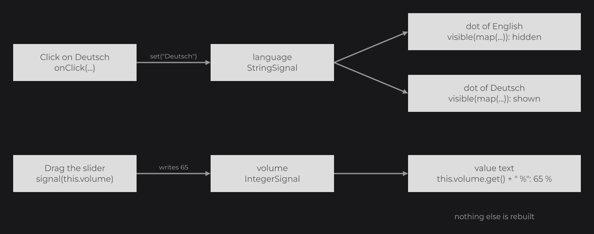

# Tutorial 3: Interactivity and State

In this part the settings screen comes alive: the language list reacts to clicks, the placeholders become real switches and a slider, the screen follows its state through signals, and the values are saved to disk. It applies [Input](../concepts/input.md) and [Signals and State](../concepts/state.md) to the screen of part 2.

You start from the code of [Tutorial 2](layout.md). By the end you add three classes (`ToggleSwitchNode`, `VolumeSliderNode`, `SettingsStore`) and one line to `Main`.

## Step 1: react to a click with onClick

Start with the language list: give each row an `onClick` callback that prints its language:

```java
RectNode
.create(0, 0, 720, 52)
.color(Color.WHITE)
.onClick((node, mouseX, mouseY, button) -> System.out.println("Selected " + language))
.body(item -> {
	TextNode.create(24, item.dh(2)).text(Text.create(language, label)).anchorY(Align.CENTER).attach(item);
})
.attach(list);
```

Click the rows: the console prints the language you clicked. Each lambda captures the `language` of its loop turn. `color(...)` stays before `onClick(...)`: the setters of `RectNode` first, then those every node shares (see [Nodes](../concepts/nodes.md)).

## Step 2: keep the selection in a signal

The selection is state, so it goes in a signal, a field of `SettingsUI`:

```java
private final StringSignal language = StringSignal.of("English");
```

Write the click into the signal, and give each row a dot that shows while its language is the selected one:

```java
RectNode
.create(0, 0, 720, 52)
.color(Color.WHITE)
.onClick((node, mouseX, mouseY, button) -> this.language.set(language))
.body(item -> {
	TextNode.create(24, item.dh(2)).text(Text.create(language, label)).anchorY(Align.CENTER).attach(item);
	CircleNode.create(680, 18, 16).color(Theme.INK).visible(this.language.map(selected -> selected.equals(language))).attach(item);
})
.attach(list);
```

- `CircleNode.create(x, y, diameter)` draws a filled circle.
- `this.language.map(...)` derives a signal from `language`: `true` for the row of the selected language. `visible(...)` follows it, so the dot shows and hides when `language` changes.
- `map` fits here because the loop variable `language` decides the result. When the value depends only on signals and fields, write the plain expression instead, as the next step does.

Click "Deutsch": the dot of English hides and the dot of Deutsch shows. No node is rebuilt: you changed the state, and the values that depend on it followed.




## Step 3: input controls

Controls handle the input and the value; you draw them. The screen needs two: an on/off switch and a slider.

### An on/off switch with CheckboxNode

`CheckboxNode` flips between checked and unchecked on each click. Here it is drawn as a switch: a track and a knob that moves to the right when checked:

```java
package com.example.settings;

import dev.joid.lib.color.Color;
import dev.joid.lib.draw.DrawUtils;
import dev.joid.lib.ui.node.impl.structure.checkbox.CheckboxNode;

public class ToggleSwitchNode extends CheckboxNode {

	protected ToggleSwitchNode(final double x, final double y, final double width, final double height) {
		super(x, y, width, height);
	}

	public static ToggleSwitchNode create(final double x, final double y, final double width, final double height) {
		return new ToggleSwitchNode(x, y, width, height);
	}

	@Override
	public void draw(final double mouseX, final double mouseY) {
		final double size = super.getHeight() - 8D;
		final double knobX = super.isChecked() ? super.getWidth() - size - 4D : 4D;
		DrawUtils.SHAPE.drawRect(super.getX(), super.getY(), super.getWidth(), super.getHeight(), super.isChecked() ? Theme.INK : Theme.CARD);
		DrawUtils.SHAPE.drawRect(super.getX() + knobX, super.getY() + 4D, size, size, Color.WHITE);
	}

}
```

The switch has a `protected` constructor and a static `create(...)` factory, like every node. `draw` runs every frame in the coordinate space of the parent, so the node is at `super.getX()`, `super.getY()`. `DrawUtils.SHAPE` draws the shapes (see [Drawing](../drawing/drawing.md)).

### A slider with IntegerSliderNode

`IntegerSliderNode` picks an integer by dragging a thumb along a track: you draw the track in `drawSlider`, and the thumb is a `SliderThumbNode` that draws itself in `drawThumb`, given to the slider with `thumb(...)`:

```java
package com.example.settings;

import dev.joid.lib.draw.DrawUtils;
import dev.joid.lib.ui.node.impl.structure.slider.SliderThumbNode;
import dev.joid.lib.ui.node.impl.structure.slider.impl.IntegerSliderNode;

public class VolumeSliderNode extends IntegerSliderNode {

	protected VolumeSliderNode(final double x, final double y, final double width, final double height) {
		super(x, y, width, height);
		super.thumb(new Knob(height));
	}

	public static VolumeSliderNode create(final double x, final double y, final double width, final double height) {
		return new VolumeSliderNode(x, y, width, height);
	}

	@Override
	public void drawSlider(final double mouseX, final double mouseY) {
		DrawUtils.SHAPE.drawRect(super.getX(), super.getY() + super.dh(2) - 3D, super.getWidth(), 6D, Theme.CARD);
	}

	private static final class Knob extends SliderThumbNode {

		private Knob(final double size) {
			super(size, size);
		}

		@Override
		public void drawThumb(final double mouseX, final double mouseY) {
			DrawUtils.SHAPE.drawRect(super.getX(), super.getY(), super.getWidth(), super.getHeight(), Theme.INK);
		}

	}

}
```

The slider centers the thumb vertically and moves it along the track; pressing anywhere on the track jumps the thumb under the mouse and starts a drag.

### Connecting the controls to signals

Add three more signals to `SettingsUI`, next to `language`:

```java
private final BooleanSignal music = BooleanSignal.of(true);
private final IntegerSignal volume = IntegerSignal.of(80);
private final BooleanSignal notifications = BooleanSignal.of(false);
```

Then replace the placeholder texts of the three rows with the controls:

```java
final RectNode music = this.row(flex, "Music", label);
ToggleSwitchNode.create(music.aw(-100), 18, 76, 36).signal(this.music).attach(music);
final RectNode volume = this.row(flex, "Volume", label).visible(this.music);
VolumeSliderNode.create(200, 24, 400, 24).values(0, 100, 80).signal(this.volume).attach(volume);
TextNode.create(0, 0, volume.aw(-24), volume.getHeight()).text(Text.create(this.volume.get() + " %", label, Align.END, Align.CENTER)).attach(volume);
```

```java
final RectNode notifications = this.row(flex, "Notifications", label);
ToggleSwitchNode.create(notifications.aw(-100), 18, 76, 36).signal(this.notifications).attach(notifications);
```

| Code | What it does |
| --- | --- |
| `signal(this.music)` | Binds the switch to the signal both ways: each click writes the new state, and a value set elsewhere moves the switch. |
| `values(0, 100, 80)` | The integers from 0 to 100, starting at 80; the binding then applies the value of the signal. |
| `signal(this.volume)` | Binds the slider the same way: each new value is written into the signal. |
| `visible(this.music)` | A boolean signal goes as it is to `visible(...)`: the Volume row shows only while the music is on. |
| `Text.create(this.volume.get() + " %", ...)` | A plain expression that reads a signal: JOID follows it and recomputes the text each time `volume` changes, so "80 %" follows the slider. |

Turn the music off: the Volume row disappears and the next sections move up, because a `FlexNode` gives no room to hidden children.


## Step 4: persist the settings with a store

Restart the program: every value is back to its default, because the signals live in the UI. To keep them, move them into a store with the `PERMANENT` scope, saved to a file between runs. Create `SettingsStore`, with one signal per setting:

```java
package com.example.settings;

import com.google.gson.JsonObject;

import dev.joid.lib.signal.impl.primitive.BooleanSignal;
import dev.joid.lib.signal.impl.primitive.IntegerSignal;
import dev.joid.lib.signal.impl.primitive.StringSignal;
import dev.joid.lib.ui.core.hook.store.UIStore;
import dev.joid.lib.ui.core.hook.store.data.UIStoreData;
import dev.joid.lib.ui.core.hook.store.scope.StoreScope;

@UIStoreData(id = "settings", scope = StoreScope.PERMANENT)
public class SettingsStore extends UIStore {

	private final BooleanSignal music = BooleanSignal.of(true);
	private final IntegerSignal volume = IntegerSignal.of(80);
	private final StringSignal language = StringSignal.of("English");
	private final BooleanSignal notifications = BooleanSignal.of(false);

	@Override
	public void load(final JsonObject json) {
		if (json.has("music")) {
			this.music.set(json.get("music").getAsBoolean());
		}
		if (json.has("volume")) {
			this.volume.set(json.get("volume").getAsInt());
		}
		if (json.has("language")) {
			this.language.set(json.get("language").getAsString());
		}
		if (json.has("notifications")) {
			this.notifications.set(json.get("notifications").getAsBoolean());
		}
	}

	@Override
	public void save(final JsonObject json) {
		json.addProperty("music", this.music.get());
		json.addProperty("volume", this.volume.get());
		json.addProperty("language", this.language.get());
		json.addProperty("notifications", this.notifications.get());
	}

	public BooleanSignal getMusic() {
		return this.music;
	}

	public IntegerSignal getVolume() {
		return this.volume;
	}

	public StringSignal getLanguage() {
		return this.language;
	}

	public BooleanSignal getNotifications() {
		return this.notifications;
	}

}
```

- `@UIStoreData` is required on every store. `id` names the file: `config/store/settings.store` in the working directory.
- `load(JsonObject)` runs once, when the store is created and its file exists; `save(JsonObject)` fills the JSON before each write. A value missing from the file keeps its default.

In `SettingsUI`, replace the four signal fields with the store:

```java
private final SettingsStore settings = super.useStore(SettingsStore.class);
```

then replace `this.music` with `this.settings.getMusic()`, `this.volume` with `this.settings.getVolume()`, and so on. `useStore` creates the store the first time, reading its file, and returns the same instance afterwards.

JOID writes the stores when a UI closes, so `Escape` saves them. Closing the window does not close the UI: in `Main`, save the stores with `UIStoreHook.saveAll()` when the loop ends:

```java
while (!GLFW.glfwWindowShouldClose(window)) {
	GLFW.glfwPollEvents();
	bridge.frame();
	GLFW.glfwSwapBuffers(window);
}

UIStoreHook.saveAll();
GLFW.glfwDestroyWindow(window);
GLFW.glfwTerminate();
```

Add `import dev.joid.lib.ui.core.hook.store.UIStoreHook;`; the rest of `Main` is unchanged.

> TIP: A store fits signals that other screens could share. For a few plain fields of one UI class, such as the selected tab, `@UIProperty` is simpler (see [Signals and State](../concepts/state.md)).

## The complete code

`ToggleSwitchNode`, `VolumeSliderNode` and `SettingsStore` are complete above. `SettingsUI`:

```java
package com.example.settings;

import java.io.File;
import java.util.Arrays;
import java.util.List;

import dev.joid.lib.color.Color;
import dev.joid.lib.draw.text.builder.Text;
import dev.joid.lib.font.FontWeight;
import dev.joid.lib.font.TextInfo;
import dev.joid.lib.resource.Resource;
import dev.joid.lib.ui.core.UI;
import dev.joid.lib.ui.core.data.UIData;
import dev.joid.lib.ui.node.Node;
import dev.joid.lib.ui.node.impl.design.resource.ResourceNode;
import dev.joid.lib.ui.node.impl.design.shape.CircleNode;
import dev.joid.lib.ui.node.impl.design.shape.RectNode;
import dev.joid.lib.ui.node.impl.design.text.TextNode;
import dev.joid.lib.ui.node.impl.structure.flex.FlexNode;
import dev.joid.lib.utils.align.Align;

@UIData(backgroundColor = "#18181B")
public final class SettingsUI extends UI {

	private static final List<String> LANGUAGES = Arrays.asList("English", "Français", "Deutsch", "Español");

	private final SettingsStore settings = super.useStore(SettingsStore.class);

	@Override
	public void init() {
		final TextInfo title = TextInfo.create(Theme.getFont(), FontWeight.BOLD, 40F, Theme.INK);
		final TextInfo hint = TextInfo.create(Theme.getFont(), 18F, Theme.INK);
		final TextInfo section = TextInfo.create(Theme.getFont(), FontWeight.BOLD, 16F, Theme.INK).letterSpacing(0.08F);
		final TextInfo label = TextInfo.create(Theme.getFont(), 22F, Theme.INK);

		RectNode
		.create(560, 150, 800, 780)
		.color(Theme.CARD)
		.body(card -> {
			ResourceNode.create(40, 40, 48, 48).resource(Resource.of(new File("icons/settings.png"))).attach(card);
			TextNode.create(104, 64).text(Text.create("Settings", title)).anchorY(Align.CENTER).attach(card);
			TextNode.create(0, 40, card.aw(-40), 48).text(Text.create("Saved automatically", hint, Align.END, Align.CENTER)).attach(card);
			FlexNode
			.vertical(40, 112, 720)
			.margin(12)
			.body(flex -> {
				TextNode.create(0, 0, 0, 36).text(Text.create("AUDIO", section, Align.START, Align.END)).attach(flex);
				final RectNode music = this.row(flex, "Music", label);
				ToggleSwitchNode.create(music.aw(-100), 18, 76, 36).signal(this.settings.getMusic()).attach(music);
				final RectNode volume = this.row(flex, "Volume", label).visible(this.settings.getMusic());
				VolumeSliderNode.create(200, 24, 400, 24).values(0, 100, 80).signal(this.settings.getVolume()).attach(volume);
				TextNode.create(0, 0, volume.aw(-24), volume.getHeight()).text(Text.create(this.settings.getVolume().get() + " %", label, Align.END, Align.CENTER)).attach(volume);
				TextNode.create(0, 0, 0, 36).text(Text.create("GENERAL", section, Align.START, Align.END)).attach(flex);
				final RectNode notifications = this.row(flex, "Notifications", label);
				ToggleSwitchNode.create(notifications.aw(-100), 18, 76, 36).signal(this.settings.getNotifications()).attach(notifications);
				TextNode.create(0, 0, 0, 36).text(Text.create("LANGUAGE", section, Align.START, Align.END)).attach(flex);
				FlexNode
				.vertical(0, 0, 720)
				.margin(8)
				.body(list -> {
					for (final String language : SettingsUI.LANGUAGES) {
						RectNode
						.create(0, 0, 720, 52)
						.color(Color.WHITE)
						.onClick((node, mouseX, mouseY, button) -> this.settings.getLanguage().set(language))
						.body(item -> {
							TextNode.create(24, item.dh(2)).text(Text.create(language, label)).anchorY(Align.CENTER).attach(item);
							CircleNode.create(680, 18, 16).color(Theme.INK).visible(this.settings.getLanguage().map(selected -> selected.equals(language))).attach(item);
						})
						.attach(list);
					}
				})
				.attach(flex);
			})
			.attach(card);
		})
		.attach(this);
	}

	private RectNode row(final Node parent, final String name, final TextInfo info) {
		return RectNode
		.create(0, 0, 720, 72)
		.color(Color.WHITE)
		.body(row -> {
			TextNode.create(24, row.dh(2)).text(Text.create(name, info)).anchorY(Align.CENTER).attach(row);
		})
		.attach(parent);
	}

}
```

## What you should see

Change a few values, close the window and start again: the screen opens with your values. The file `config/store/settings.store` holds them as JSON, for example `{"music":true,"volume":65,"language":"Deutsch","notifications":true}`.


## See also

- Next: [Tutorial 4: Polish](polish.md)
- [Input](../concepts/input.md)
- [Signals and State](../concepts/state.md)
- [SliderNode](../nodes/input/slider.md)
- [CheckboxNode](../nodes/input/checkbox.md)