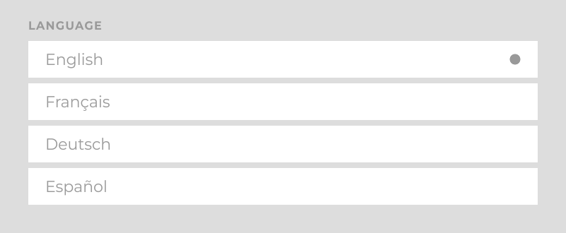
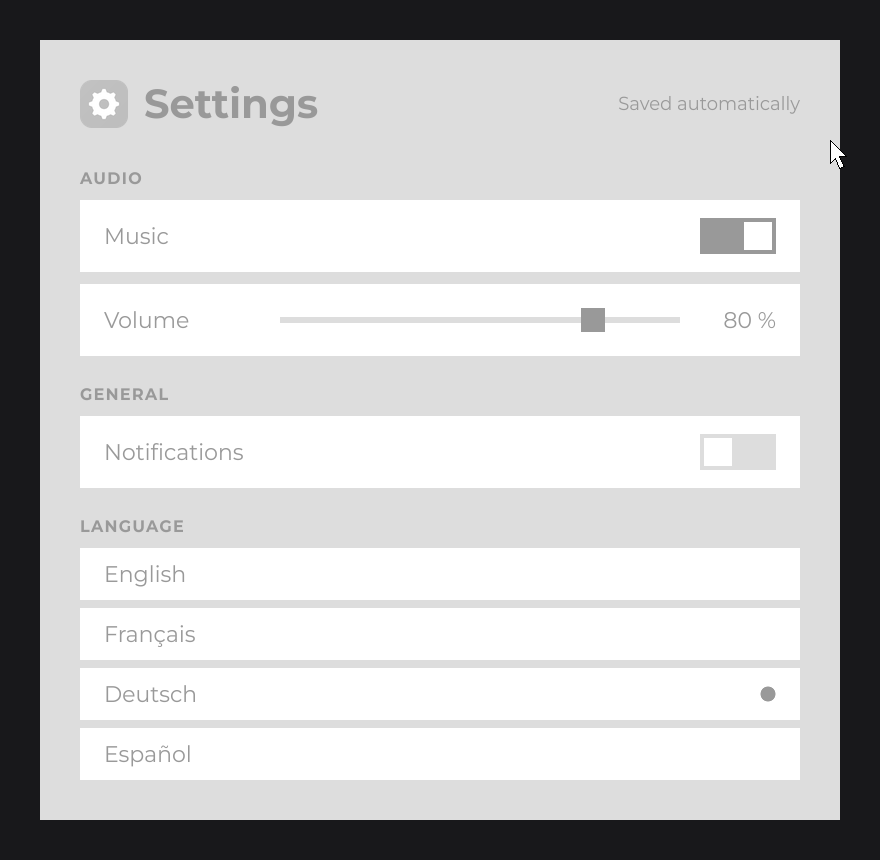
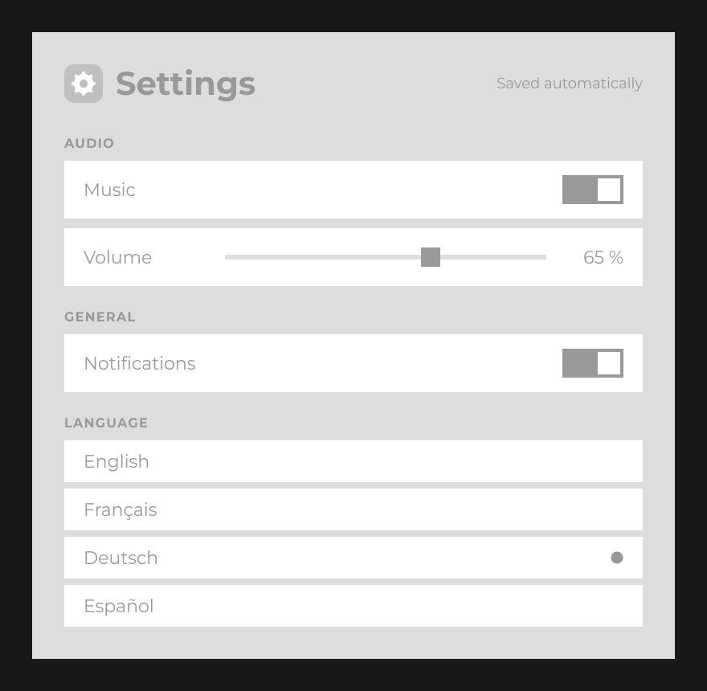

# Tutorial 3: Interactivity and State

In this part the settings screen comes alive: the language list reacts to clicks, the placeholders become real switches and a slider, the screen updates itself from signals, and the values are saved to disk so they survive a restart.

You start from the `SettingsUI` of [Tutorial 2](layout.md). By the end you add three classes (`ToggleSwitchNode`, `VolumeSliderNode`, `SettingsStore`) and one line to `Main`.

## Step 1: react to a click with onClick

A node reacts to the user through callbacks: lambdas you register with `onXxx(...)` methods. `onClick` runs when a mouse button is pressed over the node. Add one to the language rows of the list:

```java
RectNode
.create(0, 0, 720, 52)
.color("English".equals(language) ? SettingsUI.ACCENT : SettingsUI.ROW)
.onClick((node, mouseX, mouseY, clickType) -> System.out.println("Selected " + language))
.body(item -> {
    TextNode.create(24, item.dh(2)).text(Text.create(language, label)).anchorY(Align.CENTER).attach(item);
})
.attach(list);
```

Run the program and click the rows: the console prints the language you clicked. The lambda receives the node, the mouse position in canvas units and the `ClickType`; a click consumed by `onClick` does not reach the nodes below it or the UIs behind.

`color(...)` comes before `onClick(...)` in the chain: the setters of a node type (`color` of `RectNode`) must come before the setters every node shares (`onClick`, `body`, `anchor`...), because those return a plain `Node`. See [Core Concepts](../getting-started/core-concepts.md#fluent-api-conventions).

## Step 2: keep the selection in a signal

Printing is not enough: the selection must change the highlighted row. JOID keeps state in **signals**. A `Signal<T>` holds a value and notifies its subscribers when `set(...)` changes it. Add a field to `SettingsUI`:

```java
private final StringSignal language = new StringSignal("English");
```

`StringSignal` (`dev.joid.lib.utils.signal.impl.primitive`) is a signal of `String`; `"English"` is its default value, returned by `getOrDefault()` until something is set.

Then make the list depend on it. `watch(signal, properties...)` subscribes a node to a signal; on each change, `WatchProperty.CLEAR_CHILDREN` removes the node's children and `WatchProperty.BODY` runs its `body` lambda again, so the list is rebuilt from the current value:

```java
FlexNode
.vertical(0, 0, 720)
.margin(8)
.watch(this.language, WatchProperty.CLEAR_CHILDREN, WatchProperty.BODY)
.body(list -> {
    for (final String language : SettingsUI.LANGUAGES) {
        RectNode
        .create(0, 0, 720, 52)
        .color(language.equals(this.language.getOrDefault()) ? SettingsUI.ACCENT : SettingsUI.ROW)
        .onClick((node, mouseX, mouseY, clickType) -> this.language.set(language))
        .body(item -> {
            TextNode.create(24, item.dh(2)).text(Text.create(language, label)).anchorY(Align.CENTER).attach(item);
        })
        .attach(list);
    }
})
.attach(flex);
```

Click "Deutsch": the click sets the signal, the signal notifies the list, the list rebuilds its four rows, and "Deutsch" is now highlighted. You never told a row to repaint: you changed the state, and the part of the tree that depends on it followed. `WatchProperty` is in `dev.joid.lib.ui.node.property.watch`; see [Watching Signals](../state/watch.md).



## Step 3: input controls

JOID ships the behavior of the usual controls and leaves their look to you: `CheckboxNode`, `ToggleNode`, `SliderNode` and the others are abstract classes in which you only write the drawing (`draw`, or `drawSlider` and the cursor's `drawCursor` for a slider). This keeps every control in the style of your application.

### An on/off switch with CheckboxNode

`CheckboxNode` (`dev.joid.lib.ui.node.impl.structure.checkbox`) flips between checked and unchecked on each click and calls `onChange`. Draw it as a switch: a track and a knob that moves to the right when checked.

```java
package com.example.settings;

import dev.joid.lib.color.Color;
import dev.joid.lib.draw.DrawUtils;
import dev.joid.lib.ui.node.impl.structure.checkbox.CheckboxNode;

public class ToggleSwitchNode extends CheckboxNode {

    private static final Color ON = Color.decode("#6366F1");
    private static final Color OFF = Color.decode("#4B5563");

    protected ToggleSwitchNode(final double x, final double y, final double width, final double height) {
        super(x, y, width, height);
    }

    public static ToggleSwitchNode create(final double x, final double y, final double width, final double height) {
        return new ToggleSwitchNode(x, y, width, height);
    }

    @Override
    public void draw(final double mouseX, final double mouseY) {
        final double knob = super.getHeight() - 8D;
        final double knobX = super.isChecked() ? super.getWidth() - knob - 4D : 4D;
        DrawUtils.SHAPE.drawRect(super.getX(), super.getY(), super.getWidth(), super.getHeight(), super.isChecked() ? ToggleSwitchNode.ON : ToggleSwitchNode.OFF);
        DrawUtils.SHAPE.drawRect(super.getX() + knobX, super.getY() + 4D, knob, knob, Color.WHITE);
    }

}
```

- A custom node has a `protected` constructor and a static `create(...)` factory, like the built-in nodes; see [Custom Nodes](../nodes/custom-nodes.md).
- `draw` runs every frame. It draws in the coordinate space of the parent, so the node's own position is `super.getX()`, `super.getY()`. `DrawUtils.SHAPE` (`dev.joid.lib.draw`) draws shapes; see [Shapes](../drawing/shapes.md).

### A slider with IntegerSliderNode

`IntegerSliderNode` (`dev.joid.lib.ui.node.impl.structure.slider.impl`) picks an integer by dragging a cursor along a track. You draw the track in `drawSlider` and give it a `SliderCursorNode` that draws the cursor:

```java
package com.example.settings;

import dev.joid.lib.color.Color;
import dev.joid.lib.draw.DrawUtils;
import dev.joid.lib.ui.node.impl.structure.slider.SliderCursorNode;
import dev.joid.lib.ui.node.impl.structure.slider.impl.IntegerSliderNode;

public class VolumeSliderNode extends IntegerSliderNode {

    private static final Color TRACK = Color.decode("#4B5563");

    protected VolumeSliderNode(final double x, final double y, final double width, final double height) {
        super(x, y, width, height);
        super.cursor(new Knob(height, height));
    }

    public static VolumeSliderNode create(final double x, final double y, final double width, final double height) {
        return new VolumeSliderNode(x, y, width, height);
    }

    @Override
    public void drawSlider(final double mouseX, final double mouseY) {
        DrawUtils.SHAPE.drawRect(super.getX(), super.getY() + super.getHeight() / 2D - 3D, super.getWidth(), 6D, VolumeSliderNode.TRACK);
    }

    private static final class Knob extends SliderCursorNode {

        private Knob(final double width, final double height) {
            super(width, height);
        }

        @Override
        public void drawCursor(final double mouseX, final double mouseY) {
            DrawUtils.SHAPE.drawRect(super.getX(), super.getY(), super.getWidth(), super.getHeight(), Color.WHITE);
        }

    }

}
```

The cursor is a child of the slider, square, as high as the slider. Pressing anywhere on the track jumps the cursor under the mouse and starts dragging it.

### Connecting the controls to signals

Add three more signals to `SettingsUI`, next to `language`:

```java
private final BooleanSignal music = new BooleanSignal(true);
private final IntegerSignal volume = new IntegerSignal(80);
private final BooleanSignal notifications = new BooleanSignal(false);
```

Then replace the placeholder texts of the three rows with the controls:

```java
final RectNode music = this.row(flex, "Music", label);
ToggleSwitchNode
.create(music.aw(-100), 18, 76, 36)
.signal(this.music)
.attach(music);

final RectNode volume = this.row(flex, "Volume", label);
volume.visible(node -> this.music.getOrDefault());
VolumeSliderNode
.create(200, 24, 400, 24)
.values(0, 100, this.volume.getOrDefault())
.signal(this.volume)
.attach(volume);
TextNode
.create(volume.aw(-24), volume.dh(2))
.text(Text.create("", label))
.<TextNode>onInit(node -> node.getText().text(this.volume.getOrDefault() + " %"))
.watch(this.volume)
.anchor(Align.END, Align.CENTER)
.attach(volume);
```

```java
final RectNode notifications = this.row(flex, "Notifications", label);
ToggleSwitchNode
.create(notifications.aw(-100), 18, 76, 36)
.signal(this.notifications)
.attach(notifications);
```

Each control is bound to its signal:

| Code | What it does |
| --- | --- |
| `signal(this.music)` | Binds the switch to the signal, both ways: the switch starts on the signal's value, each click writes the new state into the signal, and a value set elsewhere moves the switch. |
| `values(0, 100, value)` | Gives the slider the integers from 0 to 100 and selects `value`. |
| `signal(this.volume)` | Binds the slider to the signal the same way: each new value is written into the signal. |
| `watch(this.volume)` and `onInit(...)` | The text node watches the signal: each value the slider writes reloads the node, and `onInit` writes the new text, so "80 %" follows the slider. The text starts empty and the first `onInit` fills it. |
| `visible(node -> ...)` | A predicate evaluated every frame: the Volume row shows only while the music is on. |

Turn the music off: the Volume row disappears and the GENERAL and LANGUAGE sections move up, because a `FlexNode` gives no room to hidden children. Turn it on again and the row comes back with the slider where you left it.



## Step 4: persist the settings with a store

Close the window and start the program again: every value is back to its default. The signals live in the UI, and the UI is rebuilt from scratch on each launch. To keep them, move them into a **store**.

A store is a state object that outlives a node tree. Its `StoreContext` decides how long: `LOCAL` lives with one UI, `GLOBAL` is shared by every UI, and `PERMANENT` is shared and saved to a file between runs. Create `SettingsStore`:

```java
package com.example.settings;

import com.google.gson.JsonObject;

import dev.joid.lib.ui.core.hook.store.UIStore;
import dev.joid.lib.ui.core.hook.store.context.StoreContext;
import dev.joid.lib.ui.core.hook.store.data.UIStoreData;
import dev.joid.lib.utils.signal.impl.primitive.BooleanSignal;
import dev.joid.lib.utils.signal.impl.primitive.IntegerSignal;
import dev.joid.lib.utils.signal.impl.primitive.StringSignal;

@UIStoreData(id = "settings", context = StoreContext.PERMANENT)
public class SettingsStore extends UIStore {

    private final BooleanSignal music = new BooleanSignal(true);
    private final IntegerSignal volume = new IntegerSignal(80);
    private final BooleanSignal notifications = new BooleanSignal(false);
    private final StringSignal language = new StringSignal("English");

    @Override
    public void load(final JsonObject json) {
        if (json.has("music")) {
            this.music.set(json.get("music").getAsBoolean());
        }
        if (json.has("volume")) {
            this.volume.set(json.get("volume").getAsInt());
        }
        if (json.has("notifications")) {
            this.notifications.set(json.get("notifications").getAsBoolean());
        }
        if (json.has("language")) {
            this.language.set(json.get("language").getAsString());
        }
    }

    @Override
    public void save(final JsonObject json) {
        json.addProperty("music", this.music.getOrDefault());
        json.addProperty("volume", this.volume.getOrDefault());
        json.addProperty("notifications", this.notifications.getOrDefault());
        json.addProperty("language", this.language.getOrDefault());
    }

    public BooleanSignal getMusic() {
        return this.music;
    }

    public IntegerSignal getVolume() {
        return this.volume;
    }

    public BooleanSignal getNotifications() {
        return this.notifications;
    }

    public StringSignal getLanguage() {
        return this.language;
    }

}
```

- `@UIStoreData` is required on every store. `id` names the file: `config/store/settings.store` in the working directory.
- `load(JsonObject)` runs once, when the store is created and its file exists; `save(JsonObject)` fills the JSON before each write. Values missing from the file keep their defaults.
- The store needs a public constructor without parameters, which the class has by default.

In `SettingsUI`, delete the four signal fields and get the store at the start of `init()`:

```java
final SettingsStore settings = this.useStore(SettingsStore.class);
```

then replace `this.music` with `settings.getMusic()`, `this.volume` with `settings.getVolume()`, and so on. `useStore` creates the store the first time (reading its file) and returns the same instance afterwards.

JOID writes a permanent store when a UI closes, so pressing `Escape` saves it. Closing the window while the screen is open does not close the UI: save the stores yourself when the loop ends. In `Main`, add `UIStoreHook.saveAll()` (`dev.joid.lib.ui.core.hook.store`) after the loop:

```java
private void loop() {
    while (!GLFW.glfwWindowShouldClose(this.window)) {
        if (GLFW.glfwGetWindowAttrib(this.window, GLFW.GLFW_ICONIFIED) == GLFW.GLFW_TRUE) {
            GLFW.glfwWaitEvents();
            continue;
        }

        GLFW.glfwPollEvents();
        this.flushPendingKey();

        this.bridge.update();
        BridgeHandler.RENDER.get().clear(0.1F, 0.1F, 0.1F, 1F);
        this.bridge.draw();
        GLFW.glfwSwapBuffers(this.window);
    }

    UIStoreHook.saveAll();
    GLFW.glfwDestroyWindow(this.window);
    GLFW.glfwTerminate();
}
```

The rest of `Main` is unchanged; add `import dev.joid.lib.ui.core.hook.store.UIStoreHook;`.

> TIP: For a few plain fields of one UI class (the selected tab, a sort order), annotate them with `@UIProperty` instead: JOID saves them when the UI closes and restores them before `init()`. Stores fit state shared between UIs or held in signals, like these settings. See [Persistent UI Properties](../state/properties.md).

## The complete code

`ToggleSwitchNode`, `VolumeSliderNode` and `SettingsStore` are complete above. `SettingsUI`:

```java
package com.example.settings;

import java.io.File;
import java.util.Arrays;
import java.util.List;

import dev.joid.lib.color.Color;
import dev.joid.lib.draw.text.builder.Text;
import dev.joid.lib.font.FontWeight;
import dev.joid.lib.font.IFont;
import dev.joid.lib.font.dto.TextInfo;
import dev.joid.lib.resource.Resource;
import dev.joid.lib.ui.core.UI;
import dev.joid.lib.ui.core.data.UIData;
import dev.joid.lib.ui.node.Node;
import dev.joid.lib.ui.node.impl.design.resource.ResourceNode;
import dev.joid.lib.ui.node.impl.design.shape.RectNode;
import dev.joid.lib.ui.node.impl.design.text.TextNode;
import dev.joid.lib.ui.node.impl.structure.flex.FlexNode;
import dev.joid.lib.ui.node.property.watch.WatchProperty;
import dev.joid.lib.utils.align.Align;

@UIData(backgroundColor = "#030712")
public final class SettingsUI extends UI {

    private static final Color CARD = Color.decode("#111827");
    private static final Color ROW = Color.decode("#1F2937");
    private static final Color ACCENT = Color.decode("#6366F1");
    private static final Color MUTED = Color.decode("#9CA3AF");

    private static final List<String> LANGUAGES = Arrays.asList("English", "Français", "Deutsch", "Español");

    private final IFont font;

    public SettingsUI(final IFont font) {
        this.font = font;
    }

    @Override
    public void init() {
        final SettingsStore settings = this.useStore(SettingsStore.class);

        final TextInfo title = TextInfo.create(this.font, FontWeight.BOLD, 40, Color.WHITE);
        final TextInfo hint = TextInfo.create(this.font, 18, SettingsUI.MUTED);
        final TextInfo section = TextInfo.create(this.font, FontWeight.BOLD, 16, SettingsUI.MUTED).letterSpacing(0.08F);
        final TextInfo label = TextInfo.create(this.font, 22, Color.WHITE);

        RectNode
        .create(560, 150, 800, 780)
        .color(SettingsUI.CARD)
        .body(card -> {
            ResourceNode.create(40, 40, 48, 48).resource(Resource.of(new File("icons/settings.png"))).attach(card);
            TextNode.create(104, 64).text(Text.create("Settings", title)).anchorY(Align.CENTER).attach(card);
            TextNode.create(card.aw(-40), 64).text(Text.create("Saved automatically", hint)).anchor(Align.END, Align.CENTER).attach(card);

            FlexNode
            .vertical(40, 112, 720)
            .margin(12)
            .body(flex -> {
                TextNode.create(0, 0, 0, 36).text(Text.create("AUDIO", section, Align.START, Align.END)).attach(flex);
                final RectNode music = this.row(flex, "Music", label);
                ToggleSwitchNode
                .create(music.aw(-100), 18, 76, 36)
                .signal(settings.getMusic())
                .attach(music);

                final RectNode volume = this.row(flex, "Volume", label);
                volume.visible(node -> settings.getMusic().getOrDefault());
                VolumeSliderNode
                .create(200, 24, 400, 24)
                .values(0, 100, settings.getVolume().getOrDefault())
                .signal(settings.getVolume())
                .attach(volume);
                TextNode
                .create(volume.aw(-24), volume.dh(2))
                .text(Text.create("", label))
                .<TextNode>onInit(node -> node.getText().text(settings.getVolume().getOrDefault() + " %"))
                .watch(settings.getVolume())
                .anchor(Align.END, Align.CENTER)
                .attach(volume);

                TextNode.create(0, 0, 0, 36).text(Text.create("GENERAL", section, Align.START, Align.END)).attach(flex);
                final RectNode notifications = this.row(flex, "Notifications", label);
                ToggleSwitchNode
                .create(notifications.aw(-100), 18, 76, 36)
                .signal(settings.getNotifications())
                .attach(notifications);

                TextNode.create(0, 0, 0, 36).text(Text.create("LANGUAGE", section, Align.START, Align.END)).attach(flex);
                FlexNode
                .vertical(0, 0, 720)
                .margin(8)
                .watch(settings.getLanguage(), WatchProperty.CLEAR_CHILDREN, WatchProperty.BODY)
                .body(list -> {
                    for (final String language : SettingsUI.LANGUAGES) {
                        RectNode
                        .create(0, 0, 720, 52)
                        .color(language.equals(settings.getLanguage().getOrDefault()) ? SettingsUI.ACCENT : SettingsUI.ROW)
                        .onClick((node, mouseX, mouseY, clickType) -> settings.getLanguage().set(language))
                        .body(item -> {
                            TextNode.create(24, item.dh(2)).text(Text.create(language, label)).anchorY(Align.CENTER).attach(item);
                        })
                        .attach(list);
                    }
                })
                .attach(flex);
            })
            .attach(card);
        })
        .attach(this);
    }

    private RectNode row(final Node parent, final String name, final TextInfo info) {
        return RectNode
        .create(0, 0, 720, 72)
        .color(SettingsUI.ROW)
        .body(row -> {
            TextNode.create(24, row.dh(2)).text(Text.create(name, info)).anchorY(Align.CENTER).attach(row);
        })
        .attach(parent);
    }

}
```

## What you should see

The rows now hold working controls: two switches, a slider with its value on the right, and a clickable language list. Change a few values, close the window and start the program again: the screen opens with your values. The file `config/store/settings.store` holds them as JSON, for example `{"music":true,"volume":65,"notifications":true,"language":"Deutsch"}`.



## Recap

- Callbacks such as `onClick` are lambdas registered on a node; an input callback consumes the event it handles.
- Input controls are abstract: you subclass `CheckboxNode`, `IntegerSliderNode` and the others, and only draw them.
- A `Signal<T>` holds state. Nodes `watch` it: by default the node reloads and its `onInit` writes the new value, and `CLEAR_CHILDREN` with `BODY` rebuilds part of the tree. Controls are bound to it with `signal(...)`, and a `visible(...)` predicate, evaluated every frame, can read it.
- A `PERMANENT` store keeps signals between runs; `UIStoreHook.saveAll()` saves it when the application exits.

Next, [Tutorial 4: Polish](polish.md) gives the screen its final look.

## See also

- [Callbacks](../interactions/callbacks.md)
- [CheckboxNode](../nodes/input/checkbox.md)
- [SliderNode](../nodes/input/slider.md)
- [Signals](../state/signals.md)
- [Watching Signals](../state/watch.md)
- [Stores](../state/stores.md)