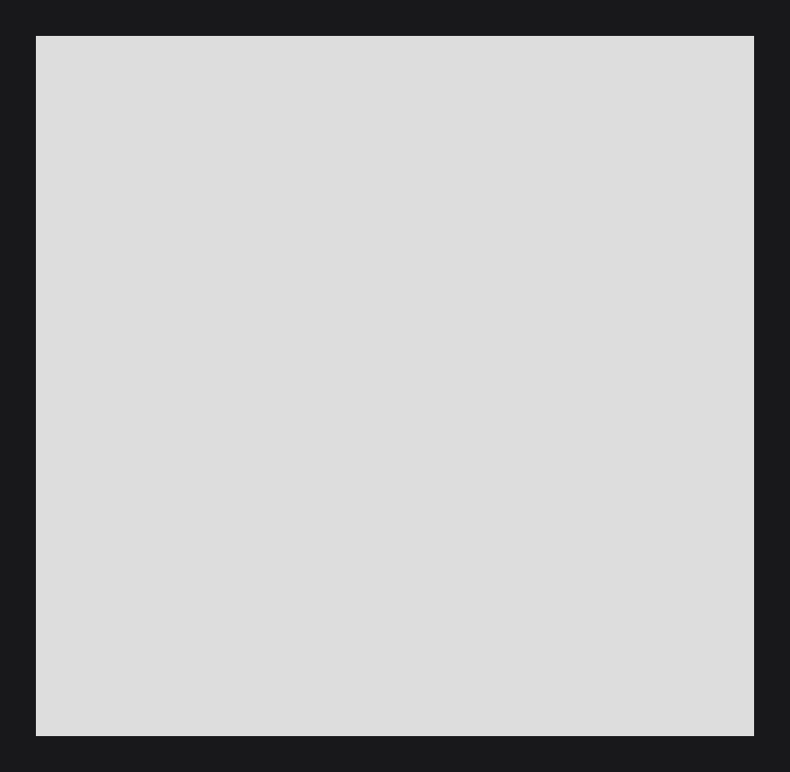
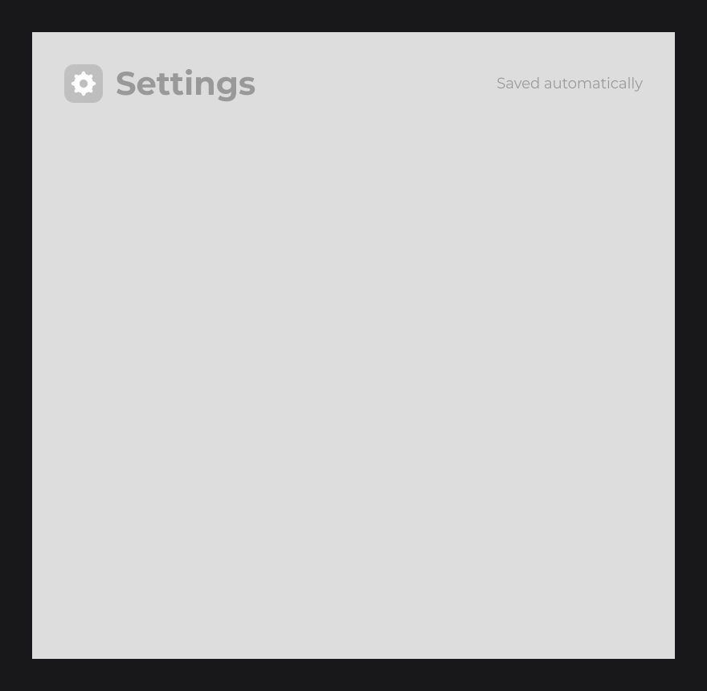
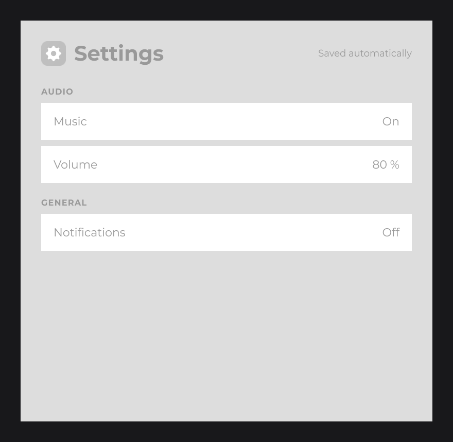
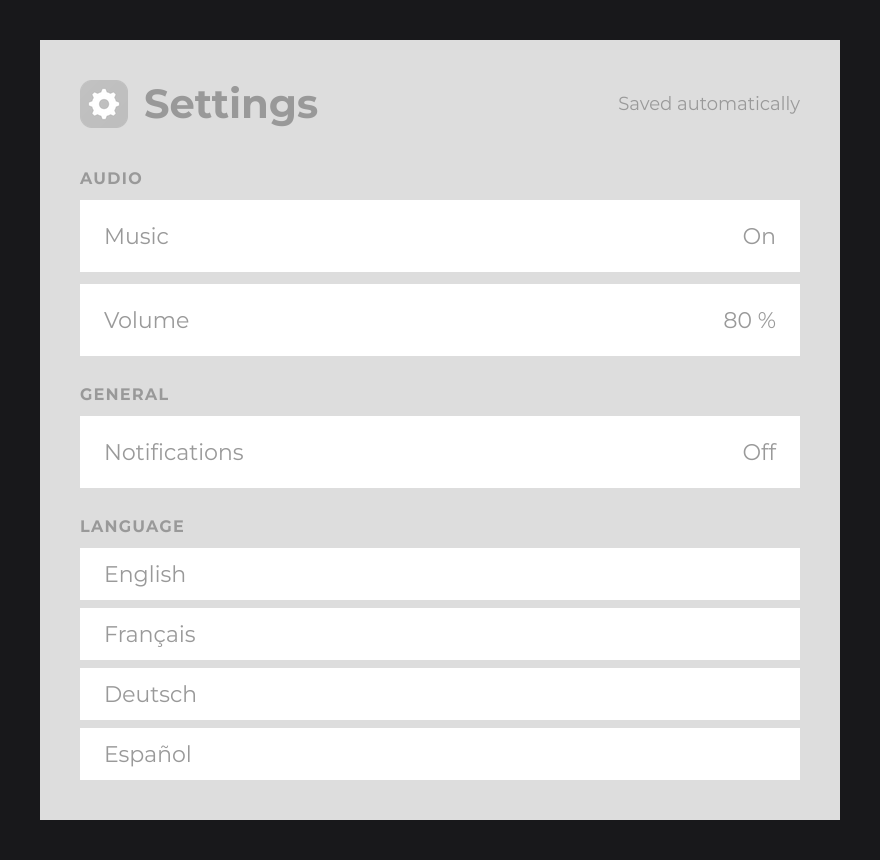

# Tutorial 2: Building the Layout

In this part you build the static layout of the settings screen: a card centered on the canvas, a header with an icon and title, and rows laid out by `FlexNode`. Nothing reacts to the mouse yet; the values on the right are placeholders that part 3 replaces with real controls.

You start from the code of [Tutorial 1](setup.md).

## Step 1: The card with RectNode

The card is a `RectNode`, the filled rectangle of [Nodes](../concepts/nodes.md). First give `Theme` the colors of the screen:

```java
public static final Color INK  = Color.decode("#999999");
public static final Color CARD = Color.decode("#DDDDDD");
```

Then replace the body of `init()` in `SettingsUI`:

```java
@Override
public void init() {
	RectNode
	.create(560, 150, 800, 780)
	.color(Theme.CARD)
	.attach(this);
}
```

A card 800 units wide at x = 560 is horizontally centered ((1920 - 800) / 2), and 780 high at y = 150 is vertically centered ((1080 - 780) / 2), on any window. See [Canvas and Scaling](../concepts/canvas.md).



## Step 2: Children with body

The header is three children of the card, built in its `body(...)` and placed relative to it: (40, 40) inside the card is 40 units from its top-left corner. Create the text styles once, at the start of `init()`:

```java
final TextInfo title = TextInfo.create(Theme.getFont(), FontWeight.BOLD, 40F, Theme.INK);
final TextInfo hint = TextInfo.create(Theme.getFont(), 18F, Theme.INK);
```

Then add the header to the card:

```java
RectNode
.create(560, 150, 800, 780)
.color(Theme.CARD)
.body(card -> {
	ResourceNode.create(40, 40, 48, 48).resource(Resource.of(new File("icons/settings.png"))).attach(card);
	TextNode.create(104, 64).text(Text.create("Settings", title)).anchorY(Align.CENTER).attach(card);
	TextNode.create(0, 40, card.aw(-40), 48).text(Text.create("Saved automatically", hint, Align.END, Align.CENTER)).attach(card);
})
.attach(this);
```

- The icon is a `ResourceNode` showing `Resource.of(new File(...))`, loaded in the background.
- The title is a `TextNode` without a size, which takes the size of its text. `anchorY(Align.CENTER)` puts its vertical center on y = 64, the center of the 48-unit icon.
- The hint has a box: `TextNode.create(x, y, width, height)` with `Text.create(text, info, horizontalAlign, verticalAlign)` aligns the text inside it. `card.aw(-40)` is the width of the card minus 40, so you never write a size twice.



## Step 3: Rows with FlexNode

The rows go in a `FlexNode.vertical(x, y, width)` column, which stacks its children with a gap and grows to fit them. Each child is created at (0, 0) and the flex moves it into its slot. All rows look the same, so a method of `SettingsUI` builds one:

```java
private RectNode row(final Node parent, final String name, final TextInfo info) {
	return RectNode
	.create(0, 0, 720, 72)
	.color(Color.WHITE)
	.body(row -> {
		TextNode.create(24, row.dh(2)).text(Text.create(name, info)).anchorY(Align.CENTER).attach(row);
	})
	.attach(parent);
}
```

`row.dh(2)` is half the height of the row; with `anchorY(Align.CENTER)`, the label is vertically centered. The method attaches the row to the column and returns it as a `RectNode` so the caller can add the value on its right.

Two more styles go next to `title` and `hint`:

```java
final TextInfo section = TextInfo.create(Theme.getFont(), FontWeight.BOLD, 16F, Theme.INK).letterSpacing(0.08F);
final TextInfo label = TextInfo.create(Theme.getFont(), 22F, Theme.INK);
```

Then the column, inside the `body` of the card, after the header:

```java
FlexNode
.vertical(40, 112, 720)
.margin(12)
.body(flex -> {
	TextNode.create(0, 0, 0, 36).text(Text.create("AUDIO", section, Align.START, Align.END)).attach(flex);
	final RectNode music = this.row(flex, "Music", label);
	TextNode.create(0, 0, music.aw(-24), music.getHeight()).text(Text.create("On", label, Align.END, Align.CENTER)).attach(music);
	final RectNode volume = this.row(flex, "Volume", label);
	TextNode.create(0, 0, volume.aw(-24), volume.getHeight()).text(Text.create("80 %", label, Align.END, Align.CENTER)).attach(volume);
	TextNode.create(0, 0, 0, 36).text(Text.create("GENERAL", section, Align.START, Align.END)).attach(flex);
	final RectNode notifications = this.row(flex, "Notifications", label);
	TextNode.create(0, 0, notifications.aw(-24), notifications.getHeight()).text(Text.create("Off", label, Align.END, Align.CENTER)).attach(notifications);
})
.attach(card);
```

- A section title is 36 units high with text at the bottom, leaving space above.
- The value of each row is a text node as large as the row minus 24 units, with text aligned to the end.
- Children are laid out in the order you attach them. A hidden child takes no room: the next ones move up, which part 3 uses to hide Volume while music is off.



## Step 4: A nested list

The language list is a second `FlexNode` inside the first. Add a constant to `SettingsUI`:

```java
private static final List<String> LANGUAGES = Arrays.asList("English", "Français", "Deutsch", "Español");
```

Then build one row per language, after the Notifications row:

```java
TextNode.create(0, 0, 0, 36).text(Text.create("LANGUAGE", section, Align.START, Align.END)).attach(flex);
FlexNode
.vertical(0, 0, 720)
.margin(8)
.body(list -> {
	for (final String language : SettingsUI.LANGUAGES) {
		RectNode
		.create(0, 0, 720, 52)
		.color(Color.WHITE)
		.body(item -> {
			TextNode.create(24, item.dh(2)).text(Text.create(language, label)).anchorY(Align.CENTER).attach(item);
		})
		.attach(list);
	}
})
.attach(flex);
```

A `FlexNode` is a node like any other: the outer column sees the inner list as one child, 232 units high (four rows of 52 and three gaps of 8). Part 3 marks the selected language with a dot.



> TIP: In dev mode, press `F3` and hover the rows: the inspector shows the class, the bounds and the place in the tree of each node.

## The complete code

`Theme` (add the new constants):

```java
public static final Color INK  = Color.decode("#999999");
public static final Color CARD = Color.decode("#DDDDDD");
```

`SettingsUI` (replace the body of `init()` and add the `row` method):

```java
package com.example.settings;

import java.io.File;
import java.util.Arrays;
import java.util.List;

import dev.joid.lib.color.Color;
import dev.joid.lib.draw.text.builder.Text;
import dev.joid.lib.font.FontWeight;
import dev.joid.lib.font.TextInfo;
import dev.joid.lib.resource.Resource;
import dev.joid.lib.ui.core.UI;
import dev.joid.lib.ui.core.data.UIData;
import dev.joid.lib.ui.node.Node;
import dev.joid.lib.ui.node.impl.design.resource.ResourceNode;
import dev.joid.lib.ui.node.impl.design.shape.RectNode;
import dev.joid.lib.ui.node.impl.design.text.TextNode;
import dev.joid.lib.ui.node.impl.structure.flex.FlexNode;
import dev.joid.lib.utils.align.Align;

@UIData(backgroundColor = "#18181B")
public final class SettingsUI extends UI {

	private static final List<String> LANGUAGES = Arrays.asList("English", "Français", "Deutsch", "Español");

	@Override
	public void init() {
		final TextInfo title = TextInfo.create(Theme.getFont(), FontWeight.BOLD, 40F, Theme.INK);
		final TextInfo hint = TextInfo.create(Theme.getFont(), 18F, Theme.INK);
		final TextInfo section = TextInfo.create(Theme.getFont(), FontWeight.BOLD, 16F, Theme.INK).letterSpacing(0.08F);
		final TextInfo label = TextInfo.create(Theme.getFont(), 22F, Theme.INK);

		RectNode
		.create(560, 150, 800, 780)
		.color(Theme.CARD)
		.body(card -> {
			ResourceNode.create(40, 40, 48, 48).resource(Resource.of(new File("icons/settings.png"))).attach(card);
			TextNode.create(104, 64).text(Text.create("Settings", title)).anchorY(Align.CENTER).attach(card);
			TextNode.create(0, 40, card.aw(-40), 48).text(Text.create("Saved automatically", hint, Align.END, Align.CENTER)).attach(card);

			FlexNode
			.vertical(40, 112, 720)
			.margin(12)
			.body(flex -> {
				TextNode.create(0, 0, 0, 36).text(Text.create("AUDIO", section, Align.START, Align.END)).attach(flex);
				final RectNode music = this.row(flex, "Music", label);
				TextNode.create(0, 0, music.aw(-24), music.getHeight()).text(Text.create("On", label, Align.END, Align.CENTER)).attach(music);
				final RectNode volume = this.row(flex, "Volume", label);
				TextNode.create(0, 0, volume.aw(-24), volume.getHeight()).text(Text.create("80 %", label, Align.END, Align.CENTER)).attach(volume);
				TextNode.create(0, 0, 0, 36).text(Text.create("GENERAL", section, Align.START, Align.END)).attach(flex);
				final RectNode notifications = this.row(flex, "Notifications", label);
				TextNode.create(0, 0, notifications.aw(-24), notifications.getHeight()).text(Text.create("Off", label, Align.END, Align.CENTER)).attach(notifications);

				TextNode.create(0, 0, 0, 36).text(Text.create("LANGUAGE", section, Align.START, Align.END)).attach(flex);
				FlexNode
				.vertical(0, 0, 720)
				.margin(8)
				.body(list -> {
					for (final String language : SettingsUI.LANGUAGES) {
						RectNode
						.create(0, 0, 720, 52)
						.color(Color.WHITE)
						.body(item -> {
							TextNode.create(24, item.dh(2)).text(Text.create(language, label)).anchorY(Align.CENTER).attach(item);
						})
						.attach(list);
					}
				})
				.attach(flex);
			})
			.attach(card);
		})
		.attach(this);
	}

	private RectNode row(final Node parent, final String name, final TextInfo info) {
		return RectNode
		.create(0, 0, 720, 72)
		.color(Color.WHITE)
		.body(row -> {
			TextNode.create(24, row.dh(2)).text(Text.create(name, info)).anchorY(Align.CENTER).attach(row);
		})
		.attach(parent);
	}

}
```

## See also

- Next: [Tutorial 3: Interactivity and State](interactivity.md)
- [Layout](../concepts/layout.md)
- [Nodes](../concepts/nodes.md)
- [Canvas and Scaling](../concepts/canvas.md)
- [Text and Fonts](../concepts/text.md)