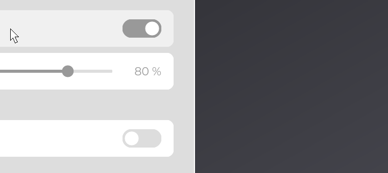
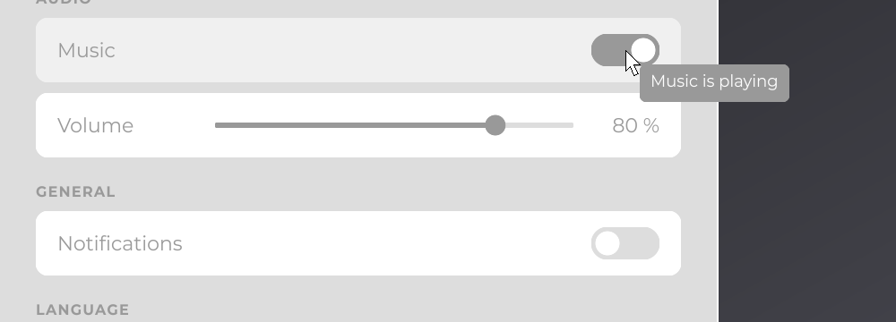

# Tutorial 4: Polish

The settings screen works; in this last part you make it look finished: a gradient background, a rounded and outlined card, rows animated under the mouse, tooltips, a sliding switch and an opening animation. It applies [Styling](../concepts/styling.md) and [Animation](../concepts/animation.md).

You start from the code of [Tutorial 3](interactivity.md). `Main`, `AppUIBridge` and `SettingsStore` do not change.

## Step 1: a gradient background

A `Color` can carry a linear gradient, and `@UIData` accepts it as a string:

```java
@UIData(backgroundColor = "gradient(#18181B, #52525B, 0, 0, 1, 1)")
public final class SettingsUI extends UI {
```

The two colors are the start and the end; the four numbers are the start and end points as fractions of the area, here from the top-left corner `(0, 0)` to the bottom-right corner `(1, 1)`. Without them, the gradient goes from left to right.

## Step 2: rounded corners and a border

Round the card with `RoundedNodeEffect` and outline it with the border of `RectNode`:

```java
RectNode
.create(560, 150, 800, 780)
.color(Theme.CARD)
.borderColor(Color.WHITE)
.borderStroke(2D)
.effect(RoundedNodeEffect.create(24F))
```

The border is drawn outside the card and follows its rounded corners. The setters of `RectNode` (`color`, `borderColor`, `borderStroke`) come before `effect(...)`, a setter of every node.


## Step 3: hover animation

The rows blend to a `hoveredColor(...)` while the mouse is over them, a little faster than the default 200 ms with `hoverDuration` and eased with `hoverEquation`, and get rounded corners. Add the hover color to `Theme`:

```java
public static final Color HOVER = Color.decode("#F0F0F0");
```

then update the `row` method:

```java
private RectNode row(final Node parent, final String name, final TextInfo info) {
	return RectNode
	.create(0, 0, 720, 72)
	.color(Color.WHITE)
	.hoveredColor(Theme.HOVER)
	.effect(RoundedNodeEffect.create(14F))
	.hoverDuration(150L)
	.hoverEquation(TweenEquations.QUAD_OUT)
	.body(row -> {
		TextNode.create(24, row.dh(2)).text(Text.create(name, info)).anchorY(Align.CENTER).attach(row);
	})
	.attach(parent);
}
```

and the language rows:

```java
RectNode
.create(0, 0, 720, 52)
.color(Color.WHITE)
.hoveredColor(Theme.HOVER)
.effect(RoundedNodeEffect.create(12F))
.onClick((node, mouseX, mouseY, button) -> this.settings.getLanguage().set(language))
```

`TweenEquations.QUAD_OUT` starts fast and slows down, so a row reacts at once under the mouse.


## Step 4: tooltips

Give the switches `hover(...)` tooltips (see [Input](../concepts/input.md)). The lambda is read while the tooltip shows, so the line of the Music switch follows the state of the music:

```java
ToggleSwitchNode
.create(music.aw(-100), 18, 76, 36)
.signal(this.settings.getMusic())
.hover(() -> this.settings.getMusic().get() ? "Music is playing" : "Music is muted")
.attach(music);
```

```java
ToggleSwitchNode
.create(notifications.aw(-100), 18, 76, 36)
.signal(this.settings.getNotifications())
.hover(() -> "Show a notification when a download completes")
.attach(notifications);
```

JOID asks the UI to draw the lines of the hovered node with `drawHover`, which by default hands them to the UI bridge. `AppUIBridge` draws no tooltip, so the settings screen draws its own: override `drawHover` in `SettingsUI`, where `TextConverter.convertLines(content)` gives the lines:

```java
@Override
public void drawHover(final Object content, final double mouseX, final double mouseY) {
	final List<String> lines = TextConverter.convertLines(content);
	final TextInfo info = TextInfo.create(Theme.getFont(), 18F, Color.WHITE);
	double width = 0D;
	for (final String line : lines) {
		width = Math.max(width, info.getWidth(line));
	}

	DrawUtils.SHAPE.drawRoundedRect(mouseX + 16D, mouseY + 16D, width + 24D, lines.size() * 26D + 16D, Theme.INK, 8F);
	for (int i = 0; i < lines.size(); i++) {
		DrawUtils.TEXT.drawText(mouseX + 28D, mouseY + 24D + i * 26D, Text.create(lines.get(i), info));
	}
}
```

The mouse position is in canvas units, and `TextInfo.getWidth(text)` measures a line so that the box fits it.



## Step 5: an animated switch

The knob of the switch jumps from one side to the other. Make it slide with a `TweenAnimator` (see [Animation](../concepts/animation.md)) that goes from `0F` (off) to `1F` (on); the knob position and the track color follow its value. In `ToggleSwitchNode`, add two fields and replace `draw`:

```java
private final TweenAnimator knob = TweenAnimator.create();
private Boolean shown;
```

```java
@Override
public void draw(final double mouseX, final double mouseY) {
	final boolean checked = super.isChecked();
	if (this.shown == null) {
		this.knob.setValue(checked ? 1F : 0F);
	} else if (this.shown != checked) {
		this.knob.sequence(180F, checked ? 1F : 0F, TweenEquations.QUAD_OUT).start();
	}
	this.shown = checked;
	this.knob.update();

	final float progress = this.knob.getValue();
	final double size = super.getHeight() - 8D;
	DrawUtils.SHAPE.drawRoundedRect(super.getX(), super.getY(), super.getWidth(), super.getHeight(), Theme.CARD.to(Theme.INK, progress), (float) super.dh(2));
	DrawUtils.SHAPE.drawCircle(super.getX() + 4D + size / 2D + (super.getWidth() - size - 8D) * progress, super.getY() + super.dh(2), Color.WHITE, size / 2D);
}
```

- `shown` is the state drawn on the previous frame, `null` before the first one: the first frame places the knob at once with `setValue`, so a switch that opens checked does not slide.
- When the state changes, `sequence(duration, value, equation).start()` slides to the other side in 180 ms.
- `update()` advances the animation by the time elapsed since the last call, read from the clock of JOID.
- `CARD.to(INK, progress)` blends the two colors; `drawRoundedRect` with a radius of half the height draws a pill.

The slider gets a rounded track, the part before the thumb filled with `Theme.INK`, and a round thumb: see the complete code below.



## Step 6: an opening transition

`PopTransition` scales the UI from 75 % to 100 % in 130 ms when it opens, and back when it closes. Set it in the constructor of `SettingsUI`, so that every instance pops:

```java
public SettingsUI() {
	super.setTransition(new PopTransition());
}
```

Start the program: the card pops in, and `Escape` pops it out. See [UIs](../concepts/uis.md#transitions) to write your own.


## The complete code

`Theme`:

```java
package com.example.settings;

import java.io.File;

import dev.joid.lib.color.Color;
import dev.joid.lib.font.impl.msdf.MsdfFont;
import dev.joid.lib.font.impl.msdf.MsdfFontLoader;

public final class Theme {

	public static final Color INK   = Color.decode("#999999");
	public static final Color CARD  = Color.decode("#DDDDDD");
	public static final Color HOVER = Color.decode("#F0F0F0");

	private static MsdfFont font;

	private Theme() {}

	public static void load() {
		Theme.font = MsdfFontLoader.load(new File("fonts/Montserrat-Regular.ttf"), new File("fonts/Montserrat-Bold.ttf")).join();
	}

	public static MsdfFont getFont() {
		return Theme.font;
	}

}
```

`SettingsUI`:

```java
package com.example.settings;

import java.io.File;
import java.util.Arrays;
import java.util.List;

import dev.joid.lib.animation.tween.TweenEquations;
import dev.joid.lib.color.Color;
import dev.joid.lib.draw.DrawUtils;
import dev.joid.lib.draw.text.builder.Text;
import dev.joid.lib.font.FontWeight;
import dev.joid.lib.font.TextInfo;
import dev.joid.lib.font.converter.TextConverter;
import dev.joid.lib.resource.Resource;
import dev.joid.lib.ui.core.UI;
import dev.joid.lib.ui.core.data.UIData;
import dev.joid.lib.ui.core.transition.impl.PopTransition;
import dev.joid.lib.ui.node.Node;
import dev.joid.lib.ui.node.effect.impl.RoundedNodeEffect;
import dev.joid.lib.ui.node.impl.design.resource.ResourceNode;
import dev.joid.lib.ui.node.impl.design.shape.CircleNode;
import dev.joid.lib.ui.node.impl.design.shape.RectNode;
import dev.joid.lib.ui.node.impl.design.text.TextNode;
import dev.joid.lib.ui.node.impl.structure.flex.FlexNode;
import dev.joid.lib.utils.align.Align;

@UIData(backgroundColor = "gradient(#18181B, #52525B, 0, 0, 1, 1)")
public final class SettingsUI extends UI {

	private static final List<String> LANGUAGES = Arrays.asList("English", "Français", "Deutsch", "Español");

	private final SettingsStore settings = super.useStore(SettingsStore.class);

	public SettingsUI() {
		super.setTransition(new PopTransition());
	}

	@Override
	public void init() {
		final TextInfo title = TextInfo.create(Theme.getFont(), FontWeight.BOLD, 40F, Theme.INK);
		final TextInfo hint = TextInfo.create(Theme.getFont(), 18F, Theme.INK);
		final TextInfo section = TextInfo.create(Theme.getFont(), FontWeight.BOLD, 16F, Theme.INK).letterSpacing(0.08F);
		final TextInfo label = TextInfo.create(Theme.getFont(), 22F, Theme.INK);

		RectNode
		.create(560, 150, 800, 780)
		.color(Theme.CARD)
		.borderColor(Color.WHITE)
		.borderStroke(2D)
		.effect(RoundedNodeEffect.create(24F))
		.body(card -> {
			ResourceNode.create(40, 40, 48, 48).resource(Resource.of(new File("icons/settings.png"))).attach(card);
			TextNode.create(104, 64).text(Text.create("Settings", title)).anchorY(Align.CENTER).attach(card);
			TextNode.create(0, 40, card.aw(-40), 48).text(Text.create("Saved automatically", hint, Align.END, Align.CENTER)).attach(card);
			FlexNode
			.vertical(40, 112, 720)
			.margin(12)
			.body(flex -> {
				TextNode.create(0, 0, 0, 36).text(Text.create("AUDIO", section, Align.START, Align.END)).attach(flex);
				final RectNode music = this.row(flex, "Music", label);
				ToggleSwitchNode
				.create(music.aw(-100), 18, 76, 36)
				.signal(this.settings.getMusic())
				.hover(() -> this.settings.getMusic().get() ? "Music is playing" : "Music is muted")
				.attach(music);
				final RectNode volume = this.row(flex, "Volume", label).visible(this.settings.getMusic());
				VolumeSliderNode.create(200, 24, 400, 24).values(0, 100, 80).signal(this.settings.getVolume()).attach(volume);
				TextNode.create(0, 0, volume.aw(-24), volume.getHeight()).text(Text.create(this.settings.getVolume().get() + " %", label, Align.END, Align.CENTER)).attach(volume);
				TextNode.create(0, 0, 0, 36).text(Text.create("GENERAL", section, Align.START, Align.END)).attach(flex);
				final RectNode notifications = this.row(flex, "Notifications", label);
				ToggleSwitchNode
				.create(notifications.aw(-100), 18, 76, 36)
				.signal(this.settings.getNotifications())
				.hover(() -> "Show a notification when a download completes")
				.attach(notifications);
				TextNode.create(0, 0, 0, 36).text(Text.create("LANGUAGE", section, Align.START, Align.END)).attach(flex);
				FlexNode
				.vertical(0, 0, 720)
				.margin(8)
				.body(list -> {
					for (final String language : SettingsUI.LANGUAGES) {
						RectNode
						.create(0, 0, 720, 52)
						.color(Color.WHITE)
						.hoveredColor(Theme.HOVER)
						.effect(RoundedNodeEffect.create(12F))
						.onClick((node, mouseX, mouseY, button) -> this.settings.getLanguage().set(language))
						.body(item -> {
							TextNode.create(24, item.dh(2)).text(Text.create(language, label)).anchorY(Align.CENTER).attach(item);
							CircleNode.create(680, 18, 16).color(Theme.INK).visible(this.settings.getLanguage().map(selected -> selected.equals(language))).attach(item);
						})
						.attach(list);
					}
				})
				.attach(flex);
			})
			.attach(card);
		})
		.attach(this);
	}

	@Override
	public void drawHover(final Object content, final double mouseX, final double mouseY) {
		final List<String> lines = TextConverter.convertLines(content);
		final TextInfo info = TextInfo.create(Theme.getFont(), 18F, Color.WHITE);
		double width = 0D;
		for (final String line : lines) {
			width = Math.max(width, info.getWidth(line));
		}

		DrawUtils.SHAPE.drawRoundedRect(mouseX + 16D, mouseY + 16D, width + 24D, lines.size() * 26D + 16D, Theme.INK, 8F);
		for (int i = 0; i < lines.size(); i++) {
			DrawUtils.TEXT.drawText(mouseX + 28D, mouseY + 24D + i * 26D, Text.create(lines.get(i), info));
		}
	}

	private RectNode row(final Node parent, final String name, final TextInfo info) {
		return RectNode
		.create(0, 0, 720, 72)
		.color(Color.WHITE)
		.hoveredColor(Theme.HOVER)
		.effect(RoundedNodeEffect.create(14F))
		.hoverDuration(150L)
		.hoverEquation(TweenEquations.QUAD_OUT)
		.body(row -> {
			TextNode.create(24, row.dh(2)).text(Text.create(name, info)).anchorY(Align.CENTER).attach(row);
		})
		.attach(parent);
	}

}
```

`ToggleSwitchNode`:

```java
package com.example.settings;

import dev.joid.lib.animation.animator.TweenAnimator;
import dev.joid.lib.animation.tween.TweenEquations;
import dev.joid.lib.color.Color;
import dev.joid.lib.draw.DrawUtils;
import dev.joid.lib.ui.node.impl.structure.checkbox.CheckboxNode;

public class ToggleSwitchNode extends CheckboxNode {

	private final TweenAnimator knob = TweenAnimator.create();
	private Boolean shown;

	protected ToggleSwitchNode(final double x, final double y, final double width, final double height) {
		super(x, y, width, height);
	}

	public static ToggleSwitchNode create(final double x, final double y, final double width, final double height) {
		return new ToggleSwitchNode(x, y, width, height);
	}

	@Override
	public void draw(final double mouseX, final double mouseY) {
		final boolean checked = super.isChecked();
		if (this.shown == null) {
			this.knob.setValue(checked ? 1F : 0F);
		} else if (this.shown != checked) {
			this.knob.sequence(180F, checked ? 1F : 0F, TweenEquations.QUAD_OUT).start();
		}
		this.shown = checked;
		this.knob.update();

		final float progress = this.knob.getValue();
		final double size = super.getHeight() - 8D;
		DrawUtils.SHAPE.drawRoundedRect(super.getX(), super.getY(), super.getWidth(), super.getHeight(), Theme.CARD.to(Theme.INK, progress), (float) super.dh(2));
		DrawUtils.SHAPE.drawCircle(super.getX() + 4D + size / 2D + (super.getWidth() - size - 8D) * progress, super.getY() + super.dh(2), Color.WHITE, size / 2D);
	}

}
```

`VolumeSliderNode`:

```java
package com.example.settings;

import dev.joid.lib.draw.DrawUtils;
import dev.joid.lib.ui.node.impl.structure.slider.SliderThumbNode;
import dev.joid.lib.ui.node.impl.structure.slider.impl.IntegerSliderNode;

public class VolumeSliderNode extends IntegerSliderNode {

	protected VolumeSliderNode(final double x, final double y, final double width, final double height) {
		super(x, y, width, height);
		super.thumb(new Knob(height));
	}

	public static VolumeSliderNode create(final double x, final double y, final double width, final double height) {
		return new VolumeSliderNode(x, y, width, height);
	}

	@Override
	public void drawSlider(final double mouseX, final double mouseY) {
		final double y = super.getY() + super.dh(2) - 3D;
		final double filled = super.getThumb().getX() + super.getThumb().dw(2);
		DrawUtils.SHAPE.drawRoundedRect(super.getX(), y, super.getWidth(), 6D, Theme.CARD, 3F);
		DrawUtils.SHAPE.drawRoundedRect(super.getX(), y, filled, 6D, Theme.INK, 3F);
	}

	private static final class Knob extends SliderThumbNode {

		private Knob(final double size) {
			super(size, size);
		}

		@Override
		public void drawThumb(final double mouseX, final double mouseY) {
			DrawUtils.SHAPE.drawCircle(super.getX() + super.dw(2), super.getY() + super.dh(2), Theme.INK, super.dw(2));
		}

	}

}
```

`getThumb()` returns the thumb, whose `x` is relative to the slider: its `x` plus half its width is the filled length.

## What you should see

The card pops in on a dark gradient, rows lighten under the mouse, the switches slide, the slider fills up to its round cursor, and hovering a switch shows a tooltip.


## Next steps

| To | Read |
| --- | --- |
| Find the right node for a job | [Component Catalog](../components/overview.md) |
| Draw every control of an application once | [Building a UI Kit](../components/ui-kit.md) |
| Add a dropdown or a reorderable list | [SelectorNode](../nodes/input/selector.md), [ReorderableFlexNode](../nodes/layout/reorderable-flex.md) |
| Load more fonts and style text | [Text and Fonts](../concepts/text.md) |
| Run inside your own engine | [Embedding JOID in an Application](../integration/ui-bridge.md) |

## See also

- [Styling](../concepts/styling.md)
- [Animation](../concepts/animation.md)
- [Effects](../styling/effects.md)
- [Building a UI Kit](../components/ui-kit.md)