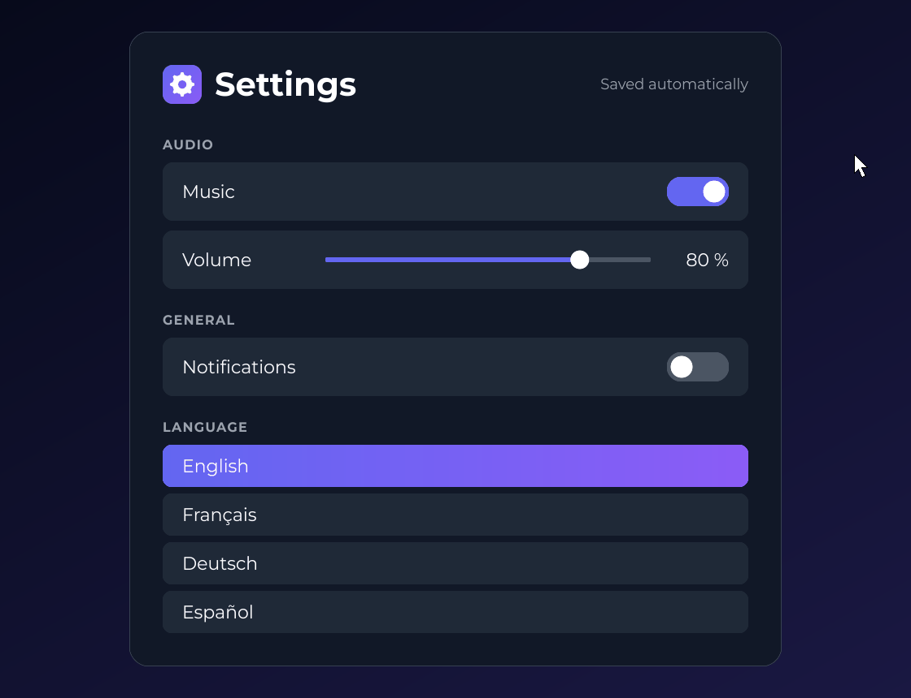
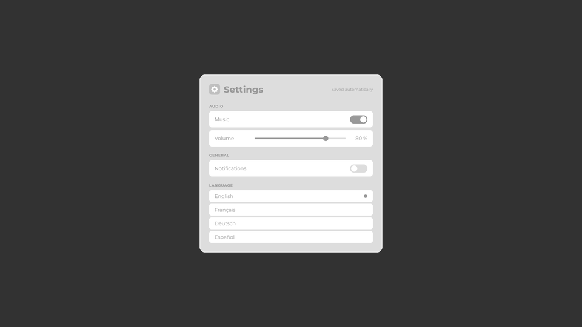
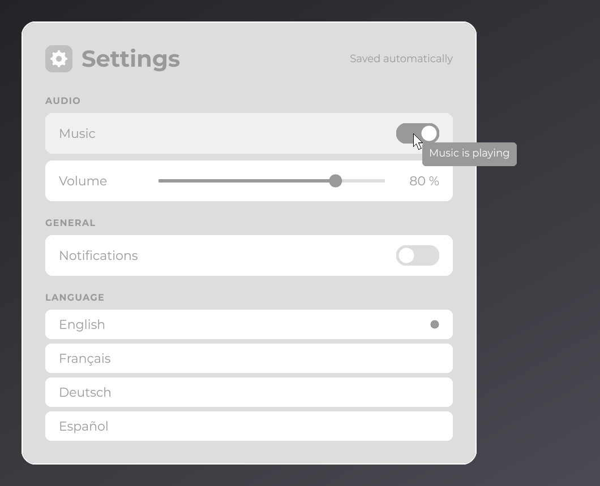

# Tutorial 4: Polish

The settings screen works; in this last part you make it look finished. You give it a gradient background, round its corners and outline the card with effects, animate the rows under the mouse, add tooltips, animate the switches, and make the screen pop in when it opens.

You start from the code of [Tutorial 3](interactivity.md). `Main`, `AppUIBridge` and `SettingsStore` do not change.

## Step 1: a gradient background

Any `Color` in JOID can carry a linear gradient, and `@UIData` accepts a gradient string for the background:

```java
@UIData(backgroundColor = "gradient(#030712, #1E1B4B, 0, 0, 1, 1)")
public final class SettingsUI extends UI {
```

The four numbers are the start and end points of the gradient as fractions of the window: from the top-left corner `(0, 0)` to the bottom-right corner `(1, 1)`. In code, `start.toGradient(end)` builds the same thing. Use it for the selected language, with a second constant:

```java
private static final Color ACCENT = Color.decode("#6366F1");
private static final Color SELECTED = SettingsUI.ACCENT.toGradient(Color.decode("#8B5CF6"));
```

`toGradient(end)` goes from left to right across the node. See [Colors and Gradients](../styling/colors.md).

## Step 2: rounded corners and a border with effects

An effect changes how a node is drawn without changing the node: `RoundedNodeEffect` rounds its corners, `BorderNodeEffect` outlines it, and the others blur, mask or transform it. Effects work on any node, built-in or yours. `RectNode` also has a `border(...)` shortcut. Style the card:

```java
RectNode
.create(560, 150, 800, 780)
.color(SettingsUI.CARD)
.border(SettingsUI.BORDER, 1D)
.effect(RoundedNodeEffect.create(24F))
.body(card -> {
```

with `private static final Color BORDER = Color.decode("#374151");` next to the other colors.

The border is drawn outside the card and follows its rounded corners, whatever order you add them in. `RoundedNodeEffect` is in `dev.joid.lib.ui.node.effect.impl`; see [Effects](../styling/effects.md) and [RoundedNodeEffect](../styling/rounded.md).

## Step 3: hover animation

`RectNode.color(color, hoveredColor)` blends from the first color to the second while the mouse is over the node. The blend follows the node's hover animation, 200 ms and linear by default; `hoverDuration` and `hoverEquation` change it. Update the `row` method:

```java
private RectNode row(final Node parent, final String name, final TextInfo info) {
    return RectNode
    .create(0, 0, 720, 72)
    .color(SettingsUI.ROW, SettingsUI.ROW_HOVER)
    .effect(RoundedNodeEffect.create(14F))
    .hoverDuration(150L)
    .hoverEquation(TweenEquations.QUAD_OUT)
    .body(row -> {
        TextNode.create(24, row.dh(2)).text(Text.create(name, info)).anchorY(Align.CENTER).attach(row);
    })
    .attach(parent);
}
```

and the language rows, where the selected row keeps its gradient (a `null` hovered color means no hover change):

```java
final boolean selected = language.equals(settings.getLanguage().getOrDefault());
RectNode
.create(0, 0, 720, 52)
.color(selected ? SettingsUI.SELECTED : SettingsUI.ROW, selected ? null : SettingsUI.ROW_HOVER)
.effect(RoundedNodeEffect.create(12F))
.onClick((node, mouseX, mouseY, clickType) -> settings.getLanguage().set(language))
```

`TweenEquations` (`dev.joid.lib.animation.tweenengine`) lists the easing curves; `QUAD_OUT` starts fast and slows down. See [Hover and Tooltips](../interactions/hover.md) and [Easing](../animation/easing.md).

## Step 4: tooltips

`hover(() -> "text")` gives a node a tooltip; the supplier is called every frame the tooltip shows. The tooltip of the Music switch depends on the `music` signal, so the switch watches it: each publish reloads the switch, and its `onInit` builds the line again. `hoverLines(...)` replaces the previous line instead of adding one more. Add tooltips to the two switches:

```java
ToggleSwitchNode
.create(music.aw(-100), 18, 76, 36)
.checked(settings.getMusic().getOrDefault())
.onChange((toggle, checked) -> settings.getMusic().set(checked))
.onInit(toggle -> {
    final String line = settings.getMusic().getOrDefault() ? "Music is playing" : "Music is muted";
    toggle.hoverLines(() -> line);
})
.watch(settings.getMusic())
.attach(music);
```

```java
ToggleSwitchNode
.create(notifications.aw(-100), 18, 76, 36)
.checked(settings.getNotifications().getOrDefault())
.onChange((toggle, checked) -> settings.getNotifications().set(checked))
.hover(() -> "Show a notification when a download completes")
.attach(notifications);
```

JOID collects the lines of the hovered node and asks the UI to draw them with `drawHover`, which by default delegates to the UI bridge. The `AppUIBridge` of part 1 draws nothing, so the settings screen draws its own tooltips. Add a `TextInfo` field created in the constructor, and override `drawHover`:

```java
private final TextInfo tooltip;

public SettingsUI(final IFont font) {
    this.font = font;
    this.tooltip = TextInfo.create(font, 18, Color.WHITE);
    this.setTransition(new PopTransition());
}

@Override
public void drawHover(final List<String> lines, final double mouseX, final double mouseY) {
    double width = 0D;
    for (final String line : lines) {
        width = Math.max(width, this.tooltip.getWidth(line));
    }

    DrawUtils.SHAPE.drawRoundedRect(mouseX + 16D, mouseY + 16D, width + 24D, lines.size() * 26D + 16D, SettingsUI.TOOLTIP, 8F);
    for (int i = 0; i < lines.size(); i++) {
        DrawUtils.TEXT.drawText(mouseX + 28D, mouseY + 24D + i * 26D, Text.create(lines.get(i), this.tooltip));
    }
}
```

The mouse position is in canvas units and the drawing happens on the canvas, above every node. `TextInfo.getWidth(text)` measures a line so the box fits it. The constructor also sets the transition of step 6.

## Step 5: an animated switch

The switch knob jumps from one side to the other. Make it slide with a `TweenAnimator` (`dev.joid.lib.animation.animator`), which animates a `float` over time. In `ToggleSwitchNode`, the animator goes from `0F` (off) to `1F` (on); the knob position and the track color follow its value. Add two fields and replace `draw`:

```java
private final TweenAnimator knob = TweenAnimator.create(0F);
private Boolean shown;

@Override
public void draw(final double mouseX, final double mouseY) {
    final boolean checked = super.isChecked();
    if (this.shown == null) {
        this.knob.setValue(checked ? 1F : 0F);
    } else if (this.shown != checked) {
        this.knob.getManager().killAll();
        this.knob.sequence(180F, checked ? 1F : 0F, TweenEquations.QUAD_OUT).start();
    }
    this.shown = checked;
    this.knob.update();

    final float progress = this.knob.getValue();
    final double size = super.getHeight() - 8D;
    DrawUtils.SHAPE.drawRoundedRect(super.getX(), super.getY(), super.getWidth(), super.getHeight(), ToggleSwitchNode.OFF.to(ToggleSwitchNode.ON, progress), (float) (super.getHeight() / 2D));
    DrawUtils.SHAPE.drawCircle(super.getX() + 4D + size / 2D + (super.getWidth() - size - 8D) * progress, super.getY() + super.getHeight() / 2D, Color.WHITE, size / 2D);
}
```

- `shown` is the state drawn on the previous frame, `null` before the first one. On the first frame, the knob is placed at once (`setValue`), so a switch that opens checked does not slide.
- When the state changes, `killAll()` stops a slide still running, and `sequence(duration, value, equation).start()` slides to the other side in 180 ms.
- `update()` advances the animation by the time elapsed since the last call, read from JOID's clock.
- `OFF.to(ON, progress)` blends the two colors; `drawRoundedRect` with a radius of half the height draws a pill and `drawCircle` the knob.

The slider gets the same treatment: a rounded track, the part before the cursor filled with the accent color, and a round cursor. See the complete code below and [TweenAnimator](../animation/tween-animator.md).



## Step 6: an opening transition

A transition animates a UI when it opens and when it closes. `PopTransition` (`dev.joid.lib.ui.core.transition.impl`) scales the UI from 75 % to 100 % in 130 ms on opening and back on closing, while the background fades. The constructor of step 4 sets it:

```java
this.setTransition(new PopTransition());
```

Start the program: the card pops in. Press `Escape`: it pops out before the screen closes.

 See [Transitions](../ui/transitions.md) to write your own.

## The complete code

`SettingsUI`:

```java
package com.example.settings;

import java.io.File;
import java.util.Arrays;
import java.util.List;

import dev.joid.lib.animation.tweenengine.TweenEquations;
import dev.joid.lib.color.Color;
import dev.joid.lib.draw.DrawUtils;
import dev.joid.lib.draw.text.builder.Text;
import dev.joid.lib.font.FontWeight;
import dev.joid.lib.font.IFont;
import dev.joid.lib.font.dto.TextInfo;
import dev.joid.lib.resource.Resource;
import dev.joid.lib.ui.core.UI;
import dev.joid.lib.ui.core.data.UIData;
import dev.joid.lib.ui.core.transition.impl.PopTransition;
import dev.joid.lib.ui.node.Node;
import dev.joid.lib.ui.node.effect.impl.RoundedNodeEffect;
import dev.joid.lib.ui.node.impl.design.resource.ResourceNode;
import dev.joid.lib.ui.node.impl.design.shape.RectNode;
import dev.joid.lib.ui.node.impl.design.text.TextNode;
import dev.joid.lib.ui.node.impl.structure.flex.FlexNode;
import dev.joid.lib.ui.node.property.watch.WatchProperty;
import dev.joid.lib.utils.align.Align;

@UIData(backgroundColor = "gradient(#030712, #1E1B4B, 0, 0, 1, 1)")
public final class SettingsUI extends UI {

    private static final Color CARD = Color.decode("#111827");
    private static final Color BORDER = Color.decode("#374151");
    private static final Color ROW = Color.decode("#1F2937");
    private static final Color ROW_HOVER = Color.decode("#2B3A4F");
    private static final Color ACCENT = Color.decode("#6366F1");
    private static final Color SELECTED = SettingsUI.ACCENT.toGradient(Color.decode("#8B5CF6"));
    private static final Color MUTED = Color.decode("#9CA3AF");
    private static final Color TOOLTIP = Color.decode("#030712");

    private static final List<String> LANGUAGES = Arrays.asList("English", "Français", "Deutsch", "Español");

    private final IFont font;
    private final TextInfo tooltip;

    public SettingsUI(final IFont font) {
        this.font = font;
        this.tooltip = TextInfo.create(font, 18, Color.WHITE);
        this.setTransition(new PopTransition());
    }

    @Override
    public void init() {
        final SettingsStore settings = this.useStore(SettingsStore.class);

        final TextInfo title = TextInfo.create(this.font, FontWeight.BOLD, 40, Color.WHITE);
        final TextInfo hint = TextInfo.create(this.font, 18, SettingsUI.MUTED);
        final TextInfo section = TextInfo.create(this.font, FontWeight.BOLD, 16, SettingsUI.MUTED).letterSpacing(0.08F);
        final TextInfo label = TextInfo.create(this.font, 22, Color.WHITE);

        RectNode
        .create(560, 150, 800, 780)
        .color(SettingsUI.CARD)
        .border(SettingsUI.BORDER, 1D)
        .effect(RoundedNodeEffect.create(24F))
        .body(card -> {
            ResourceNode.create(40, 40, 48, 48).resource(Resource.of(new File("icons/settings.png"))).attach(card);
            TextNode.create(104, 64).text(Text.create("Settings", title)).anchorY(Align.CENTER).attach(card);
            TextNode.create(card.aw(-40), 64).text(Text.create("Saved automatically", hint)).anchor(Align.END, Align.CENTER).attach(card);

            FlexNode
            .vertical(40, 112, 720)
            .margin(12)
            .body(flex -> {
                TextNode.create(0, 0, 0, 36).text(Text.create("AUDIO", section, Align.START, Align.END)).attach(flex);
                final RectNode music = this.row(flex, "Music", label);
                ToggleSwitchNode
                .create(music.aw(-100), 18, 76, 36)
                .checked(settings.getMusic().getOrDefault())
                .onChange((toggle, checked) -> settings.getMusic().set(checked))
                .onInit(toggle -> {
                    final String line = settings.getMusic().getOrDefault() ? "Music is playing" : "Music is muted";
                    toggle.hoverLines(() -> line);
                })
                .watch(settings.getMusic())
                .attach(music);

                final RectNode volume = this.row(flex, "Volume", label);
                volume.visible(node -> settings.getMusic().getOrDefault());
                VolumeSliderNode
                .create(200, 24, 400, 24)
                .values(0, 100, settings.getVolume().getOrDefault())
                .signal(settings.getVolume())
                .attach(volume);
                TextNode
                .create(volume.aw(-24), volume.dh(2))
                .text(Text.create("", label))
                .<TextNode>onInit(node -> node.getText().text(settings.getVolume().getOrDefault() + " %"))
                .watch(settings.getVolume())
                .anchor(Align.END, Align.CENTER)
                .attach(volume);

                TextNode.create(0, 0, 0, 36).text(Text.create("GENERAL", section, Align.START, Align.END)).attach(flex);
                final RectNode notifications = this.row(flex, "Notifications", label);
                ToggleSwitchNode
                .create(notifications.aw(-100), 18, 76, 36)
                .checked(settings.getNotifications().getOrDefault())
                .onChange((toggle, checked) -> settings.getNotifications().set(checked))
                .hover(() -> "Show a notification when a download completes")
                .attach(notifications);

                TextNode.create(0, 0, 0, 36).text(Text.create("LANGUAGE", section, Align.START, Align.END)).attach(flex);
                FlexNode
                .vertical(0, 0, 720)
                .margin(8)
                .watch(settings.getLanguage(), WatchProperty.CLEAR_CHILDREN, WatchProperty.BODY)
                .body(list -> {
                    for (final String language : SettingsUI.LANGUAGES) {
                        final boolean selected = language.equals(settings.getLanguage().getOrDefault());
                        RectNode
                        .create(0, 0, 720, 52)
                        .color(selected ? SettingsUI.SELECTED : SettingsUI.ROW, selected ? null : SettingsUI.ROW_HOVER)
                        .effect(RoundedNodeEffect.create(12F))
                        .onClick((node, mouseX, mouseY, clickType) -> settings.getLanguage().set(language))
                        .body(item -> {
                            TextNode.create(24, item.dh(2)).text(Text.create(language, label)).anchorY(Align.CENTER).attach(item);
                        })
                        .attach(list);
                    }
                })
                .attach(flex);
            })
            .attach(card);
        })
        .attach(this);
    }

    @Override
    public void drawHover(final List<String> lines, final double mouseX, final double mouseY) {
        double width = 0D;
        for (final String line : lines) {
            width = Math.max(width, this.tooltip.getWidth(line));
        }

        DrawUtils.SHAPE.drawRoundedRect(mouseX + 16D, mouseY + 16D, width + 24D, lines.size() * 26D + 16D, SettingsUI.TOOLTIP, 8F);
        for (int i = 0; i < lines.size(); i++) {
            DrawUtils.TEXT.drawText(mouseX + 28D, mouseY + 24D + i * 26D, Text.create(lines.get(i), this.tooltip));
        }
    }

    private RectNode row(final Node parent, final String name, final TextInfo info) {
        return RectNode
        .create(0, 0, 720, 72)
        .color(SettingsUI.ROW, SettingsUI.ROW_HOVER)
        .effect(RoundedNodeEffect.create(14F))
        .hoverDuration(150L)
        .hoverEquation(TweenEquations.QUAD_OUT)
        .body(row -> {
            TextNode.create(24, row.dh(2)).text(Text.create(name, info)).anchorY(Align.CENTER).attach(row);
        })
        .attach(parent);
    }

}
```

`ToggleSwitchNode`:

```java
package com.example.settings;

import dev.joid.lib.animation.animator.TweenAnimator;
import dev.joid.lib.animation.tweenengine.TweenEquations;
import dev.joid.lib.color.Color;
import dev.joid.lib.draw.DrawUtils;
import dev.joid.lib.ui.node.impl.structure.checkbox.CheckboxNode;

public class ToggleSwitchNode extends CheckboxNode {

    private static final Color ON = Color.decode("#6366F1");
    private static final Color OFF = Color.decode("#4B5563");

    private final TweenAnimator knob = TweenAnimator.create(0F);
    private Boolean shown;

    protected ToggleSwitchNode(final double x, final double y, final double width, final double height) {
        super(x, y, width, height);
    }

    public static ToggleSwitchNode create(final double x, final double y, final double width, final double height) {
        return new ToggleSwitchNode(x, y, width, height);
    }

    @Override
    public void draw(final double mouseX, final double mouseY) {
        final boolean checked = super.isChecked();
        if (this.shown == null) {
            this.knob.setValue(checked ? 1F : 0F);
        } else if (this.shown != checked) {
            this.knob.getManager().killAll();
            this.knob.sequence(180F, checked ? 1F : 0F, TweenEquations.QUAD_OUT).start();
        }
        this.shown = checked;
        this.knob.update();

        final float progress = this.knob.getValue();
        final double size = super.getHeight() - 8D;
        DrawUtils.SHAPE.drawRoundedRect(super.getX(), super.getY(), super.getWidth(), super.getHeight(), ToggleSwitchNode.OFF.to(ToggleSwitchNode.ON, progress), (float) (super.getHeight() / 2D));
        DrawUtils.SHAPE.drawCircle(super.getX() + 4D + size / 2D + (super.getWidth() - size - 8D) * progress, super.getY() + super.getHeight() / 2D, Color.WHITE, size / 2D);
    }

}
```

`VolumeSliderNode`:

```java
package com.example.settings;

import dev.joid.lib.color.Color;
import dev.joid.lib.draw.DrawUtils;
import dev.joid.lib.ui.node.impl.structure.slider.SliderCursorNode;
import dev.joid.lib.ui.node.impl.structure.slider.impl.IntegerSliderNode;

public class VolumeSliderNode extends IntegerSliderNode {

    private static final Color TRACK = Color.decode("#4B5563");
    private static final Color FILL = Color.decode("#6366F1");

    protected VolumeSliderNode(final double x, final double y, final double width, final double height) {
        super(x, y, width, height);
        super.cursor(new Knob(height, height));
    }

    public static VolumeSliderNode create(final double x, final double y, final double width, final double height) {
        return new VolumeSliderNode(x, y, width, height);
    }

    @Override
    public void drawSlider(final double mouseX, final double mouseY) {
        final double y = super.getY() + super.getHeight() / 2D - 3D;
        final double fill = super.getCursor().getX() + super.getCursor().getWidth() / 2D;
        DrawUtils.SHAPE.drawRoundedRect(super.getX(), y, super.getWidth(), 6D, VolumeSliderNode.TRACK, 3F);
        DrawUtils.SHAPE.drawRoundedRect(super.getX(), y, fill, 6D, VolumeSliderNode.FILL, 3F);
    }

    private static final class Knob extends SliderCursorNode {

        private Knob(final double width, final double height) {
            super(width, height);
        }

        @Override
        public void drawCursor(final double mouseX, final double mouseY) {
            DrawUtils.SHAPE.drawCircle(super.getX() + super.getWidth() / 2D, super.getY() + super.getHeight() / 2D, Color.WHITE, super.getWidth() / 2D);
        }

    }

}
```

The cursor's `x` is relative to the slider, so `getCursor().getX()` plus half the cursor width is the length of the filled part of the track.

## What you should see

The card pops in on a gradient from near-black to dark indigo, with rounded corners and a thin outline. Rows lighten smoothly under the mouse; the selected language is filled with an indigo-to-violet gradient. The switches are pills whose knob slides and whose track fades to indigo; the slider fills up to its round cursor. Hovering a switch shows a dark rounded tooltip next to the mouse. `Escape` plays the closing animation.



## Recap

- Colors can be gradients: `start.toGradient(end)` in code, `gradient(...)` in strings such as `@UIData(backgroundColor = ...)`.
- Effects such as `RoundedNodeEffect` style any node; `RectNode.border(...)` adds an outline that follows the rounding.
- `color(color, hoveredColor)` with `hoverDuration` and `hoverEquation` animates nodes under the mouse.
- `hover(...)` adds tooltips; a UI draws them in `drawHover`, or its bridge does.
- A `TweenAnimator` animates any value you draw with; `PopTransition` animates a whole UI on open and close.

## Next steps

You have used most of JOID's everyday features. From here:

| To | Read |
| --- | --- |
| Understand the model behind what you wrote | [Core Concepts](../getting-started/core-concepts.md) |
| Learn each topic step by step | [Essentials](../essentials/uis.md) |
| Find the right node for a job | [Component Catalog](../components/overview.md) |
| Add a text field, a selector or a scrolling list | [TextFieldNode](../nodes/input/text-field.md), [SelectorNode](../nodes/input/selector.md), [Overflow and Scrolling](../nodes/layout/overflow-and-scroll.md) |
| Load more fonts and style text | [Adding Your Own Fonts](../fonts/adding-fonts.md), [Styling Text](../text/styling-text.md) |
| Open several screens and popups | [Opening and Closing UIs](../ui/managing-uis.md) |
| Run inside your own engine | [Bridges](../integration/bridges.md) |

## See also

- [Effects](../styling/effects.md)
- [Colors and Gradients](../styling/colors.md)
- [Hover and Tooltips](../interactions/hover.md)
- [TweenAnimator](../animation/tween-animator.md)
- [Transitions](../ui/transitions.md)