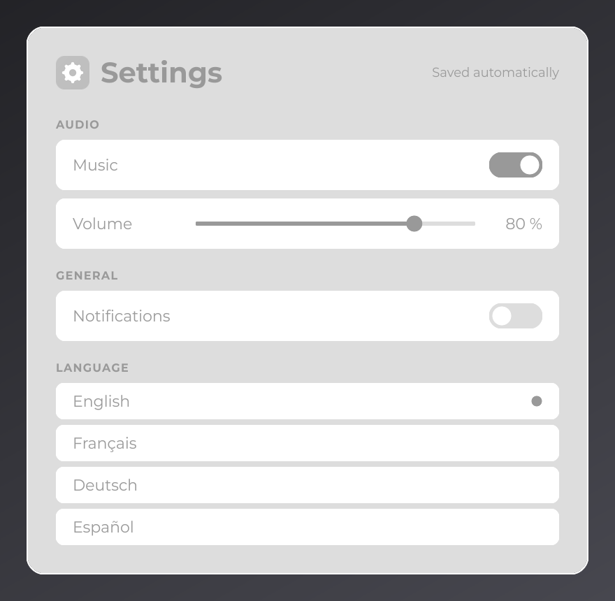
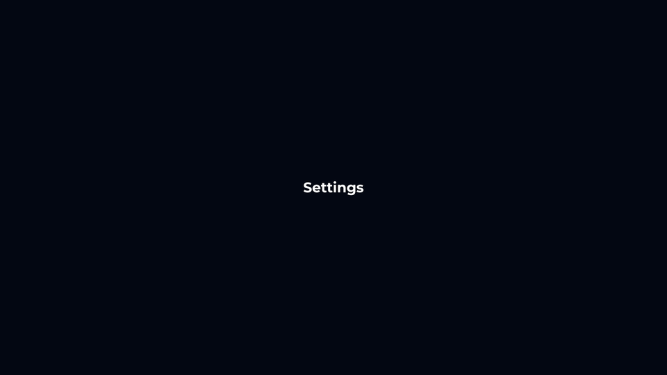

# Tutorial 1: Project Setup

This four-part tutorial puts the Core Concepts together in one real application: a settings screen. In this first part you turn the [Quick Start](../getting-started/quick-start.md) project into that application: a new package, a bold face in the font, and a first screen. Each later part starts from the code of the previous one.

## What you build

By the end of [Tutorial 4](polish.md), the application shows a settings card centered in the window:

- a header with an icon, the title "Settings" and a hint;
- an **Audio** section with a **Music** switch and a **Volume** slider whose row hides while the music is off;
- a **General** section with a **Notifications** switch;
- a **Language** list where the selected entry carries a dot;
- values saved to disk, hover colors, tooltips, rounded corners, a gradient background, a sliding switch and an opening animation.



JOID draws nothing by itself: every color, size and shape of this screen is written in the tutorial code, in neutral grays. Change the constants and the same code draws your own design.

| Part | You put into practice |
| --- | --- |
| 1. Project Setup (this page) | The Quick Start project as a base, a font family, a first screen configured with `@UIData`. |
| [2. Building the Layout](layout.md) | Nodes and `body`, size helpers, anchors, nested `FlexNode` columns, text and an image. |
| [3. Interactivity and State](interactivity.md) | `onClick`, signals followed by nodes, controls you draw, a permanent store. |
| [4. Polish](polish.md) | A gradient, effects, hover animation, tooltips, a `TweenAnimator`, a transition. |

| Class | Role | Written in |
| --- | --- | --- |
| `Main` | Creates the window, registers the backend and the bridge, loads JOID and the theme, runs the frame loop. | Quick Start, adapted in parts 1 and 3 |
| `AppUIBridge` | Hosts the open UIs and clears the screen. | Quick Start, unchanged |
| `Theme` | The font and the colors of the application. | Quick Start, grows in parts 1, 2 and 4 |
| `SettingsUI` | The settings screen. | Part 1, grows in every part |
| `ToggleSwitchNode`, `VolumeSliderNode`, `SettingsStore` | The switch, the slider and the saved values. | Part 3 |

## Step 1: start from the Quick Start project

Copy the [Quick Start](../getting-started/quick-start.md) project with its `-dev` jar: the developer tools help while you build. Move `Main`, `AppUIBridge` and `Theme` to the package `com.example.settings`, delete `CounterUI`, and point `build.gradle` to the new main class:

```groovy
application {
	mainClass = 'com.example.settings.Main'
	if (System.getProperty('os.name').toLowerCase().contains('mac')) {
		applicationDefaultJvmArgs = ['-XstartOnFirstThread']
	}
}
```

Put these files in the working directory (the project folder with `gradle run`):

| File | Content |
| --- | --- |
| `fonts/Montserrat-Regular.ttf`, `fonts/Montserrat-Bold.ttf` | A regular and a bold face of any TrueType or OpenType family; adjust the names in `Theme` for another family. |
| `icons/settings.png` | A 48×48 icon (PNG or SVG), shown in the header from part 2. |

## Step 2: add the bold face to Theme

The screen has bold titles, so the font needs a bold face. Several files passed to `MsdfFontLoader.load(...)` build one family. Replace `load()` in `Theme`:

```java
public static void load() {
	Theme.font = MsdfFontLoader.load(new File("fonts/Montserrat-Regular.ttf"), new File("fonts/Montserrat-Bold.ttf")).join();
}
```

A `TextInfo` that asks for `FontWeight.BOLD` draws the bold face; any other weight picks the closest loaded face. The first launch generates the atlas of the new file, which takes a few seconds; later launches read the cache.

## Step 3: write the settings screen

Create `SettingsUI` in place of `CounterUI`. In this first part it shows only its title:

```java
package com.example.settings;

import dev.joid.lib.color.Color;
import dev.joid.lib.draw.text.builder.Text;
import dev.joid.lib.font.FontWeight;
import dev.joid.lib.font.TextInfo;
import dev.joid.lib.ui.core.UI;
import dev.joid.lib.ui.core.data.UIData;
import dev.joid.lib.ui.node.impl.design.text.TextNode;
import dev.joid.lib.utils.align.Align;

@UIData(backgroundColor = "#18181B")
public final class SettingsUI extends UI {

	@Override
	public void init() {
		final TextInfo title = TextInfo.create(Theme.getFont(), FontWeight.BOLD, 40F, Color.WHITE);
		TextNode.create(960, 540).text(Text.create("Settings", title)).anchor(Align.CENTER).attach(this);
	}

}
```

- `@UIData(backgroundColor = "#18181B")` replaces the default translucent background of the UI with an opaque near-black.
- `TextInfo.create(font, weight, size, color)` is the bold style of the title. (960, 540) is the center of the canvas, and `anchor(Align.CENTER)` puts the center of the text there.

## Step 4: open it from Main

`Main` keeps the window, the startup order, the input forwarding and the frame loop of the Quick Start. Only two lines change: the window title,

```java
final long window = GLFW.glfwCreateWindow(1280, 720, "Settings", 0L, 0L);
```

and the screen that `JOID.open` receives:

```java
JOID.open(new SettingsUI());
```

## Step 5: run it

Run `gradle run`, or `Main` from your IDE (with `-XstartOnFirstThread` on macOS). The window is near-black, with "Settings" in bold white at its center:



Resize the window: the title stays centered and scales with it, because positions are units of the 1920×1080 canvas (see [Canvas and Scaling](../concepts/canvas.md)). Press `Escape`: the screen closes, and only the clear color of `AppUIBridge` remains.

> TIP: Start JOID with `JOID.inst().setDevMode(true).load()` while you follow the next parts: `Ctrl+R` or `F5` reruns `init()` after each change, and `F3` shows the developer panel.

## The complete code

`SettingsUI` is complete above. `Theme`:

```java
package com.example.settings;

import java.io.File;

import dev.joid.lib.font.impl.msdf.MsdfFont;
import dev.joid.lib.font.impl.msdf.MsdfFontLoader;

public final class Theme {

	private static MsdfFont font;

	private Theme() {}

	public static void load() {
		Theme.font = MsdfFontLoader.load(new File("fonts/Montserrat-Regular.ttf"), new File("fonts/Montserrat-Bold.ttf")).join();
	}

	public static MsdfFont getFont() {
		return Theme.font;
	}

}
```

`Main`:

```java
package com.example.settings;

import org.lwjgl.glfw.GLFW;
import org.lwjgl.glfw.GLFWErrorCallback;
import org.lwjgl.opengl.GL;

import dev.joid.backend.lwjgl3.Backend;
import dev.joid.backend.lwjgl3.GlContextRequest;
import dev.joid.base.glfw.input.GlfwInputForwarder;
import dev.joid.internal.JOID;
import dev.joid.lib.bridge.BridgeHandler;
import dev.joid.lib.bridge.window.IWindowBridge;

public final class Main {

	public static void main(final String[] args) {
		GLFWErrorCallback.createPrint(System.err).set();
		if (!GLFW.glfwInit()) {
			throw new IllegalStateException("Unable to initialize GLFW");
		}

		GlContextRequest.CORE_33.apply();
		final long window = GLFW.glfwCreateWindow(1280, 720, "Settings", 0L, 0L);
		if (window == 0L) {
			throw new IllegalStateException("Unable to create the window");
		}

		GLFW.glfwMakeContextCurrent(window);
		GL.createCapabilities();
		Backend.register(window);

		final AppUIBridge bridge = new AppUIBridge();
		BridgeHandler.UI.register(bridge);
		JOID.inst().load();
		Theme.load();

		GlfwInputForwarder.create(bridge).attach(window);
		GLFW.glfwSetFramebufferSizeCallback(window, (handle, width, height) -> {
			if (width > 0 && height > 0) {
				bridge.resize(width, height);
			}
		});

		final IWindowBridge windowBridge = BridgeHandler.WINDOW.get();
		bridge.resize(windowBridge.getWidth(), windowBridge.getHeight());
		JOID.open(new SettingsUI());

		while (!GLFW.glfwWindowShouldClose(window)) {
			GLFW.glfwPollEvents();
			bridge.frame();
			GLFW.glfwSwapBuffers(window);
		}

		GLFW.glfwDestroyWindow(window);
		GLFW.glfwTerminate();
	}

}
```

`AppUIBridge`, the bridge of the Quick Start in the new package:

```java
package com.example.settings;

import dev.joid.lib.bridge.BridgeHandler;
import dev.joid.lib.bridge.render.IRenderBridge;
import dev.joid.lib.bridge.ui.StackUIBridge;

public final class AppUIBridge extends StackUIBridge {

	@Override
	protected void drawBackground() {
		final IRenderBridge render = BridgeHandler.RENDER.get();
		render.clearColor(0.1F, 0.1F, 0.1F, 1F);
		render.clearDepth();
		render.clearStencil();
	}

}
```

## See also

- Next: [Tutorial 2: Building the Layout](layout.md)
- [Quick Start](../getting-started/quick-start.md)
- [UIs](../concepts/uis.md)
- [Frame Loop and Dev Tools](../concepts/frame-loop.md)
- [Text and Fonts](../concepts/text.md)