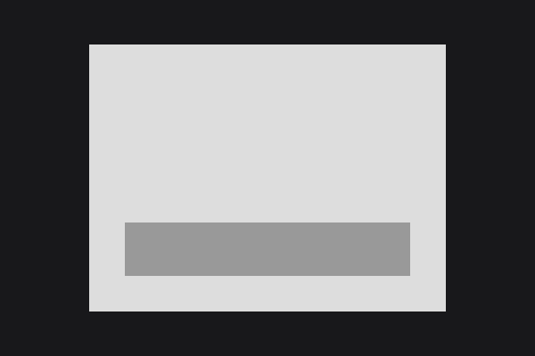
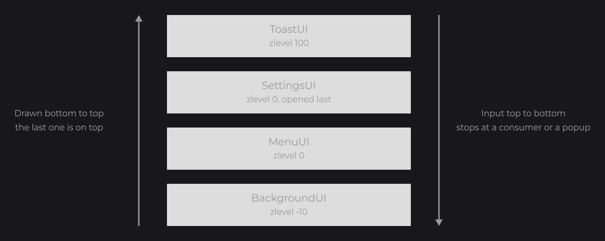

# Opening and Closing UIs

You open, close and look up UIs through static methods of `JOID` (`dev.joid.internal.JOID`), which hand the work to the UI bridge that accepts the UI. This page follows [The UI Class](ui-class.md): it covers those methods, how several UIs share the window, how Escape closes them, and popups.

## Opening and closing with JOID.open and JOID.close

```java
final SettingsUI settings = new SettingsUI();
JOID.open(settings);

if (JOID.isOpen(SettingsUI.class)) {
	JOID.close(JOID.getUI(SettingsUI.class));
}
```



`JOID.open` finds the bridge that accepts the UI (the registered bridge whose `canHandle(ui)` returns `true`, the highest index first, then the last registered) and calls its `open(ui)`. It returns that bridge, and throws an `IllegalStateException` ("No IUIBridge can open X: register one whose canHandle accepts it") when none accepts the UI. `JOID.close` asks the UI through `ui.onClose()`, then calls the bridge's `close(ui)`. Both work whatever the `closeable` option of the UI. Called from another thread than the render thread of the engine, they run on the render thread a moment later, through the [thread bridge](../integration/bridges.md#ithreadbridge).

## Refusing to close with close()

Override `close()` to keep a UI open, for example to confirm unsaved changes (`dirty` is a `boolean` field of the UI):

```java
@Override
public boolean close() {
	if (this.dirty) {
		JOID.open(new ConfirmPopup());
		return false;
	}
	return true;
}
```

The hook runs for `JOID.close(ui)`, Escape and bridges that call `ui.onClose()`. It does not run for the `force` variants. While the Out transition of a UI plays, further close requests are refused.

## What open does depends on the bridge

`JOID.open` and `JOID.close` only call the bridge's `open` and `close`; the bridge decides what they mean. `UIBridge` (`dev.joid.lib.bridge.ui`), the base class of UI bridges, leaves `open`, `close`, `add` and `remove` to you:

- A simple bridge adds every opened UI on top of the others and removes the closed ones (the bridge of the [Quick Start](../getting-started/quick-start.md)).
- `StackUIBridge` (`dev.joid.lib.bridge.ui`), and `DemoUIBridge`, the bridge of the demo window that extends it, close the open UIs (through `onClose()`) before it opens a UI that is neither a popup nor an [overlay](#overlays-with-uidataoverlay). If one of them refuses, the new UI is not opened; if one plays an Out transition, the new UI opens when the transition ends. A popup or an overlay opens without closing anything, and the overlays stay open when another UI opens.

The bridge loads a UI it adds with `ui.load(width, height)`. See [UI Bridge](../integration/ui-bridge.md).

## Several UIs at once with zlevel

A `UIBridge` keeps its UIs in `getUiList()`, an `IndexedLinkedList<UI>` sorted by `zlevel` rounded down, then by opening order. The bridge sorts the list again at every frame, so a `zlevel` changed at runtime applies from the next frame; the sort is stable, so a UI moved to the same index as another one does not pass in front of it.



| Phase | Order |
| --- | --- |
| Draw | From the first UI to the last: the last one is drawn on top. A UI with `visible = false` is skipped. |
| Update | Every UI, from the first to the last. |
| Input | From the last UI to the first, skipping UIs that are not `active` or not `visible`. The event stops at the first UI that consumes it, or at a popup. |

[Overlays](#overlays-with-uidataoverlay) come after every other UI in these orders: they are drawn above them and receive the input first.

Give a UI a `zlevel` to keep it below or above the UIs opened later, for example a background below the menus and a notification layer above them:

```java
@UIData(zlevel = -10D, background = false, closeable = false)
public class BackgroundUI extends UI {}

@UIData(zlevel = 100D, background = false, closeable = false, active = false)
public class ToastUI extends UI {}
```

`zlevel` also offsets the depth at which the UI is drawn.

### The top UI with isOnTop

`UIBridge.isOnTop(ui)` returns `true` for the first UI that is both active and visible, from the top of the list. A hidden or inactive layer above, such as the `ToastUI` above, does not take that place. Overlays and the other UIs each have their own top UI: an overlay never takes the place of the UI below it, and an overlay that takes no input is never on top. Only the top UI draws node tooltips and shows the DevNode; `ui.isOnTop()` reads the answer of the last draw. A bridge overrides `isOnTop` only for a rule of its own.

### Active, visible and closeable at runtime

Change these options through `getData()`; they apply from the next frame:

```java
hud.getData().setZlevel(200D);
toast.getData().setVisible(false);
menu.getData().setActive(false).setCloseable(false);
```

| Option | `false` means |
| --- | --- |
| `active` | No input; still updated and drawn. Useful while a UI animates out. |
| `visible` | Not drawn and no input; still updated. |
| `closeable` | Escape does not close the UI; it receives Escape as a normal key. |

## Escape handling

When Escape is pressed, `UIBridge.keyTyped` goes through the active and visible UIs from the top:


1. A closeable UI that is not an overlay first receives Escape as a key press: its nodes, keybinds, zoom and dev keys and `keyPressed`. If none of them consumes it, the bridge asks the UI to close (`onClose()`) and closes it when it agrees. In both cases Escape goes no further.
2. A UI that is not closeable, or an overlay, receives Escape as a normal key. If it consumes it, or if the UI is a popup, Escape stops; otherwise the next UI below gets the same treatment.

So a focused text field cancels its edit on the first Escape and the UI closes on the second one, a keybind on `Key.ESCAPE` keeps a closeable UI open, and a popup always stops Escape from reaching the UIs below. A UI that refuses to close (its `close()` returns `false`, or its Out transition plays) still consumes Escape.

## Popups with @UIDataPopup

`@UIDataPopup` (`dev.joid.lib.ui.core.data.popup`) marks a UI as a popup:

```java
@UIDataPopup(active = true)
public class ConfirmPopup extends UI {

	@Override
	public void init() {
		RectNode.create(710, 390, 500, 300).color(Color.decode("#DDDDDD")).attach(this);
	}

}
```

| Attribute | Default | Description |
| --- | --- | --- |
| `active` | `false` | Whether the UI is a popup. |
| `transition` | `PopupTransition.IN_OUT` | Which states of the default transition play: `NONE`, `IN` (opening only), `OUT` (closing only) or `IN_OUT`. |

A popup:

- is modal for input: the events that reach it never go to the UIs below, consumed or not;
- gets a `PopTransition` unless `transition` is `NONE`; see [Transitions](transitions.md#poptransition);
- is not closed by a `StackUIBridge` when another UI opens, and does not close the open UIs when it opens there;
- dims the UIs below with its default `@UIData` background.

`getPopup()` returns the options as a `UIDataPopupObject` with `setActive(boolean)` and `setTransition(PopupTransition)`. A change applies from the next frame: the UI creates or removes its pop transition. `PopupTransition` has `isIn()`, `isOut()` and `isActive()` (`true` unless `NONE`).

## Overlays with @UIDataOverlay

An overlay is a UI drawn over the application that hosts JOID and over its other UIs: a minimap, a notification panel, a heads-up counter. It stays open while the other UIs open and close, and it takes the input or lets it through. `@UIDataOverlay` (`dev.joid.lib.ui.core.data.overlay`) marks it:

```java
@UIData(background = false)
@UIDataOverlay(active = true, interaction = @UIDataOverlayInteraction(active = true), render = @UIDataOverlayRender(screens = true))
public class MinimapOverlay extends UI {

	@Override
	public void init() {
		RectNode.create(1560, 40, 320, 260).color(Color.decode("#DDDDDD")).draggable(DraggableProperty.screen()).attach(this);
	}

}
```

| Attribute | Default | Description |
| --- | --- | --- |
| `active` | `false` | Whether the UI is an overlay. |
| `interaction` | `@UIDataOverlayInteraction` | Whether the overlay receives the input, and which events it keeps from the host. |
| `render` | `@UIDataOverlayRender` | When the overlay is drawn, and its order among the overlays. |

`@UIDataOverlayInteraction` (`.interaction`):

| Attribute | Default | Description |
| --- | --- | --- |
| `active` | `false` | Whether the overlay receives the input. When `false`, every event goes through it to the UIs below and to the host. |
| `cancelClick` | `true` | Whether a press, a drag or a release that the overlay consumes is kept from the host. |
| `cancelScroll` | `true` | The same for the wheel. |
| `cancelKeyboard` | `true` | The same for the keys. |

`@UIDataOverlayRender` (`.render`):

| Attribute | Default | Description |
| --- | --- | --- |
| `always` | `false` | Whether the overlay is drawn even while the host hides its overlays, for example when the player of a game hides the interface. |
| `screens` | `false` | Whether the overlay is drawn while a screen is open: a UI of the bridge that is not an overlay, or a screen of the host. When `false`, the overlay is hidden and takes no input while a screen is open. |
| `zindex` | `0` | The order among the overlays: the highest one is drawn on top and receives the input first. Overlays with the same `zindex` keep their opening order. |

An overlay:

- is drawn above the UIs that are not overlays, whatever their `zlevel`, and receives the input before them;
- does not close on Escape: it receives Escape as a normal key, and the UI below closes as usual;
- cannot be a popup: a UI with both `@UIDataPopup(active = true)` and `@UIDataOverlay(active = true)` throws an `IllegalStateException` when it is created.

The bridge methods that receive the input return whether the event was consumed, so the host knows whether to handle it too: an event that an overlay consumes counts only when its `cancelClick`, `cancelScroll` or `cancelKeyboard` is `true`. See [UI Bridge](../integration/ui-bridge.md#overlays-and-the-host).

`getOverlay()` returns the options as a `UIDataOverlayObject`: `setActive(boolean)`, and `interaction()` and `render()`, which return the `UIDataOverlayInteractionObject` (`setActive`, `setCancelClick`, `setCancelScroll`, `setCancelKeyboard`) and the `UIDataOverlayRenderObject` (`setAlways`, `setScreens`, `setZindex`). A change applies from the next event or frame:

```java
this.getOverlay().interaction().setActive(false);
this.getOverlay().render().setZindex(10);
```

In the demo window, Ctrl + O on the demo menu opens and closes an overlay that you can drag over the demos.

## Reference

| Method | Description |
| --- | --- |
| `static IUIBridge open(UI ui)` | Calls `open(ui)` on the bridge that accepts `ui` and returns it. Throws an `IllegalStateException` when no bridge accepts the UI. |
| `static IUIBridge open(UI ui, boolean force)` | With `force` `false`, same as `open(ui)`. With `true`, first closes every UI of that bridge without asking them (no `close()`, no Out transition: each one is released with `properlyClose()` and passed to the bridge's `close`), then opens `ui`. |
| `static void close(UI ui)` | Asks the UI through `onClose()`: its `close()` can refuse, and an Out transition delays the removal until it ends. Then calls the bridge's `close(ui)`. Does nothing when no bridge accepts the UI. |
| `static void close(UI ui, boolean force)` | With `force` `false`, same as `close(ui)`. With `true`, releases the UI with `properlyClose()` and calls the bridge's `close(ui)` without asking and without transition. |
| `static boolean isOpen(UI ui)` | Whether the bridge of `ui` lists it as opened. |
| `static boolean isOpen(Class<? extends UI> uiClass)` | Whether an open UI is an instance of `uiClass` (subclasses count). |
| `static <T extends UI> T getUI(Class<T> uiClass)` | The first open UI, in the bridge's order, that is an instance of `uiClass`; `null` if none. |

All of them throw a `NullPointerException` for a `null` argument.

| `UIBridge` method | Description |
| --- | --- |
| `getUiList()` | The open UIs, sorted by `zlevel`, then by opening order. |
| `isOnTop(UI ui)` | Whether `ui` is the first active and visible UI from the top; `false` when no UI is open. |
| `isOpened(UI ui)` | Whether `ui` is in the list. |
| `load()` | Loads every UI again at the window size, keeping its zoom. Called by the backend on a resize. |
| `draw()`, `update()`, `mousePressed(...)`, `mouseMoved()`, `mouseReleased(...)`, `mouseScroll(...)`, `keyTyped(...)` | Dispatch the frames and the input, as described above. |

## Pitfalls

- `JOID.open` without a bridge that accepts the UI throws: register the UI bridge before opening anything.
- `zlevel` is rounded down for the order: `0.5D` and `0D` share the same index and keep their opening order.
- A popup stops every event that reaches it, even one it does not use: keep popups small in number and close them.
- A `ToastUI` with `active = false` gets no input at all: it cannot have clickable nodes.
- An overlay without `interaction = @UIDataOverlayInteraction(active = true)` gets no input either, and one without `render = @UIDataOverlayRender(screens = true)` disappears as soon as another UI opens.

## See also

- Next: [View and Scaling](view-and-scaling.md)
- [The UI Class](ui-class.md)
- [Transitions](transitions.md)
- [UI Bridge](../integration/ui-bridge.md)
- [Mouse and Keyboard](../interactions/mouse-and-keyboard.md)