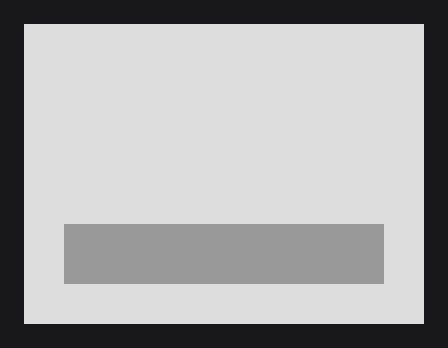

# The UI Class

`UI` (`dev.joid.lib.ui.core.UI`) is the root of a screen: it owns a tree of nodes, receives input from its bridge and draws itself on the 1920×1080 virtual canvas. Extend it once per screen, build the nodes in `init()` and configure the class with `@UIData`. This page opens the UIs guide: it takes the class that [UIs and Their Lifecycle](../concepts/uis.md) introduced and covers every hook, option and helper; the next pages open several UIs together, fit the canvas into the window and animate the opening.

## A minimal UI

```java
@UIData(backgroundColor = "#00000080", zoomable = false)
public class MenuUI extends UI {

	@Override
	public void init() {
		RectNode.create(760, 390, 400, 300).color(Color.decode("#DDDDDD")).attach(this);

		RectNode
		.create(800, 590, 320, 60)
		.color(Color.decode("#999999"))
		.hoveredColor(Color.GRAY)
		.onClick((node, mouseX, mouseY, clickType) -> JOID.close(this))
		.attach(this);

		this.keybind(() -> JOID.close(this), Key.LEFT_CONTROL, Key.Q);
	}

}
```



`UI` is abstract but has no abstract method: override only the hooks you need. Open the UI with `JOID.open(new MenuUI())`, see [Opening and Closing UIs](managing-uis.md). Nodes, keybinds and tasks belong in `init()`: anything added in the constructor is discarded by the first load.

## Lifecycle

.")

| Stage | Trigger | What happens |
| --- | --- | --- |
| Construction | `new MyUI()` | Reads `@UIData`, `@UIDataDebug`, `@UIDataPopup`, `@UIDataScale` and `@UIDataOverlay` (each one on the class or its nearest annotated superclass), creates the view and, for a popup, its default transition. No node exists yet. |
| First load | The bridge adds the UI and calls `load(width, height)` | Sizes the view to the window at zoom 1, restores the [`@UIProperty`](../state/properties.md) fields, clears what was added before, runs `init()`, then starts the In state of the [transition](transitions.md). In dev mode, also adds the DevNode and starts hot reload. |
| Frames | The bridge | Input hooks, `update()`, then the draw. See [The Frame Loop](../concepts/frame-loop.md). |
| Resize | `UIBridge.load()`, called by the backend when the window changes | `load(width, height, zoom)` resizes the view and keeps the current zoom. `init()` does not run again. |
| Reload | `reload()`, Ctrl + R or F5, the DevNode button, hot reload | Saves then restores the `@UIProperty` fields, applies the annotation values changed since their last read, detaches every node, clears the keybinds and tasks, runs `init()` again and replays the In transition. Same instance: fields, signals and zoom are kept. |
| Renew | `renew()`, Ctrl + Shift + R or Shift + F5 | Creates a new instance with the constructor without argument, releases the current instance with `dispose()`, then removes it from the bridge and adds the new one (no `close()`, no Out transition). New fields, new signals, zoom 1. Returns the new instance. |
| Close | `JOID.close(ui)`, Escape, the bridge | `fireClose()` asks your `close()` hook; if it agrees, plays the Out transition, then `dispose()` releases the UI and the bridge removes it. |
| Reopen | `JOID.open(ui)` on a closed instance | `init()` does not run again: every top-level node is loaded again and follows its signals again. |

`dispose()` detaches every node (which ends their drags, hovers and focus and unsubscribes them from their signals), stops the hot reload watcher, saves every [store](../state/stores.md), destroys the local stores of the UI and saves its `@UIProperty` fields. `JOID.close` and the Out transition call it; call it yourself only from a bridge that removes a UI without `JOID.close`.

During `init()`, `UI.getCurrent()` returns the UI being initialized; it returns `null` the rest of the time.

## Overridable hooks

`UI` implements `IUI` (`dev.joid.lib.ui.core.IUI`), whose methods all have empty defaults.

Positions are units of the 1920×1080 virtual canvas, fitted to the window without stretching; wider or taller windows show extra canvas around it. The mouse coordinates the hooks receive are always in canvas units; only `drawBackground` draws outside the canvas, in the host's space.


See [The Virtual Canvas](../concepts/canvas.md) for the fit rule and the conversions.

| Hook | Called |
| --- | --- |
| `void init()` | On the first load and on each reload. Build the nodes, keybinds and tasks here. |
| `boolean close()` | When the UI is asked to close (`JOID.close`, Escape, a bridge). Return `false` to keep it open. Default `true`. Not called by the `force` variants of `JOID.open` and `JOID.close`. |
| `void update()` | Every frame, after the nodes have updated. |
| `void drawBackground(double mouseX, double mouseY)` | Every frame, after the `@UIData` background and before the transition and the view transform: it draws in the host's coordinate space (window pixels with the projection of the [Quick Start](../getting-started/quick-start.md)), not on the canvas. |
| `void preDraw(double mouseX, double mouseY)` | Inside the view, after the nodes with a negative `zindex` and before the nodes with a `zindex` from 0 to 99. |
| `void postDraw(double mouseX, double mouseY)` | Inside the view, after the nodes with a `zindex` from 0 to 99 and before the nodes with a `zindex` of 100 or more. |
| `void mousePressed(double mouseX, double mouseY, MouseButton clickType, DispatchContext context)` | After the nodes received the press, from the front to the back. |
| `void mouseDragged(double mouseX, double mouseY, MouseButton clickType, long deltaTime, DispatchContext context)` | After the nodes received the drag. `deltaTime` is the number of milliseconds since the press, measured by the UI bridge. |
| `void mouseReleased(double mouseX, double mouseY, MouseButton clickType, DispatchContext context)` | After the nodes received the release. |
| `void mouseScroll(double mouseX, double mouseY, double notchesX, double notchesY, DispatchContext context)` | After the nodes received the scroll, in wheel notches on each axis. |
| `void keyPressed(char c, Key key, DispatchContext context)` | Last, after the nodes, the keybinds, the zoom keys and the dev keys. |

Each draw of a UI runs its steps in this order; the hooks find their place between the nodes by `zindex`:


The input hooks run even when a node already consumed the event: check `context.isCancelled()` before acting, and call `context.cancel()` to consume the event so the UIs below do not receive it. See [Mouse and Keyboard](../interactions/mouse-and-keyboard.md).

```java
@Override
public void keyPressed(final char c, final Key key, final DispatchContext context) {
	if (!context.isCancelled() && key == Key.TAB) {
		context.cancel(() -> JOID.close(this));
	}
}
```

## Configuring a UI with @UIData

`@UIData` (`dev.joid.lib.ui.core.data`) sets the options of a UI class. JOID reads it on the class, then on its superclasses, and uses the first one found (attributes are not merged).

```java
@UIData(zindex = 10, background = false, closeable = false, anchorX = Align.END, anchorY = Align.START)
public class HudUI extends UI {}
```

| Attribute | Default | Effect |
| --- | --- | --- |
| `active` | `true` | When `false`, the bridge sends the UI no input; it is still updated and drawn. |
| `visible` | `true` | When `false`, the UI is neither drawn nor sent input; it is still updated. |
| `closeable` | `true` | When `true`, Escape closes the UI (after its nodes and keybinds had the chance to consume it). `JOID.close` works either way. |
| `zoomable` | `true` | Enables the Ctrl or Alt + `+` / `-` zoom keys. |
| `background` | `true` | Fills the whole window with `backgroundColor` before drawing the UI. |
| `backgroundColor` | `"#101010c0"` | Any string accepted by `Color.decode`: `#RRGGBB`, `#RRGGBBAA`, `rgb(...)`, `rgba(...)`, `gradient(...)`. See [Colors and Gradients](../styling/colors.md). |
| `projection` | `true` | When `true`, the UI sets its own orthographic projection for the canvas. When `false`, it draws with the projection set by the host. |
| `zindex` | `0` | Order among the UIs of a bridge: higher is drawn later and receives input first. See [Several UIs at once](managing-uis.md#several-uis-at-once-with-zindex). |
| `zlevel` | `0D` | Depth offset of the UI, for 3D content. |
| `anchorX` | `Align.CENTER` | Horizontal anchor of the canvas in the window and pivot of the zoom. See [View and Scaling](view-and-scaling.md). |
| `anchorY` | `Align.CENTER` | Vertical anchor. |

### Changing the options at runtime with getData

`getData()` returns the options as a `UIDataObject`. Its setters (`setActive`, `setVisible`, `setCloseable`, `setZoomable`, `setBackground`, `setBackgroundColor(String)`, `setProjection`, `setZindex`, `setZlevel`, `setAnchorX`, `setAnchorY`) return the object, and every change applies from the next frame: the bridge sorts its UIs again, the view reads the anchors again.

```java
this.getData().setCloseable(false).setBackground(false);
```

The getters use the annotation names (`active()`, `zindex()`, `anchorX()`...); `getBackgroundColor()` returns the decoded `Color`, and `getAnchorPositionX()` / `getAnchorPositionY()` the anchor in canvas units (0, 960 or 1920; 0, 540 or 1080).

A reload applies only the annotation values that changed since their last read: a value set at runtime survives Ctrl + R as long as you do not edit that attribute of the annotation. `getData()`, `getDebug()` and `getPopup()` keep the same object for the whole life of the UI. The other annotations are [`@UIDataPopup`](managing-uis.md#popups-with-uidatapopup) and [`@UIDataDebug`](../concepts/dev-tools.md) (`profiler`, `hotreload`, both `true` by default).

## Adding nodes with add

`add(Node... nodes)` loads each node into the UI and adds it to the top-level nodes; `node.attach(ui)` does the same. Top-level nodes are kept in `getNodeList()`, sorted by `zindex`. See [Node Fundamentals](../nodes/node-fundamentals.md).

```java
this.add(RectNode.create(0, 0, 1920, 80).color(Color.DARKGRAY), RectNode.create(0, 1000, 1920, 80).color(Color.DARKGRAY));
```

## Keybinds with keybind

`keybind(Runnable runnable, Key... keys)` runs `runnable` when a key of the set is pressed while all its keys are down:

```java
this.keybind(() -> JOID.open(new SettingsUI()), Key.LEFT_CONTROL, Key.S);
```

- A keybind is identified by its set of keys, in any order: `keybind(r, Key.LEFT_CONTROL, Key.S)` then `keybind(r2, Key.S, Key.LEFT_CONTROL)` replaces the first one.
- It fires only when the pressed key is one of its keys: holding Ctrl + S then pressing A does not fire Ctrl + S again.
- Keybinds run after the nodes, only if no node consumed the key. A matching keybind consumes the key; every matching keybind runs.
- The keybinds are cleared before each `init()`: register them in `init()`. `getKeybindMap()` returns them as a `Map<Set<Key>, Runnable>`.
- A closeable UI sees Escape before it closes: a keybind on `Key.ESCAPE` consumes it and keeps the UI open.

```java
this.keybind(() -> this.open = !this.open, Key.ESCAPE);
```

## Scheduled tasks with schedule

| Method | Runs `runnable` |
| --- | --- |
| `schedule(Runnable runnable)` | Once, at the next draw of the UI. |
| `schedule(Runnable runnable, long delay)` | Once, at the first draw after `delay` milliseconds. |
| `schedule(Runnable runnable, long delay, long period)` | At the first draw after `delay` ms, then at the first draw after each `period` ms. A `period` of `0` runs it on every draw. |

```java
this.schedule(() -> System.out.println("Two seconds after init"), 2000L);
this.schedule(() -> System.out.println("Every second"), 0L, 1000L);
```

Tasks run at the start of the draw, on the thread that draws the UI, timed with the clock bridge. The task list is thread-safe, so `schedule` is the way to hand work from another thread to the UI. Tasks are cleared before each `init()`.

## Reloading with reload and renew

| Method | Shortcut (dev mode) | Instance | Fields and signals | Zoom |
| --- | --- | --- | --- | --- |
| `reload()` | Ctrl + R, F5 | Same | Kept | Kept |
| `renew()` | Ctrl + Shift + R, Shift + F5 | New, from the constructor without argument (a private one works) | New | 1 |

`renew()` throws an `IllegalStateException` when the UI is not open, when its class has no constructor without argument (anonymous class, inner class that is not static) or when that constructor fails; from the keyboard, the message is printed as `[JOID] ...` and the UI stays open. Signals declared as locals in `init()` start from zero on every reload; signals held in fields keep their value until a renew. See [Developer Tools](../concepts/dev-tools.md).

## Masks with mask and startMask

Masks clip drawing to a rectangle or to the opaque pixels of a resource, with the stencil buffer. Use them in draw hooks or custom nodes; the `Drawing` argument is a lambda without parameters that draws, here with `DrawUtils.SHAPE`:

```java
@Override
public void postDraw(final double mouseX, final double mouseY) {
	this.mask(100, 100, 400, 200, () -> DrawUtils.SHAPE.drawCircle(mouseX, mouseY, Color.GRAY, 80D));
}
```

Masks nest: an inner mask clips to the intersection with the outer ones. The `mask(...)` methods stop their mask even when the drawing throws. For a mask on a node, use [`MaskNodeEffect`](../styling/mask.md).

## Smoothing values with lerpByFramerate

`lerpByFramerate(double value, double target, double speed, double snapDiff, boolean snap)` moves `value` towards `target` by a step independent of the frame rate: at 60 fps and `speed` 1, a third of the remaining distance per frame, never past the target. Within `snapDiff` of the target, it returns `target` when `snap` is `true`, `value` otherwise.

With `panelX` a `double` field and `open` a `boolean` field of the UI:

```java
@Override
public void update() {
	this.panelX = this.lerpByFramerate(this.panelX, this.open ? 0D : -400D, 1D, 0.5D, true);
}
```

For timed animations, use a [TweenAnimator](../animation/tween-animator.md).

## Reference

### Methods

| Method | Description |
| --- | --- |
| `static UI getCurrent()` | The UI running `init()`, or `null`. |
| `add(Node... nodes)` | Loads and adds top-level nodes. |
| `keybind(Runnable runnable, Key... keys)` | Registers a keybind. |
| `schedule(Runnable)`, `schedule(Runnable, long delay)`, `schedule(Runnable, long delay, long period)` | Schedules a task. |
| `reload()` | Runs `init()` again on the same instance. |
| `UI renew()` | Replaces the open UI with a new instance and returns it. |
| `zoom(double zoom)` | Sets the zoom, clamped to its limits. See [View and Scaling](view-and-scaling.md). |
| `UI setTransition(Transition transition)`, `Transition getTransition()` | The open and close animation, `null` for none. See [Transitions](transitions.md). |
| `T useStore(Class<T> clazz, Object... args)` | The [store](../state/stores.md) of that class, created with `args` the first time; a local store is kept per UI. |
| `mask(double x, double y, double width, double height, Drawing drawing)`, `mask(..., Drawing drawing, boolean enabled)` | Runs `drawing` clipped to the rectangle; with `enabled` `false`, without clipping. |
| `mask(Resource resource, double x, double y, double width, double height, Drawing drawing)`, `mask(Resource, ..., boolean enabled)` | Runs `drawing` clipped to the pixels of `resource` drawn in the rectangle whose alpha is above 0.5. |
| `startMask(double x, double y, double width, double height)`, `startMask(Resource resource, double x, double y, double width, double height)` | Starts a mask; everything drawn until `stopMask()` is clipped. |
| `stopMask()` | Ends the last started mask. Throws `EmptyStackException` when no mask is active. |
| `double lerpByFramerate(double value, double target, double speed, double snapDiff, boolean snap)` | See [Smoothing values](#smoothing-values-with-lerpbyframerate). |
| `drawHover(Object content, double mouseX, double mouseY)` | Draws a tooltip through the bridge; the content of a text tooltip is its list of lines (`TextConverter.convertLines(content)`). Override it to draw the tooltips of this UI yourself. See [Hover and Tooltips](../interactions/hover.md). |
| `static isCtrlKeyDown()`, `isShiftKeyDown()`, `isAltKeyDown()` | Whether the left or right modifier is down. |

### Getters

| Getter | Returns |
| --- | --- |
| `UIDataObject getData()`, `UIDataDebugObject getDebug()`, `UIDataPopupObject getPopup()` | The options of the annotations, changeable at runtime. |
| `getAnnotatedData()`, `getAnnotatedDebug()`, `getAnnotatedPopup()` | The last read of the annotations, compared on reload. |
| `IndexedConcurrentList<Node> getNodeList()` | The top-level nodes. |
| `Map<Set<Key>, Runnable> getKeybindMap()` | The keybinds. |
| `List<UIScheduledTask> getScheduledTaskList()` | The pending tasks. |
| `Map<Class<? extends UIStore>, UIStore> getStoreMap()` | The local stores of the UI. |
| `UIView getView()` | The view that maps the canvas to the window. |
| `DoubleSignal getZoomLevel()`, `getScaledWidth()`, `getScaledHeight()` | The zoom and the visible size of the canvas, as signals. |
| `double getWidth()`, `double getHeight()` | The window size, in window pixels. |
| `double getMouseX()`, `double getMouseY()` | The mouse in canvas units, as sampled at the last draw. |
| `List<Node> getNodeListAt(double x, double y)`, `Node getHoveredNode()` | The visible nodes under a point, from the front to the back, and the first interactive one at the mouse (`null` when the UI is not on top). See [Nodes under a point with getNodeListAt](../interactions/mouse-and-keyboard.md#nodes-under-a-point-with-getnodelistat). |
| `double getFrameTime()` | Duration of the last frame in milliseconds (`1000 / 60` on the first frame). |
| `double getFps()` | Frames per second, updated once per second (`0` during the first second). |
| `long getRenderTime()`, `long getLastFrame()` | Duration of the last draw and clock time of the last frame, in nanoseconds. |
| `IUIBridge getBridge()` | The bridge that handles this UI, or `null`. |
| `int getIndex()` | `zindex`: the key that orders the UIs of a bridge. |
| `boolean isOnTop()` | Whether the bridge reported the UI as the top one at the last draw. |
| `boolean isInitialized()`, `boolean isClosed()` | Whether `init()` has run; whether `dispose()` ran since the last load. |
| `boolean isReloadPending()` | Whether hot reload detected a change that the next draw reloads. |
| `Node getDevNode()` | The DevNode in dev mode, otherwise `null`. |
| `double getDepthLevel()`, `setDepthLevel(double)` | Depth offset for the nodes drawn next, reset to 0 at each draw; a custom node that draws in depth raises it. |

### For bridges

| Method | Description |
| --- | --- |
| `load(double width, double height)`, `load(double width, double height, double zoom)` | Sizes the UI to the window (zoom 1 for the first form) and initializes it on the first call. |
| `draw(double mouseX, double mouseY)` | Draws the UI; the mouse is in window coordinates. Runs a pending hot reload first. |
| `fireUpdate()` | Updates the nodes, then calls `update()`. |
| `fireMousePressed(MouseButton)`, `fireMouseReleased(MouseButton)`, `fireMouseDragged(MouseButton, long)`, `fireMouseScroll(double, double)`, `fireKeyPressed(char, Key)` | Dispatch an event to the nodes and the hooks; return `true` when it was consumed, `false` before the first load. |
| `boolean isConsumingKey(Key key)` | Whether a key press would be consumed by a keybind or a focused text field of this UI, foreseen before the dispatch. |
| `boolean fireClose()` | Asks `close()`, starts the Out transition, returns `true` when the bridge can remove the UI at once. |
| `dispose()` | Releases the UI (see [Lifecycle](#lifecycle)). |

## Pitfalls

- Build in `init()`, never in the constructor: the first load clears the nodes, keybinds and tasks added before.
- Ctrl + R keeps the instance: a field initialized in the constructor or in its declaration keeps its value. Use Ctrl + Shift + R to start from a new instance.
- A UI that `renew()` must recreate needs a constructor without argument; an anonymous UI can only be reloaded.
- `drawBackground` draws in the host's space, not on the canvas: draw canvas content in `preDraw` / `postDraw` or with nodes.

## See also

- Next: [Opening and Closing UIs](managing-uis.md)
- [UIs and Their Lifecycle](../concepts/uis.md)
- [View and Scaling](view-and-scaling.md)
- [Transitions](transitions.md)
- [Persistent UI Properties](../state/properties.md)
- [UI Bridge](../integration/ui-bridge.md)