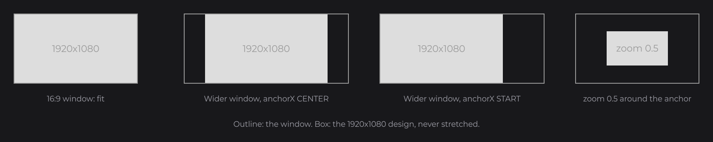

# View and Scaling

You design every UI on a virtual canvas of 1920×1080 units, and its `UIView` (`dev.joid.lib.ui.core.view.UIView`) maps that canvas to the window: it fits the canvas without stretching, places it with the UI's anchors, and applies the interface scale of the bridge and the zoom. Read this page to pin a UI to a window edge, to follow the visible area, and to convert between window and canvas coordinates.

## Pinning a UI with anchorX and anchorY

```java
@UIData(anchorX = Align.END, anchorY = Align.START, background = false)
public class MinimapUI extends UI {

	@Override
	public void init() {
		RectNode.create(1620, 20, 280, 280).color(Color.decode("#DDDDDD")).attach(this);
	}

}
```

.")

The minimap stays in the top-right corner of the window whatever its ratio, and a zoom shrinks it towards that corner.

## How the canvas fits the window



1. **Fit.** The canvas is scaled uniformly by `min(windowWidth / 1920, windowHeight / 1080)`. One canvas unit has the same size horizontally and vertically.
2. **Extend.** When the window ratio is not 16:9, the visible area is larger than 1920×1080 in one direction: a 2560×1080 window shows 2560×1080 canvas units, a 1080×1080 window shows 1920×1920.
3. **Place.** The anchors decide where the 1920×1080 design sits in that larger area.
4. **Scale.** The interface scale and the zoom scale the canvas around the anchor point.

`@UIData(anchorX = ..., anchorY = ...)` takes an `Align`: `START`, `CENTER` (default) or `END`. The anchor point is at 0, 960 or 1920 horizontally and 0, 540 or 1080 vertically, in canvas units.

| Window | Anchor | Result |
| --- | --- | --- |
| 2560×1080 | `anchorX = CENTER` | The design is centered: the window shows x from -320 to 2240. |
| 2560×1080 | `anchorX = START` | The design is pinned to the left; the extra space is on the right. |
| 2560×1080 | `anchorX = END` | The design is pinned to the right. |
| 1920×1200 | `anchorY = CENTER` | 60 extra units above and below the design. |

The view reads the anchors of `getData()` at the start of every frame: `getData().setAnchorX(Align.START)` moves the canvas, the zoom pivot and the mouse conversion from the next frame.

## Following the visible area with getScaledWidth

Three `DoubleSignal`s of the UI follow the view:

| Getter | Value |
| --- | --- |
| `getZoomLevel()` | The zoom. |
| `getScaledWidth()` | The visible width in canvas units: `viewportWidth / (interfaceScale × zoom)`. |
| `getScaledHeight()` | The visible height in canvas units. |

They change on load, resize, zoom and interface scale changes. Pass them to the [reactive setters](../state/reactive-properties.md) of a node to keep it on the window edges. This bar spans the whole visible width at the top of the window of a UI with centered anchors:

```java
RectNode
.create(0, 0, 1920, 60)
.color(Color.decode("#999999"))
.x(960D - this.getScaledWidth().get() / 2D)
.y(540D - this.getScaledHeight().get() / 2D)
.width(this.getScaledWidth())
.attach(this);
```

.")

`x(...)` and `y(...)` receive native expressions that read the signals, `width(...)` receives the signal itself: all three are recomputed when the visible area changes. For other anchors, read the view in a lambda, recomputed every frame: `x(() -> this.getView().toUiX(0D))`.

## Zoom

| Way | Effect |
| --- | --- |
| `ui.zoom(double zoom)` | Sets the zoom and updates the signals. |
| Ctrl or Alt + `+` / `-` (main keys or numpad) | Adds or removes 0.1, when the UI is `zoomable` (default). The key is consumed only when the zoom changed. |
| Left Alt + wheel | Dev mode only: adds the wheel value divided by 10000, or by 1000 with Left Shift held. Works even when the UI is not `zoomable`. |

```java
this.zoom(0.8D);
```

The zoom is clamped between 0.1 and `max(1, 1 / interfaceScale)`: at an interface scale of 1 you can zoom out but not past the fitted size, and a UI shrunk by its interface scale can be zoomed back to full size. A zoom below 1 shows more canvas: at 0.5, the visible area of a 16:9 window is 3840×2160 units.

The zoom is kept by a window resize and by `reload()` (Ctrl + R). `renew()` (Ctrl + Shift + R) creates a new UI at zoom 1, and the first load of a UI starts at zoom 1.

## Interface scale

A bridge scales a UI with `IUIBridge.getInterfaceScale(UI ui)` (default `1D`), for example to follow the GUI scale setting of its host. The UI reads it at every draw. The total scale is `interfaceScale × zoom`, applied around the anchor: with an interface scale of 0.5, the design takes half the size and the visible area is 3840×2160 canvas units. See [UI Bridge](../integration/ui-bridge.md).

## Window and canvas coordinates

| Space | Unit | Where you meet it |
| --- | --- | --- |
| Canvas | Units of the 1920×1080 design | Node positions and sizes, mouse coordinates in node callbacks and UI hooks, `ui.getMouseX()`. |
| Window | What the window bridge reports: framebuffer pixels for the GLFW backends | `IWindowBridge.getWidth()`, `UI.getWidth()`, `UI.draw(mouseX, mouseY)`, `drawBackground`. |

Convert with the view of a UI:

```java
final UIView view = this.getView();
final double canvasX = view.toUiX(windowX);
final double windowY = view.toScreenY(canvasY);
final double pixels = view.toScreenWidth(100D);
```

`toUiX` / `toUiY` and `toScreenX` / `toScreenY` are exact inverses, and `ui.getMouseX()` is `view.toUiX(windowMouseX)`. `UI.getWidth()` and `UI.getHeight()` return the window size in pixels, not the canvas size.

## Projection

With `@UIData(projection = true)` (default), the UI draws with its own orthographic projection over the visible area. With `projection = false`, it keeps the projection set by the host, for hosts that already set up a 2D projection for their screens. The UI background and `drawBackground` always draw with the host's projection.

## Reference

| Method | Description |
| --- | --- |
| `static UIView create(double anchorX, double anchorY)` | A view with an anchor point in canvas units. Each UI creates its own. |
| `UIView resize(double width, double height)` | Sets the window size and recomputes the fit. |
| `UIView zoom(double zoom)` | Sets the zoom, clamped to `[0.1, getMaxZoom()]`. On a UI, call `ui.zoom(...)` so the signals follow. |
| `UIView interfaceScale(double interfaceScale)` | Sets the interface scale and clamps the zoom again. |
| `UIView anchorX(double anchorX)`, `UIView anchorY(double anchorY)` | Sets the anchor point. A UI sets it from `getData()` at every frame, so a manual call is overwritten. |
| `double toUiX(double screenX)`, `double toUiY(double screenY)` | Window to canvas. |
| `double toScreenX(double uiX)`, `double toScreenY(double uiY)` | Canvas to window. |
| `double toScreenWidth(double uiWidth)`, `double toScreenHeight(double uiHeight)` | Canvas length to window pixels. |
| `double getScale()` | `interfaceScale × zoom`. |
| `double getMaxZoom()` | `max(1, 1 / interfaceScale)`. |
| `double getVisibleWidth()`, `double getVisibleHeight()` | The visible area in canvas units. |
| `double getOffsetX()`, `double getOffsetY()` | Offset of the design inside the visible area, from the anchor. |
| `double getViewportWidth()`, `double getViewportHeight()` | The visible area at scale 1 (at least 1920×1080). |
| `double getWidth()`, `double getHeight()` | The window size. |
| `double getAnchorX()`, `double getAnchorY()` | The anchor point. |
| `double getZoom()`, `double getInterfaceScale()` | The current zoom and interface scale. |
| `render(IRenderBridge render, boolean projection, Runnable draw)` | Runs `draw` with the view's projection (when `projection`) and transform, and restores them, even when `draw` throws. |

## Pitfalls

- Design on 1920×1080 and let the view scale: never compute positions from the window size.
- A node at a fixed canvas position sits on the design, not on the window edge: in a wider window, use the anchors or the scaled size signals to reach the edges.
- `UIView.anchorX(...)` on the view of a UI is overwritten at the next frame: change `getData().setAnchorX(...)` instead.

## See also

- [The UI Class](ui-class.md)
- [Opening and Closing UIs](managing-uis.md)
- [Reactive Properties](../state/reactive-properties.md)
- [Node Fundamentals](../nodes/node-fundamentals.md)
- [UI Bridge](../integration/ui-bridge.md)